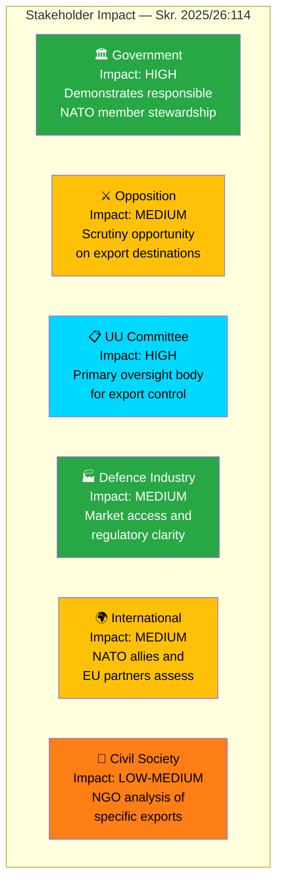

# Stakeholder Perspective Analysis — 2026-04-08

| **Field** | **Value** |
|-----------|-----------|
| **Analysis ID** | STAKE-2026-04-08-001 |
| **Analysis Date** | 2026-04-08 06:04 UTC |
| **Documents Analyzed** | 1 |
| **Produced By** | news-propositions workflow (AI-enriched) |
| **Overall Confidence** | MEDIUM |

---

## Stakeholder Impact Matrix

## Applied 6 Analysis Lenses

### 1. Government Perspective (Tidöblocket: M, KD, L + SD supply)

**Key actors**: PM Elisabeth Svantesson, Trade Minister Benjamin Dousa (Utrikesdepartementet)

The government presents Skr. 2025/26:114 as routine democratic transparency, fulfilling the mandatory annual reporting requirement. As the first full-year post-NATO report, it serves dual purposes: demonstrating responsible alliance membership and signalling continued commitment to independent export control. **Confidence: HIGH**

### 2. Opposition Perspective

**Key actors**: S foreign affairs spokesperson, V (Vänsterpartiet) defence critics, MP (Miljöpartiet)

- **S** will likely use the UU hearing to probe NATO-driven changes in export patterns and volume
- **V** opposes expanded arms exports and will challenge any increases in transfers to conflict-adjacent regions
- **MP** historically most critical of military exports; expect motions calling for stricter destination controls

**Confidence: MEDIUM**

### 3. Committee Perspective (UU — Utrikesutskottet)

The Foreign Affairs Committee is the primary parliamentary body for export control oversight. Expects to hold hearings in May-June 2026, calling ISP officials and potentially defence industry representatives. The committee will assess whether NATO accession has altered Sweden's export patterns and whether safeguards remain adequate. **Confidence: HIGH**

### 4. Defence Industry Perspective

Saab, BAE Systems Hägglunds, and other Swedish defence manufacturers benefit from NATO membership through enhanced market access and interoperability certifications. The annual report provides industry with regulatory predictability. Industry seeks streamlined export approval processes while maintaining credibility of end-user controls. **Confidence: MEDIUM**

### 5. International Partner Perspective

NATO allies (particularly US, UK, Germany) monitor Swedish export controls for compatibility with allied standards. EU partners assess dual-use regulation compliance. The report signals Sweden's commitment to multilateral export control regimes (Wassenaar Arrangement, MTCR, NSG). **Confidence: MEDIUM**

### 6. Civil Society Perspective

Svenska Freds (Swedish Peace and Arbitration Society) and other NGOs will analyse specific export decisions. Focus areas include transfers to Saudi Arabia, UAE, and other Middle East destinations, as well as end-user certificate compliance. **Confidence: LOW-MEDIUM**

## Cross-Perspective Conflicts

| Conflict | Parties | Severity |
|----------|---------|----------|
| Export expansion vs restriction | Government/Industry vs V/MP/NGOs | 🟡 MEDIUM |
| NATO interoperability vs independence | All parties (degree disagreement) | 🟢 LOW |
| Transparency depth vs security | Committee vs Government | 🟡 MEDIUM |

## Data Quality Notes

Aggregate confidence: MEDIUM. Stakeholder analysis based on institutional knowledge, party positions, and political context for HD03114.
