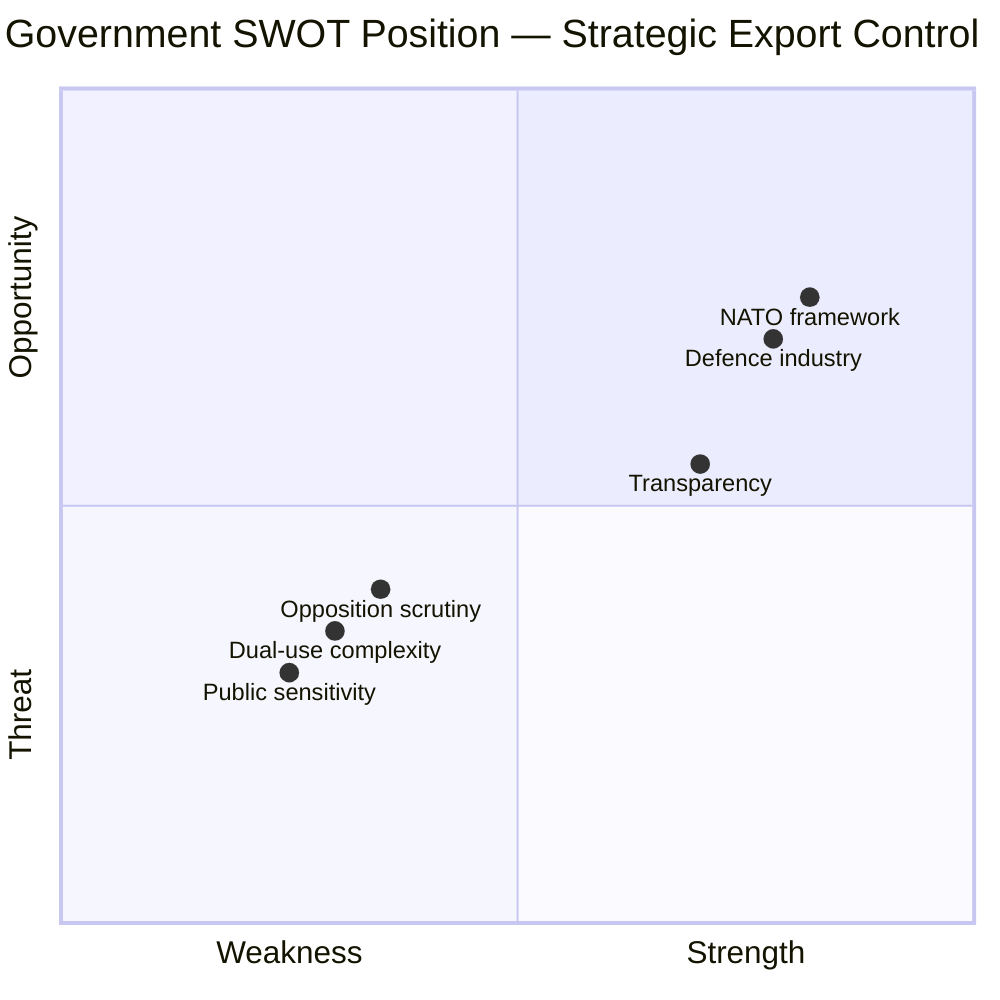

# Political SWOT Analysis — 2026-04-08

| **Field** | **Value** |
|-----------|-----------|
| **Analysis ID** | SWOT-2026-04-08-001 |
| **Analysis Date** | 2026-04-08 06:04 UTC |
| **Documents Analyzed** | 1 |
| **Produced By** | news-propositions workflow (AI-enriched) |
| **Overall Confidence** | MEDIUM |

---

## SWOT Dashboard

## Strengths

| # | Finding | Evidence | dok_id | Confidence |
|---|---------|----------|--------|------------|
| S1 | NATO membership provides enhanced defence cooperation framework | Sweden joined NATO March 2024; first full-year report under membership | HD03114 | HIGH |
| S2 | Established institutional export control infrastructure (ISP) | Mandatory annual reporting demonstrates mature oversight | HD03114 | HIGH |
| S3 | Cross-party consensus on defence strengthening | Tidöblocket + S convergence on security policy | Coalition context | HIGH |
| S4 | Strong Swedish defence industry (Saab, BAE Hägglunds) | Industry competitiveness in NATO market | Sector analysis | MEDIUM |
| S5 | EU dual-use regulation alignment (Reg. 2021/821) | Harmonised framework reduces trade friction | EU context | MEDIUM |

## Weaknesses

| # | Finding | Evidence | dok_id | Confidence |
|---|---------|----------|--------|------------|
| W1 | Skrivelse format limits parliamentary action to debate only | No vote mechanism for export control scrutiny | HD03114 (Skr.) | HIGH |
| W2 | Dual-use technology oversight increasingly complex | AI, quantum, cyber technologies blur civil-military lines | Policy domain | MEDIUM |
| W3 | Limited public-facing export destination transparency | Aggregate data may obscure controversial recipients | Reporting format | MEDIUM |

## Opportunities

| # | Finding | Evidence | dok_id | Confidence |
|---|---------|----------|--------|------------|
| O1 | NATO interoperability opens new allied export markets | Post-accession trade expansion potential | HD03114 context | MEDIUM |
| O2 | Coordinated legislative push with Prop. 2025/26:228 | Modernised military materiel regulations complement export framework | Cross-reference | HIGH |
| O3 | Demonstrating responsible export controls strengthens international credibility | Annual transparency reporting as diplomatic asset | Foreign policy | MEDIUM |

## Threats

| # | Finding | Evidence | dok_id | Confidence |
|---|---------|----------|--------|------------|
| T1 | Opposition scrutiny on specific export destinations | V and MP historically critical of arms exports | Political risk | MEDIUM |
| T2 | International pressure on dual-use transfers to authoritarian states | Geopolitical tensions and sanctions compliance | Global context | MEDIUM |
| T3 | Media amplification of controversial export decisions | Public opinion sensitivity around conflict-zone transfers | Democratic risk | LOW |

## TOWS Matrix

| | **Strengths (S)** | **Weaknesses (W)** |
|---|---|---|
| **Opportunities (O)** | **SO**: Leverage NATO membership + strong industry to expand allied cooperation (S1+O1) | **WO**: Use Prop. 2025/26:228 to address dual-use complexity gaps (W2+O2) |
| **Threats (T)** | **ST**: Cross-party defence consensus neutralises opposition challenges (S3+T1) | **WT**: Skrivelse format limits ability to respond to media pressure through legislative action (W1+T3) |

## Data Quality Notes

SWOT confidence: **MEDIUM**. Evidence drawn from HD03114 metadata, cross-document references, coalition dynamics, and geopolitical context.
