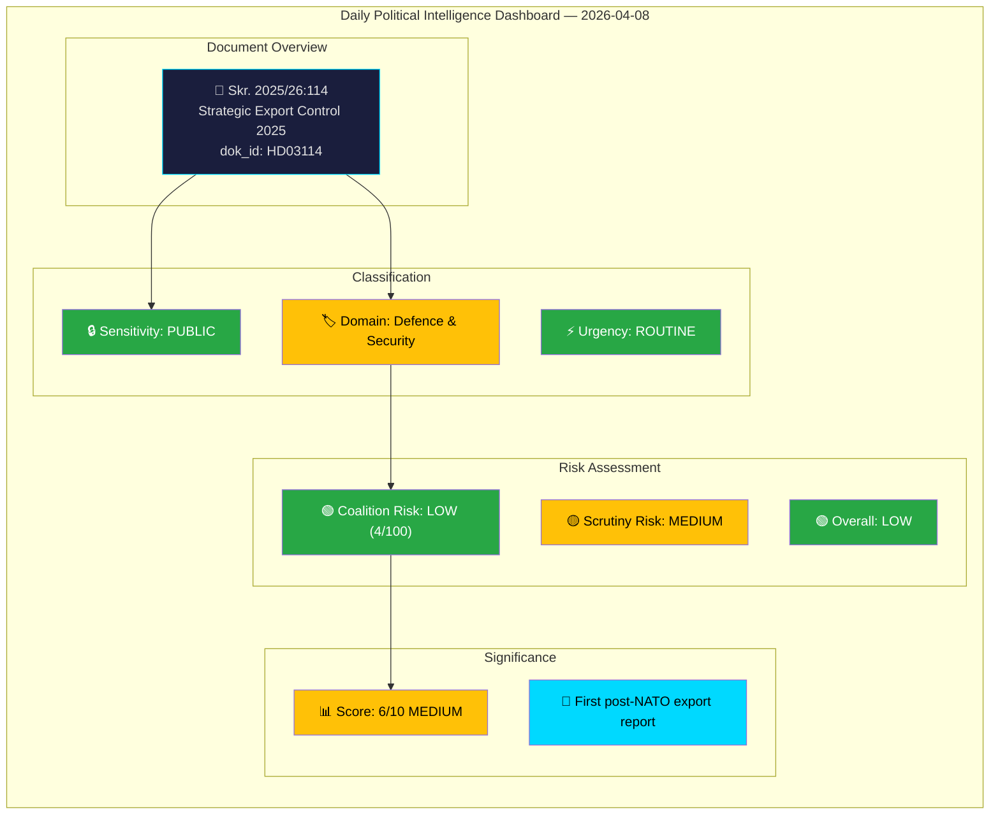

# Analysis Synthesis Summary — 2026-04-08

| **Field** | **Value** |
|-----------|-----------|
| **Synthesis ID** | SYN-2026-04-08-001 |
| **Analysis Date** | 2026-04-08 06:04 UTC |
| **Documents Analyzed** | 1 |
| **Analysis Period** | 2026-04-07 — 2026-04-08 |
| **Produced By** | news-propositions workflow (AI-enriched) |
| **Overall Confidence** | MEDIUM |

---

## Intelligence Dashboard

---

## Summary

The government submitted its annual strategic export control report (Skr. 2025/26:114) to the Riksdag on April 7, covering Sweden's 2025 military materiel and dual-use product exports. This is the **first complete annual report since Sweden's NATO accession** in March 2024, making it a politically significant transparency document. PM Svantesson and Foreign Trade Minister Benjamin Dousa authored the report, which will be reviewed by the Foreign Affairs Committee (UU).

**Data Freshness**: Documents sourced from **2026-04-07** (1 business day lookback).

## Key Findings

1. **Skr. 2025/26:114** is the annual mandatory strategic export control report — the first under NATO membership (significance: 6/10 MEDIUM)
2. Committee referral to UU (Utrikesutskottet) — hearings expected May-June 2026
3. Coalition risk: LOW (4/100) — cross-party defence consensus remains strong
4. As a skrivelse, the Riksdag debates but does not vote on the report
5. Key policy domains: defence/security policy, foreign trade policy, international law compliance

## Cross-Document Patterns

The strategic export control skrivelse is part of a broader government legislative push observed since late March 2026:
- **Defence cluster**: Prop. 2025/26:214 (cybersecurity centre), Prop. 2025/26:228 (military materiel regulation), Skr. 2025/26:114 (export control) — demonstrating coordinated defence modernisation agenda
- **Justice cluster**: Prop. 2025/26:235 (deportation), Prop. 2025/26:222 (victim compensation), Prop. 2025/26:227 (youth crime) — aggressive law-and-order agenda
- **Social policy**: Prop. 2025/26:216 (municipal healthcare), Prop. 2025/26:221 (food requirement) — deregulation and service improvement

## Risk Interconnections

The export control report compounds with Prop. 2025/26:228 (modernised military materiel regulations) to signal a comprehensive overhaul of Sweden's defence export framework. Together, these documents indicate the government is adapting Sweden's export control regime to NATO interoperability requirements while maintaining independent oversight.

## Forward Intelligence

| Watch Item | Timeline | Trigger |
|-----------|----------|---------|
| UU committee hearing on Skr. 2025/26:114 | May-June 2026 | Committee scheduling |
| Opposition motions in response | Within 15 days of publication | Filing deadline |
| ISP (export control agency) testimony | During UU hearing | Standard procedure |
| NATO interoperability agreement updates | Q2-Q3 2026 | Referenced in report |

## Implications

Overall political risk: **LOW**. The strategic export control report is routine annual transparency, but its status as the first post-NATO report elevates its political significance. The government can expect UU scrutiny but holds a comfortable majority for any related policy decisions.

## Data Quality Notes

Overall confidence: **MEDIUM**. Analysis based on MCP metadata, political context, and domain knowledge. Full-text parsing would improve confidence to HIGH.
