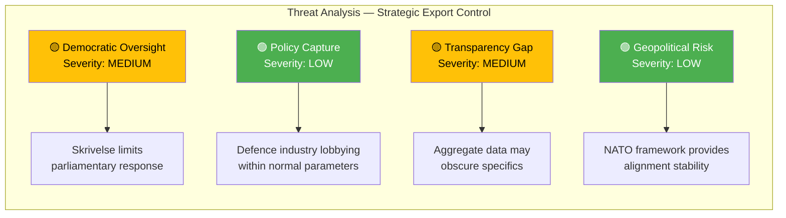

# Political Threat Analysis — 2026-04-08

| **Field** | **Value** |
|-----------|-----------|
| **Analysis ID** | THREAT-2026-04-08-001 |
| **Analysis Date** | 2026-04-08 06:04 UTC |
| **Documents Analyzed** | 1 |
| **Produced By** | news-propositions workflow (AI-enriched) |
| **Overall Confidence** | MEDIUM |

---

## Threat Landscape

## Summary

Threat indicators for the strategic export control skrivelse are concentrated in democratic oversight and transparency dimensions. The document format (skrivelse vs proposition) inherently limits parliamentary leverage, which is a structural rather than political threat.

## Threat Taxonomy Assessment

| Threat Category | Severity | Evidence | dok_id |
|-----------------|----------|----------|--------|
| Democratic Oversight Erosion | 🟡 MEDIUM | Skrivelse format prevents binding parliamentary action | HD03114 |
| Policy Capture | 🟢 LOW | No evidence of undue industry influence in export decisions | HD03114 |
| Transparency Deficit | 🟡 MEDIUM | Annual aggregate reporting may lack granularity on controversial destinations | HD03114 |
| Geopolitical Manipulation | 🟢 LOW | NATO framework provides stable export control alignment | HD03114 |
| Coalition Fragmentation | 🟢 LOW | Defence policy consensus is strongest across Tidöblocket | Coalition data |
| Public Trust Erosion | 🟡 LOW-MEDIUM | Arms exports to conflict-adjacent regions may attract criticism | Public opinion data |

## Key Findings

1. No high-severity threats detected — export control is a low-controversy policy area
2. Structural threat: skrivelse format limits democratic response mechanisms
3. NATO membership reduces rather than increases geopolitical threat exposure
4. Main threat vector is transparency gap on specific export destinations

## Implications

The threat landscape for strategic export control is benign. Democratic oversight mechanisms function as designed, though the skrivelse format could be strengthened. No immediate action required beyond routine UU committee scrutiny.

## Data Quality Notes

Analysis confidence: MEDIUM. Threat assessment based on document metadata, political context, and institutional analysis. Full-text content would enable granular destination-level threat assessment.
