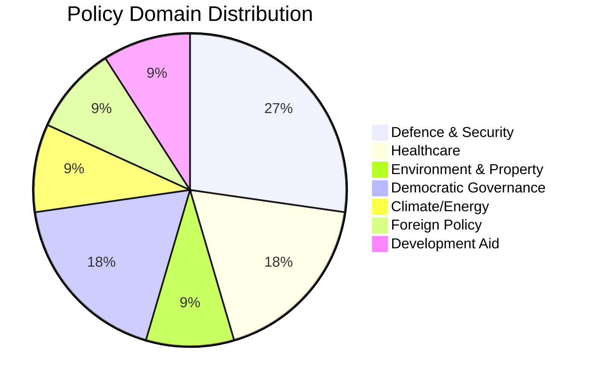

# Classification Results — 2026-04-08

**Generated**: 2026-04-08 10:27 UTC | **Workflow**: news-realtime-monitor (run 1027)
**Produced By**: news-realtime-monitor AI agent

---

## Policy Domain Classification

## Classification Table

| dok_id | Primary Domain | Secondary Domain | Committee | Confidence |
|--------|---------------|-----------------|-----------|:----------:|
| HD03230 | Environment & Property | Fiscal Policy | MJU | H |
| HD03219 | Healthcare | Government Accountability | SoU | H |
| HD11687 | Healthcare | Evidence-Based Policy | SoU | M |
| HD11688 | Climate/Energy | Social Equity | MJU | M |
| HD11689 | Defence & Security | Environmental Regulation | FöU | H |
| HD11690 | Defence & Security | Industrial Policy | FöU | H |
| HD11691 | Foreign Policy | Human Rights | UU | M |
| HD11692 | Defence & Security | Law Enforcement | FöU | M |
| HD11693 | Democratic Governance | Transparency | KU | H |
| HD11694 | Democratic Governance | Security Policy | UbU | L |
| HD024070 | Development Aid | Government Accountability | UU | M |

## Committee Workload Distribution

| Committee | Documents | Key Issues |
|-----------|:---------:|------------|
| FöU | 3 | Defence readiness (environmental permits, private actors, preparedness police) |
| SoU | 2 | Healthcare governance (dental care, quality registries) |
| UU | 2 | Foreign policy (Chechnya), development aid (Sida) |
| MJU | 2 | Environment (species protection), climate (EV premium) |
| KU | 1 | Democratic transparency (lobby register) |
| UbU | 1 | Security vetting of trust positions |
