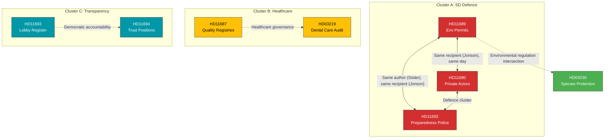

# Cross-Reference Map — 2026-04-08

**Generated**: 2026-04-08 10:27 UTC | **Workflow**: news-realtime-monitor (run 1027)
**Produced By**: news-realtime-monitor AI agent

---

## Document Relationship Graph

## Cross-Reference Table

| Source dok_id | Target dok_id | Relationship Type | Strength |
|---------------|---------------|------------------|:--------:|
| HD11689 | HD11690 | Same recipient, same day, defence cluster | STRONG |
| HD11689 | HD11692 | Same author + recipient, same day, defence cluster | STRONG |
| HD11690 | HD11692 | Same recipient, same day, defence cluster | STRONG |
| HD11687 | HD03219 | Healthcare policy domain, governance scrutiny | MEDIUM |
| HD11693 | HD11694 | Same author, democratic accountability theme | MEDIUM |
| HD11689 | HD03230 | Environmental regulation intersection | WEAK |
| HD11687 | HD12669 | S question → government answer on dental care | MEDIUM |

## External Context References

| Document | External Reference | Type |
|----------|-------------------|------|
| HD11689, HD11690, HD11692 | FöU11/FöU12 committee debates | Upcoming (April 14) |
| HD03219 | Riksrevisionen audit report | Source document |
| HD024070 | Skr 2025/26:226 (government response) | Parent document |
| HD11693 | Lagrådsremiss "Ökad insyn i politiska processer" | Legislative context |
| All documents | Spring Budget 2026 (April 7 presentation) | Fiscal context |
| HD11689, HD11690 | NATO FM meeting May 21-22 | Geopolitical context |
