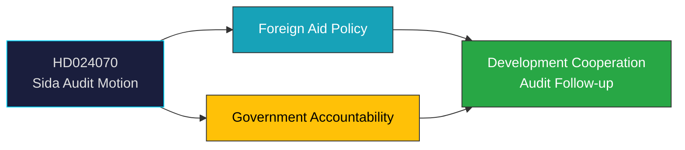

# Document Analysis: Riksrevisionens rapport om Sidas arbete med det humanitära biståndet

**Generated**: 2026-04-08 10:27 UTC | **dok_id**: HD024070 | **Type**: motion (opposition) | **Date**: 2026-04-08
**Author**: Anna Lasses, Kerstin Lundgren (C) | **Committee**: UU (Utrikesutskottet) | **Riksmöte**: 2025/26
**Significance**: 🟢 Low-Medium (3/10) | **Confidence**: MEDIUM (50%) | **Analyst**: news-realtime-monitor

---

## Executive Summary

C MPs Lasses and Lundgren file a motion in response to the government's skrivelse 2025/26:226 on Riksrevisionen's audit of Sida's humanitarian aid work. The motion calls for the government to address deficiencies in planning and follow-up identified by the audit. This demonstrates C's active role in holding the government accountable on development policy, using Riksrevisionen findings as institutional leverage. **MEDIUM confidence** — motion outcome depends on UU committee processing and coalition dynamics.

---

## Political Classification

## SWOT Analysis

| Type | Statement | Evidence | Confidence | Impact |
|------|-----------|----------|:----------:|:------:|
| S1 | C demonstrates opposition oversight using institutional audit findings | HD024070, Skr 2025/26:226 | H | M |
| W1 | Government's Sida management under scrutiny from independent auditor | HD024070, Riksrevisionen findings | M | M |
| O1 | Audit-driven reforms could strengthen Swedish development cooperation credibility | HD024070 | M | M |
| T1 | Continued aid management gaps could undermine Sweden's international reputation | HD024070 | L | M |

## Forward Indicators

| Indicator | Timeline | Confidence |
|-----------|----------|:----------:|
| UU committee scheduling | 2-4 weeks | M |
| Government response to Riksrevisionen recommendations | This session | M |
