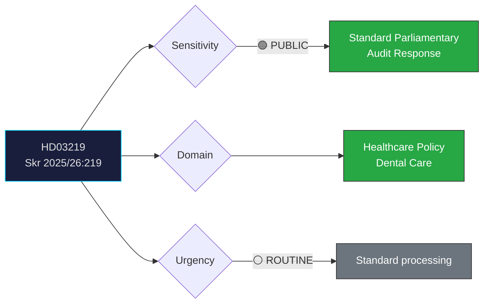

# Document Analysis: Riksrevisionens rapport om tandvårdsstödet

**Generated**: 2026-04-08 10:27 UTC
**dok_id**: HD03219
**Document Type**: skrivelse (government response to audit)
**Committee**: SoU (Socialutskottet)
**Department**: Socialdepartementet
**Date**: 2026-04-08
**Author**: Regeringen (Jakob Forssmed, KD)
**Riksmöte**: 2025/26
**Significance**: 🟢 Low-Medium (3/10)
**Confidence**: MEDIUM (50%)
**Analyst**: news-realtime-monitor

---

## Executive Summary

The government responds to the Swedish National Audit Office (Riksrevisionen) audit of the dental care support system (tandvårdsstödet). Government skrivelser responding to Riksrevisionen reports are a routine accountability mechanism but can signal policy reform intentions. Social Minister Jakob Forssmed (KD) leads the response, indicating healthcare policy ownership within the Tidö coalition. The simultaneously filed question HD11687 from Hallengren (S) on national quality registries suggests opposition scrutiny of healthcare governance. **MEDIUM confidence** — summary-level analysis pending full text.

---

## Political Classification

---

## SWOT Analysis

### Strengths
| # | Statement | Evidence (dok_id) | Confidence | Impact |
|---|-----------|-------------------|:----------:|:------:|
| S1 | Government demonstrates institutional accountability by responding to Riksrevisionen audit | HD03219 | H | L |
| S2 | KD retains policy ownership on healthcare — demonstrates coalition role | HD03219 (Forssmed authorship) | M | L |

### Weaknesses
| # | Statement | Evidence (dok_id) | Confidence | Impact |
|---|-----------|-------------------|:----------:|:------:|
| W1 | Opposition (S) simultaneously files question on quality registries — signals healthcare vulnerability | HD11687 (Hallengren, S) | M | M |
| W2 | Audit findings may reveal gaps in dental care delivery under current government | HD03219, HD12669 (dental care answer) | L | M |

### Opportunities
| # | Statement | Evidence (dok_id) | Confidence | Impact |
|---|-----------|-------------------|:----------:|:------:|
| O1 | Reform dental care support based on audit findings — demonstrate policy competence | HD03219 | M | M |

### Threats
| # | Statement | Evidence (dok_id) | Confidence | Impact |
|---|-----------|-------------------|:----------:|:------:|
| T1 | S could use audit findings in election campaigning as evidence of healthcare deterioration | HD03219, HD11687 | M | M |

---

## Stakeholder Perspective Analysis

| Stakeholder | Position | Impact | Evidence |
|-------------|----------|:------:|----------|
| **Dental care patients** | Interested in improved access and cost | M | HD03219 audit scope |
| **KD/Forssmed** | Owns response — must show credible reform path | M | HD03219 authorship |
| **S (opposition)** | Uses healthcare as electoral wedge issue | M | HD11687 Hallengren question |
| **Riksrevisionen** | Independent oversight — findings carry institutional weight | L | HD03219 as response mechanism |
| **Dental professionals** | Affected by any regulatory changes to tandvårdsstödet | L | Professional impact context |

---

## Risk Assessment

| Risk | Likelihood | Impact | L×I | Mitigation |
|------|:----------:|:------:|:---:|------------|
| Opposition weaponizes audit findings | 3 | 2 | 6 | Proactive reform announcement |
| Implementation delay on reforms | 2 | 2 | 4 | Set clear timeline in skrivelse |

---

## Forward Indicators

| Indicator | Trigger | Timeline | Confidence |
|-----------|---------|----------|:----------:|
| SoU committee scheduling of skrivelse | Committee calendar | 2-4 weeks | H |
| S interpellation on dental care access | Hallengren follow-up | 1-3 weeks | M |
| Government dental care reform proposal | Budget allocation in höstbudgeten | 4-6 months | L |

---

## Cross-Document References

- **HD11687** (Hallengren S → Lann KD): Quality registries question signals coordinated S healthcare scrutiny
- **HD12669** (Dental care answer, Forssmed → Vikström S): Minister already answering dental care questions — pattern of opposition pressure
