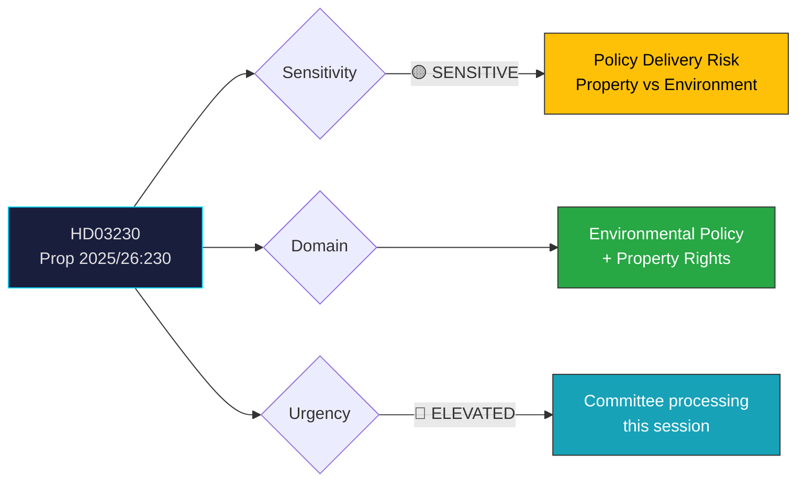

# Document Analysis: Ersättning vid rådighetsinskränkningar till följd av artskyddet

**Generated**: 2026-04-08 10:27 UTC
**dok_id**: HD03230
**Document Type**: proposition
**Committee**: MJU (Miljö- och jordbruksutskottet)
**Department**: Klimat- och näringslivsdepartementet
**Date**: 2026-04-08
**Author**: Regeringen (Johan Britz, L)
**Riksmöte**: 2025/26
**Significance**: 🟡 Medium (4/10)
**Confidence**: MEDIUM (55%)
**Analyst**: news-realtime-monitor

---

## Executive Summary

The government proposes a new compensation regime for landowners whose property rights are restricted by species protection regulations (artskyddsförordningen). This addresses a long-standing conflict between environmental protection and property rights, with significant implications for rural landowners, forestry, and the government's dual commitment to environmental sustainability and rural economic development. The proposition signals coalition alignment between M, KD, L, and SD on property rights, while potentially creating tension with environmental policy commitments. **MEDIUM confidence** — full text not available for detailed clause analysis.

---

## Political Classification

---

## SWOT Analysis

### Strengths
| # | Statement | Evidence (dok_id) | Confidence | Impact |
|---|-----------|-------------------|:----------:|:------:|
| S1 | Government addresses longstanding landowner grievance about species protection restrictions | HD03230 | M | M |
| S2 | Demonstrates coalition capacity to deliver environmental-property compromise | HD03230, HD03228 (defence materiel modernisation shows cross-domain legislative output) | M | M |

### Weaknesses
| # | Statement | Evidence (dok_id) | Confidence | Impact |
|---|-----------|-------------------|:----------:|:------:|
| W1 | May be seen as weakening species protection — environmental groups likely to object | HD03230 | M | H |
| W2 | Compensation costs create fiscal pressure alongside spring budget commitments | HD03230, Vårbudgeten 2026 | L | M |

### Opportunities
| # | Statement | Evidence (dok_id) | Confidence | Impact |
|---|-----------|-------------------|:----------:|:------:|
| O1 | Could build broader coalition support if S/C/MP accept property rights framing | HD03230 | L | M |

### Threats
| # | Statement | Evidence (dok_id) | Confidence | Impact |
|---|-----------|-------------------|:----------:|:------:|
| T1 | Environmental NGOs may challenge as EU Birds/Habitats Directive non-compliance | HD03230 | M | H |

---

## Stakeholder Perspective Analysis

| Stakeholder | Position | Impact | Evidence |
|-------------|----------|:------:|----------|
| **Rural landowners/forestry** | Strong support — addresses property restrictions | H | HD03230 proposition scope |
| **Environmental NGOs** | Likely opposition — weakening artskydd | H | General environmental policy context |
| **M/KD/L coalition** | Unified — property rights aligns with center-right values | M | HD03230 joint authorship Svantesson (M)/Britz (L) |
| **SD** | Expected support — aligns with rural voter interests | M | SD has historically supported landowner rights |
| **S/MP opposition** | Likely critical — may argue insufficient environmental safeguards | M | Policy domain context |
| **EU Commission** | Monitoring — potential infringement if compensation weakens protection | L | EU Birds/Habitats Directive framework |

---

## Risk Assessment

| Risk | Likelihood | Impact | L×I | Mitigation |
|------|:----------:|:------:|:---:|------------|
| EU non-compliance challenge | 2 | 4 | 8 | Design compensation to maintain protection effectiveness |
| Environmental backlash | 3 | 3 | 9 | Frame as fair compensation, not deregulation |
| Fiscal cost overrun | 2 | 2 | 4 | Cap compensation levels in legislation |

---

## Forward Indicators

| Indicator | Trigger | Timeline | Confidence |
|-----------|---------|----------|:----------:|
| MJU committee hearings scheduled | Committee calendar update | 2-4 weeks | M |
| Environmental org response statements | Publication of proposition full text | 1-2 weeks | H |
| Opposition motion filed in response | S or MP motion on environmental protection | 2-6 weeks | M |

---

## Cross-Document References

- **HD11689** (Miljötillstånd, Söder SD→Jonson M): Environmental permits for defence — shows parallel policy tension between environmental regulation and other policy goals
- **HD024070** (Sida humanitarian aid motion, C): Demonstrates C party's active opposition role on government accountability
- **Vårbudgeten 2026**: Fiscal context for any new compensation commitments
