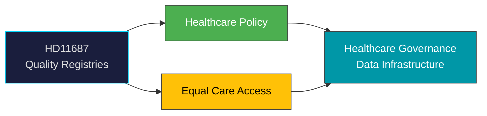

# Document Analysis: De nationella kvalitetsregistrens funktion

**Generated**: 2026-04-08 10:27 UTC | **dok_id**: HD11687 | **Type**: skriftlig fråga | **Date**: 2026-04-08
**Author**: Lena Hallengren (S) | **Recipient**: Sjukvårdsminister Elisabet Lann (KD) | **Riksmöte**: 2025/26
**Significance**: 🟢 Low-Medium (3/10) | **Confidence**: MEDIUM (55%) | **Analyst**: news-realtime-monitor

---

## Executive Summary

Former Social Minister Hallengren (S) questions Healthcare Minister Lann (KD) on national quality registries' function, financing, and role in equitable care. This connects to HD03219 (dental care audit response) — both target healthcare governance. Hallengren's status as former minister gives this institutional weight. The question frames quality registries as essential infrastructure for knowledge-based, equitable healthcare. **MEDIUM confidence** — S building healthcare narrative for 2026 election context.

---

## Political Classification

## SWOT Analysis

| Type | Statement | Evidence | Confidence | Impact |
|------|-----------|----------|:----------:|:------:|
| S1 | S deploys former minister expertise on healthcare governance scrutiny | HD11687 (Hallengren) | H | M |
| W1 | Government vulnerability on healthcare data infrastructure funding | HD11687, HD03219 dental audit | M | M |
| O1 | Quality registry reform could strengthen Swedish healthcare evidence base | HD11687 | M | M |
| T1 | S positioning healthcare as 2026 election wedge issue | HD11687, HD03219 pattern | M | H |

## Forward Indicators

| Indicator | Timeline | Confidence |
|-----------|----------|:----------:|
| Lann ministerial response | 1-2 weeks | H |
| S healthcare policy platform release | Pre-election | M |
