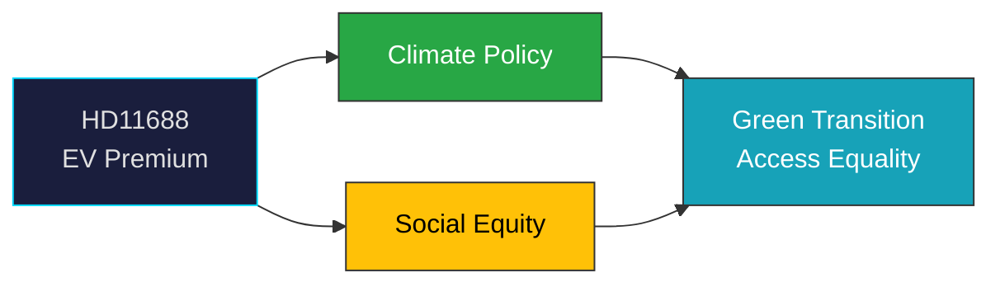

# Document Analysis: Likvärdig möjlighet att söka regeringens elbilspremie

**Generated**: 2026-04-08 10:27 UTC | **dok_id**: HD11688 | **Type**: skriftlig fråga | **Date**: 2026-04-08
**Author**: Malin Östh (V) | **Recipient**: Johan Britz (L) | **Riksmöte**: 2025/26
**Significance**: 🟢 Low (2/10) | **Confidence**: MEDIUM (50%) | **Analyst**: news-realtime-monitor

---

## Executive Summary

V MP Östh questions Climate Minister Britz (L) about inequitable access to the government's new EV premium (elbilspremie) introduced March 18, 2026. V argues the application requirements exclude certain groups from the climate incentive. This is a classic left-opposition equity critique of government climate policy — V supporting the climate goal but challenging the distribution mechanism. **MEDIUM confidence** — focused question with limited broader political implications.

---

## Political Classification

## SWOT Analysis

| Type | Statement | Evidence | Confidence | Impact |
|------|-----------|----------|:----------:|:------:|
| S1 | Government demonstrates climate commitment with EV premium | HD11688 (March 18 policy) | H | L |
| W1 | Access inequality undermines policy legitimacy | HD11688 | M | M |
| O1 | Could expand EV premium eligibility for broader political support | HD11688 | M | L |

## Forward Indicators

| Indicator | Timeline | Confidence |
|-----------|----------|:----------:|
| Britz ministerial response | 1-2 weeks | H |
| EV premium uptake statistics | Q2 2026 | M |
