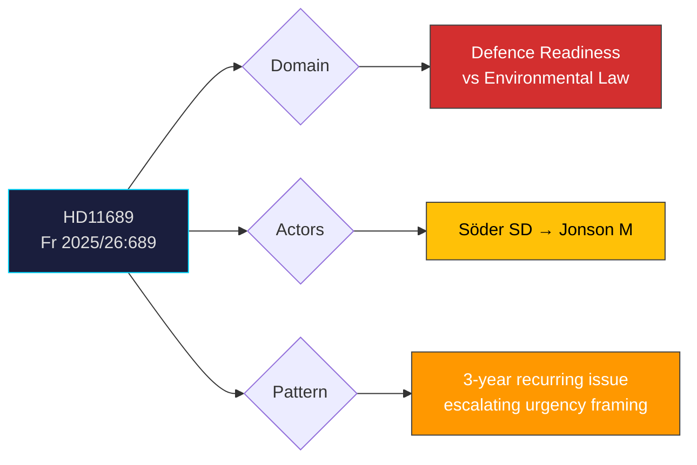

# Document Analysis: Miljötillstånd

**Generated**: 2026-04-08 10:27 UTC
**dok_id**: HD11689
**Document Type**: skriftlig fråga (written question)
**Committee**: FöU (Försvarsutskottet)
**Date**: 2026-04-08
**Author**: Björn Söder (SD)
**Party**: SD
**Recipient**: Försvarsminister Pål Jonson (M)
**Riksmöte**: 2025/26
**Significance**: 🟡 Medium (4/10)
**Confidence**: MEDIUM (55%)
**Analyst**: news-realtime-monitor

---

## Executive Summary

SD deputy speaker Björn Söder raises the issue of environmental permits impacting Försvarsmakten's operations for the third year running, framing it against "the most serious security situation since WWII." This question directly connects environmental regulation to defence readiness — a policy intersection with cross-party significance as Sweden navigates NATO membership obligations. Together with HD11690 and HD11692, this forms a coordinated SD push on defence policy directed at M's Defence Minister Jonson. **MEDIUM confidence** — sustained SD pressure pattern is clear, policy response uncertain.

---

## Political Classification

---

## SWOT Analysis

### Strengths
| # | Statement | Evidence (dok_id) | Confidence | Impact |
|---|-----------|-------------------|:----------:|:------:|
| S1 | SD demonstrates persistent policy monitoring — 3 years on same defence readiness issue | HD11689 (third year reference) | H | M |
| S2 | Aligns with NATO obligations — strengthens SD's national security credibility | HD11689, NATO FM meeting context | M | M |

### Weaknesses
| # | Statement | Evidence (dok_id) | Confidence | Impact |
|---|-----------|-------------------|:----------:|:------:|
| W1 | Three years without resolution signals government inability to deliver on defence vs environment trade-off | HD11689 | M | H |

### Threats
| # | Statement | Evidence (dok_id) | Confidence | Impact |
|---|-----------|-------------------|:----------:|:------:|
| T1 | Unresolved environmental permits could delay NATO commitments | HD11689 | M | H |
| T2 | SD may use persistent non-resolution as coalition leverage | HD11689, HD11690, HD11692 cluster | M | M |

---

## Stakeholder Perspective Analysis

| Stakeholder | Position | Impact | Evidence |
|-------------|----------|:------:|----------|
| **SD (Söder)** | Pressuring M on defence readiness obstruction | M | HD11689, 3-year follow-up |
| **M (Jonson)** | Must balance environmental law with defence needs | H | Recipient, owns defence portfolio |
| **Försvarsmakten** | Operationally constrained by environmental permits | H | HD11689 content |
| **Environmental authorities** | Legal mandate to enforce environmental protection | M | Regulatory context |

---

## Risk Assessment

| Risk | Likelihood | Impact | L×I |
|------|:----------:|:------:|:---:|
| Defence exercises delayed by permits | 3 | 4 | 12 |
| NATO readiness gap due to regulatory friction | 2 | 4 | 8 |

---

## Forward Indicators

| Indicator | Trigger | Timeline | Confidence |
|-----------|---------|----------|:----------:|
| Jonson ministerial answer | Response deadline | 1-2 weeks | H |
| FöU12 debate (civilian protection in preparedness) | Scheduled April 14 | 6 days | H |
| Environmental permit reform proposal | Government regulatory initiative | 2-6 months | L |

---

## Cross-Document References

- **HD11690** (Privata aktörer i försvaret, Wiechel SD): Parallel defence modernisation push
- **HD11692** (Beredskapspoliser, Söder SD): Same author, same recipient, same day — coordinated pressure
- **HD03230** (Species protection compensation, Prop): Related environmental vs other policy tension
