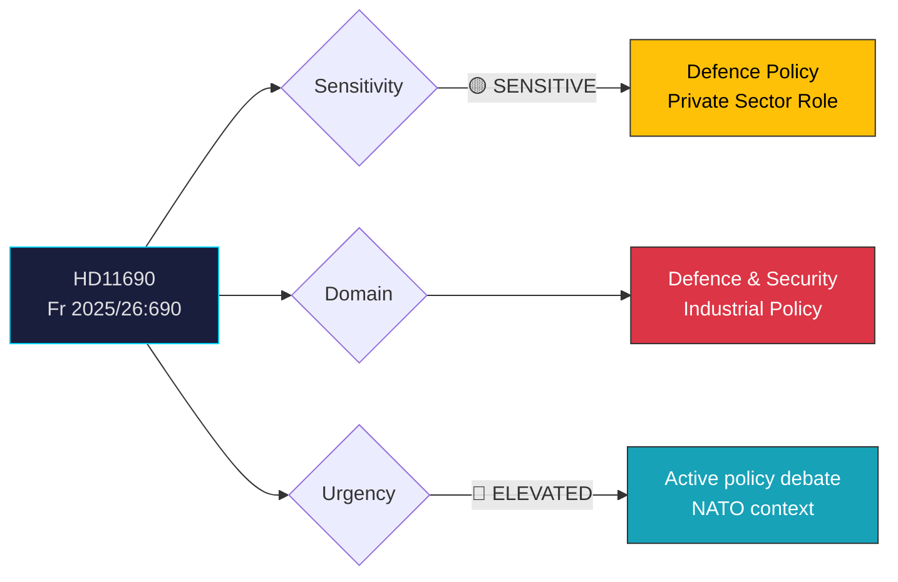

# Document Analysis: Privata aktörer i försvaret

**Generated**: 2026-04-08 10:27 UTC
**dok_id**: HD11690
**Document Type**: skriftlig fråga (written question)
**Committee**: FöU (Försvarsutskottet)
**Date**: 2026-04-08
**Author**: Markus Wiechel (SD)
**Party**: SD
**Recipient**: Försvarsminister Pål Jonson (M)
**Riksmöte**: 2025/26
**Significance**: 🟡 Medium (4/10)
**Confidence**: MEDIUM (50%)
**Analyst**: news-realtime-monitor

---

## Executive Summary

SD MP Markus Wiechel questions Defence Minister Pål Jonson (M) about the role of private actors in defence, explicitly referencing Ukraine's innovation in warfighting as a model Sweden should learn from. This is part of a coordinated cluster of 3 defence-related questions from SD today (HD11689, HD11690, HD11692), signaling SD's sustained pressure on the government coalition partner M to accelerate defence modernisation. The Ukraine reference adds foreign policy context amid Sweden's NATO membership. **MEDIUM confidence** — written questions indicate policy priorities but don't guarantee policy change.

---

## Political Classification

---

## SWOT Analysis

### Strengths
| # | Statement | Evidence (dok_id) | Confidence | Impact |
|---|-----------|-------------------|:----------:|:------:|
| S1 | SD-M alignment on defence strengthening maintains Tidö coalition stability | HD11690, HD11689, HD11692 (3 SD defence questions to M) | M | M |
| S2 | Ukraine lessons-learned framing gives policy relevance and urgency | HD11690 summary (Ukraine reference) | H | M |

### Weaknesses
| # | Statement | Evidence (dok_id) | Confidence | Impact |
|---|-----------|-------------------|:----------:|:------:|
| W1 | Private defence actors raises procurement integrity concerns | HD11690 | L | M |
| W2 | SD pushing from right may create tension with L on public-sector principles | HD11690, HD11694 (L recipient on trust positions) | L | L |

### Opportunities
| # | Statement | Evidence (dok_id) | Confidence | Impact |
|---|-----------|-------------------|:----------:|:------:|
| O1 | Defence innovation agenda could attract cross-party support given NATO context | HD11690 | M | M |

### Threats
| # | Statement | Evidence (dok_id) | Confidence | Impact |
|---|-----------|-------------------|:----------:|:------:|
| T1 | Opposition could frame private defence reliance as privatisation of national security | HD11690 | L | M |

---

## Stakeholder Perspective Analysis

| Stakeholder | Position | Impact | Evidence |
|-------------|----------|:------:|----------|
| **SD (Wiechel)** | Pushing for private sector defence innovation | M | HD11690, HD11689, HD11692 cluster |
| **M (Jonson)** | Must respond — defence is M's core policy domain | M | HD11690 recipient |
| **Defence industry** | Would benefit from expanded private sector role | H | Policy direction context |
| **Försvarsmakten** | Operationally affected by procurement model changes | H | Institutional impact |
| **NATO allies** | Interoperability benefits from innovation | L | Sweden hosting NATO FM meeting May 21-22 |

---

## Risk Assessment

| Risk | Likelihood | Impact | L×I | Mitigation |
|------|:----------:|:------:|:---:|------------|
| Procurement integrity challenges | 2 | 3 | 6 | Transparent competitive processes |
| Coalition tension on private vs public | 2 | 2 | 4 | Frame as innovation, not privatisation |

---

## Forward Indicators

| Indicator | Trigger | Timeline | Confidence |
|-----------|---------|----------|:----------:|
| Jonson's written answer (frs) | Ministerial response deadline | 1-2 weeks | H |
| FöU committee debate on defence readiness | FöU11/FöU12 scheduled April 14 | 6 days | H |
| Government defence innovation strategy | Possible in connection with NATO FM meeting | 4-6 weeks | L |

---

## Cross-Document References

- **HD11689** (Miljötillstånd, Söder SD→Jonson M): Environmental permits blocking defence operations — parallel SD-M defence pressure
- **HD11692** (Beredskapspoliser, Söder SD→Jonson M): Preparedness police — third SD defence question today
- **HD03228** (Prop: Modernised defence materiel framework): Government already legislating on defence modernisation
- **FöU11/FöU12**: Committee reports on defence scheduled for debate April 14
