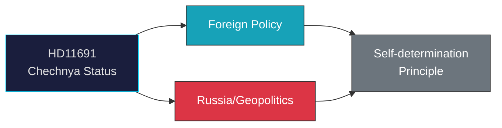

# Document Analysis: Tjetjeniens status

**Generated**: 2026-04-08 10:27 UTC | **dok_id**: HD11691 | **Type**: skriftlig fråga | **Date**: 2026-04-08
**Author**: Markus Wiechel (SD) | **Recipient**: Utrikesminister Maria Malmer Stenergard (M) | **Riksmöte**: 2025/26
**Significance**: 🟢 Low (2/10) | **Confidence**: LOW (40%) | **Analyst**: news-realtime-monitor

---

## Executive Summary

Wiechel (SD) raises Chechnya's status as a Russian republic with a history of independence struggle, directed at Foreign Minister Malmer Stenergard (M). This foreign policy question connects to broader Russia/Ukraine policy context. While Chechnya's self-determination is an established geopolitical topic, the Swedish Riksdag has limited direct influence. **LOW confidence** — foreign policy question with symbolic rather than actionable implications.

---

## Political Classification

## SWOT Analysis

| Type | Statement | Evidence | Confidence | Impact |
|------|-----------|----------|:----------:|:------:|
| S1 | SD demonstrates engagement with geopolitical human rights issues | HD11691 | M | L |
| W1 | Limited Swedish policy levers on Chechnya's status | HD11691 | H | L |
| O1 | Could contribute to broader Russia strategy narrative | HD11691, Ukraine context | L | L |

## Forward Indicators

| Indicator | Timeline | Confidence |
|-----------|----------|:----------:|
| Malmer Stenergard response | 1-2 weeks | H |
| NATO FM meeting agenda items | May 21-22 | L |
