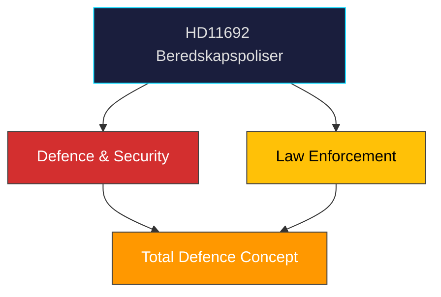

# Document Analysis: Beredskapspoliser

**Generated**: 2026-04-08 10:27 UTC | **dok_id**: HD11692 | **Type**: skriftlig fråga | **Date**: 2026-04-08
**Author**: Björn Söder (SD) | **Recipient**: Försvarsminister Pål Jonson (M) | **Riksmöte**: 2025/26
**Significance**: 🟢 Low-Medium (3/10) | **Confidence**: MEDIUM (50%) | **Analyst**: news-realtime-monitor

---

## Executive Summary

Söder (SD) questions the preparedness police concept following SOU 2025:57, which proposes using police students and retired officers. SD wants broader mobilisation capacity separating military and police functions. Third of three coordinated SD defence questions today (with HD11689, HD11690). **MEDIUM confidence** — policy direction uncertain pending government response.

---

## Political Classification

---

## SWOT Analysis

| Type | Statement | Evidence | Confidence | Impact |
|------|-----------|----------|:----------:|:------:|
| S1 | SD demonstrates comprehensive total-defence vision | HD11692, HD11689, HD11690 cluster | M | M |
| W1 | SOU 2025:57 limited scope may disappoint broader preparedness advocates | HD11692 SOU reference | M | L |
| O1 | Cross-party agreement on total defence could accelerate implementation | FöU12 committee report context | M | M |
| T1 | Police resource constraints could undermine preparedness police concept | HD11692 | L | M |

## Stakeholder Analysis

| Stakeholder | Position | Evidence |
|-------------|----------|----------|
| SD (Söder) | Pushing for expanded preparedness police beyond SOU scope | HD11692 |
| M (Jonson) | Must respond on government's total defence vision | Recipient |
| Police authorities | Operationally affected by preparedness police proposals | SOU 2025:57 |

## Forward Indicators

| Indicator | Timeline | Confidence |
|-----------|----------|:----------:|
| Jonson ministerial response | 1-2 weeks | H |
| FöU12 debate on civilian protection | April 14 | H |
| Government total defence proposition | 3-6 months | L |
