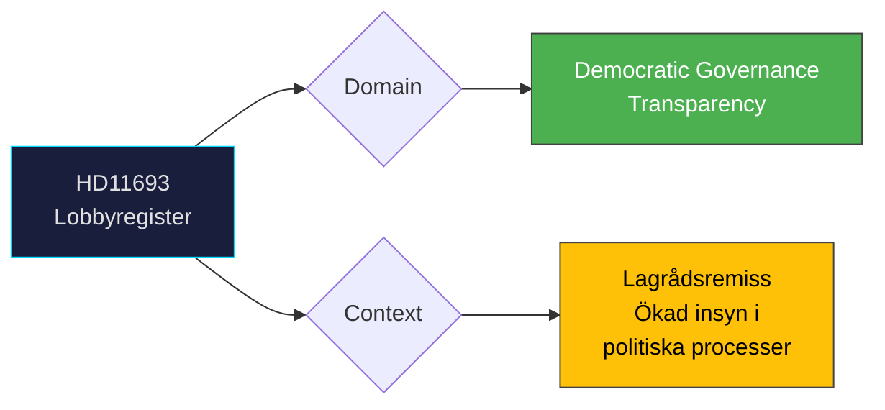

# Document Analysis: Lobbyregister

**Generated**: 2026-04-08 10:27 UTC | **dok_id**: HD11693 | **Type**: skriftlig fråga | **Date**: 2026-04-08
**Author**: Markus Wiechel (SD) | **Recipient**: Justitieminister Gunnar Strömmer (M) | **Riksmöte**: 2025/26
**Significance**: 🟡 Medium (4/10) | **Confidence**: MEDIUM (55%) | **Analyst**: news-realtime-monitor

---

## Executive Summary

Wiechel (SD) questions Justice Minister Strömmer (M) about the newly proposed lobby register following the government's lagrådsremiss "Ökad insyn i politiska processer." This is significant as it represents a concrete democratic transparency reform — a lobby register would increase accountability in Swedish political processes. The timing suggests SD is pushing for even stronger transparency measures than what the government proposed. **MEDIUM confidence** — lagrådsremiss exists, legislation likely in pipeline.

---

## Political Classification

---

## SWOT Analysis

| Type | Statement | Evidence | Confidence | Impact |
|------|-----------|----------|:----------:|:------:|
| S1 | Government has already sent lagrådsremiss — shows legislative momentum on transparency | HD11693 summary | H | M |
| S2 | Cross-party transparency interest strengthens democratic legitimacy | HD11693 (SD), KU38 (parliamentary process report) | M | M |
| W1 | Lobby register scope may be too narrow if limited to certain communication types | HD11693 | M | M |
| O1 | Sweden could become Nordic transparency leader with comprehensive lobby register | HD11693, international comparison | M | H |
| T1 | Industry/lobbying groups may resist implementation | HD11693 | M | M |

## Stakeholder Analysis

| Stakeholder | Position | Evidence |
|-------------|----------|----------|
| SD (Wiechel) | Pushing for comprehensive lobby transparency | HD11693 |
| M (Strömmer) | Leading legislative process via lagrådsremiss | Recipient |
| Civil society/media | Strong interest in transparency reform | Democratic accountability context |
| Lobbying industry | Potentially resistant to mandatory registration | Policy impact |

## Forward Indicators

| Indicator | Timeline | Confidence |
|-----------|----------|:----------:|
| Lagråd opinion on lobby register bill | 2-4 weeks | H |
| Government proposition to Riksdag | This session (2025/26) | M |
| KU committee processing | 4-8 weeks after proposition | M |
