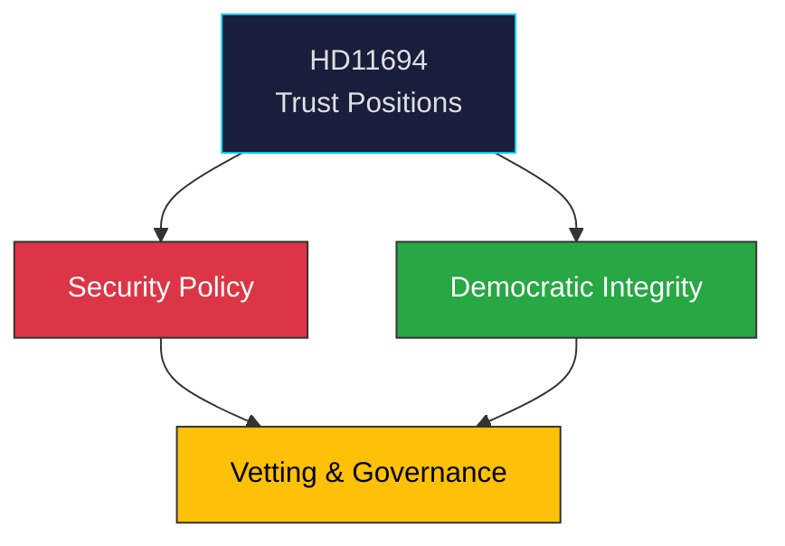

# Document Analysis: Offentliga förtroendeuppdrag

**Generated**: 2026-04-08 10:27 UTC | **dok_id**: HD11694 | **Type**: skriftlig fråga | **Date**: 2026-04-08
**Author**: Markus Wiechel (SD) | **Recipient**: Lotta Edholm (L) | **Riksmöte**: 2025/26
**Significance**: 🟢 Low (2/10) | **Confidence**: LOW (40%) | **Analyst**: news-realtime-monitor

---

## Executive Summary

Wiechel (SD) questions Education Minister Edholm (L) about security vetting of public trust positions, framing it within "security twilight" (säkerhetspolitiskt skymningsläge) and threats to democracy. This connects democratic integrity with security policy — a theme across multiple SD questions today. The question directed at L (coalition partner) rather than M suggests SD probing L's policy alignment on security matters. **LOW confidence** — written question with uncertain policy response likelihood.

---

## Political Classification

## SWOT Analysis

| Type | Statement | Evidence | Confidence | Impact |
|------|-----------|----------|:----------:|:------:|
| S1 | SD demonstrates broad security awareness beyond defence | HD11694 | M | L |
| W1 | Question to L (not M) may signal internal coalition tension on security scope | HD11694 | L | L |
| T1 | Overly broad security vetting could chill academic/civic freedom | HD11694 | L | M |

## Forward Indicators

| Indicator | Timeline | Confidence |
|-----------|----------|:----------:|
| Edholm ministerial response | 1-2 weeks | H |
