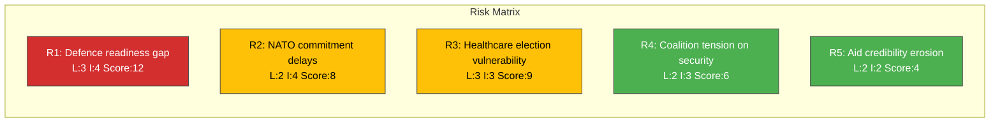

# Risk Assessment — 2026-04-08

**Generated**: 2026-04-08 10:27 UTC | **Workflow**: news-realtime-monitor (run 1027)
**Documents**: 11 | **Confidence**: MEDIUM (55%) | **Produced By**: news-realtime-monitor AI agent

---

## Risk Matrix

## Detailed Risk Register

| ID | Risk | Likelihood (1-5) | Impact (1-5) | Score | Trend | Key Evidence |
|----|------|:-----------------:|:------------:|:-----:|:-----:|-------------|
| R1 | Defence environmental permits block exercises | 3 | 4 | 12 | ↗️ | HD11689 (3-year recurring) |
| R2 | NATO readiness gap from regulatory friction | 2 | 4 | 8 | → | HD11689, HD11690 |
| R3 | S builds healthcare narrative for 2026 election | 3 | 3 | 9 | ↗️ | HD11687, HD03219 |
| R4 | SD probes coalition partner alignment on security | 2 | 3 | 6 | → | HD11694 (SD→L) |
| R5 | Sida aid management gaps weaken Sweden's international standing | 2 | 2 | 4 | → | HD024070 |

## Cascading Risk Pathways

| Primary Risk | Cascading To | Mechanism | Timeline |
|--------------|-------------|-----------|----------|
| R1 Defence permits | R2 NATO delays | Unresolved permits → exercise cancellation → capability gap | 3-12 months |
| R3 Healthcare narrative | Electoral risk | S healthcare platform → voter mobilisation | By Sept 2026 election |
| R4 Coalition tension | Government stability | SD probing L → policy disagreements → coalition friction | Ongoing |
