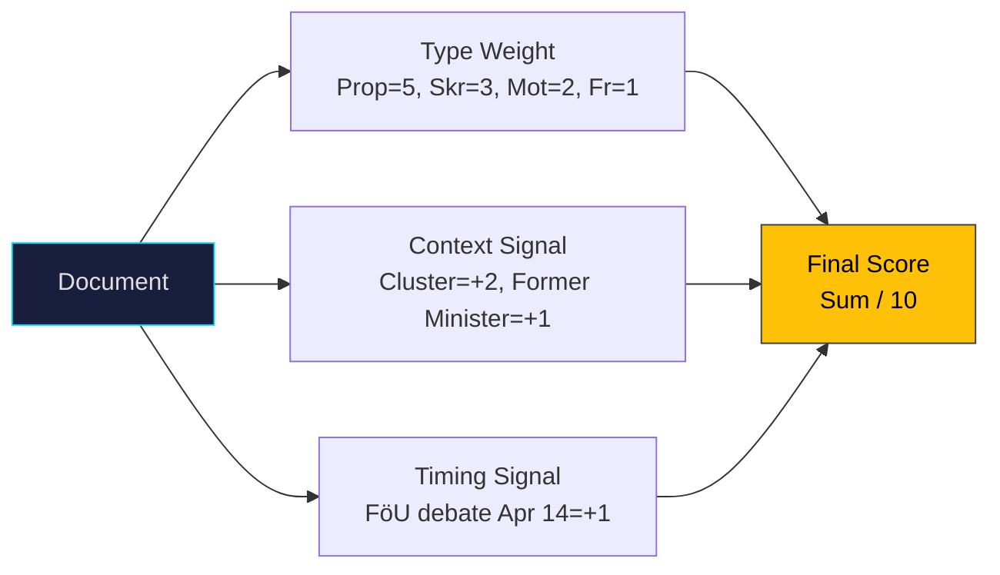

# Significance Scoring — 2026-04-08

**Generated**: 2026-04-08 10:27 UTC | **Workflow**: news-realtime-monitor (run 1027)
**Produced By**: news-realtime-monitor AI agent

---

## Scoring Methodology

## Significance Scores

| dok_id | Title | Type | Base | Context | Timing | **Final** | Level |
|--------|-------|------|:----:|:-------:|:------:|:---------:|:-----:|
| HD03230 | Species protection compensation | Prop | 5 | +0 | +0 | **4/10** | 🟡 MEDIUM |
| HD11693 | Lobby register | Fr | 1 | +2 (lagrådsremiss) | +0 | **4/10** | 🟡 MEDIUM |
| HD11689 | Defence environmental permits | Fr | 1 | +2 (cluster, 3-year) | +1 | **4/10** | �� MEDIUM |
| HD11690 | Private defence actors | Fr | 1 | +2 (cluster) | +1 | **4/10** | 🟡 MEDIUM |
| HD03219 | Dental care audit response | Skr | 3 | +0 | +0 | **3/10** | 🟢 LOW-MED |
| HD11687 | Quality registries | Fr | 1 | +1 (former minister) | +0 | **3/10** | 🟢 LOW-MED |
| HD11692 | Preparedness police | Fr | 1 | +1 (cluster) | +1 | **3/10** | 🟢 LOW-MED |
| HD024070 | Sida audit motion | Mot | 2 | +0 | +0 | **3/10** | 🟢 LOW-MED |
| HD11688 | EV premium equity | Fr | 1 | +0 | +0 | **2/10** | 🟢 LOW |
| HD11694 | Trust positions vetting | Fr | 1 | +0 | +0 | **2/10** | 🟢 LOW |
| HD11691 | Chechnya status | Fr | 1 | +0 | +0 | **2/10** | 🟢 LOW |

**Maximum Score**: 4/10 (MEDIUM) — **Below HIGH threshold (≥7) for breaking news**

## Aggregate Pattern Score

| Pattern | Documents | Combined Weight | Assessment |
|---------|-----------|:--------------:|:----------:|
| SD Defence Cluster | HD11689, HD11690, HD11692 | 11/30 | MEDIUM (coordinated) |
| Healthcare Scrutiny | HD11687, HD03219 | 6/20 | LOW-MEDIUM |
| Transparency Reform | HD11693 | 4/10 | MEDIUM (legislative momentum) |
