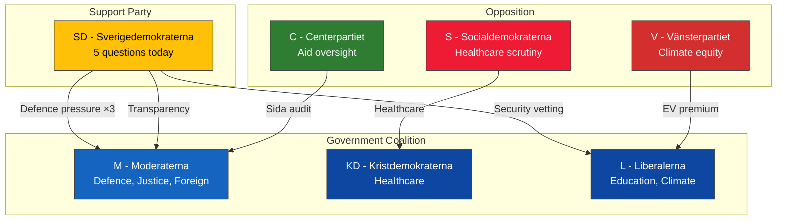

# Stakeholder Perspectives — 2026-04-08

**Generated**: 2026-04-08 10:27 UTC | **Workflow**: news-realtime-monitor (run 1027)
**Confidence**: MEDIUM (55%) | **Produced By**: news-realtime-monitor AI agent

---

## Stakeholder Map

## Detailed Perspectives

| Stakeholder | Today's Activity | Strategic Position | Key Documents |
|-------------|-----------------|-------------------|---------------|
| **SD** | 5 written questions (most active) | Pressuring coalition on defence + governance | HD11689, HD11690, HD11691, HD11692, HD11693, HD11694 |
| **M** | Recipient of 4 questions + 2 gov docs | Defending policy across defence, justice, foreign affairs | HD03230, HD03219 |
| **KD** | Recipient of 1 healthcare question | Under scrutiny on healthcare governance | HD11687 |
| **L** | Recipient of 2 questions | Under pressure on climate equity + security scope | HD11688, HD11694 |
| **S** | 1 healthcare question (former minister) | Building healthcare narrative with institutional weight | HD11687 |
| **V** | 1 climate equity question | Classic equity critique of government policy | HD11688 |
| **C** | 1 motion (Sida audit) | Active oversight using Riksrevisionen findings | HD024070 |
| **Government** | 2 new documents (prop + skr) | Managing policy across multiple domains | HD03230, HD03219 |
