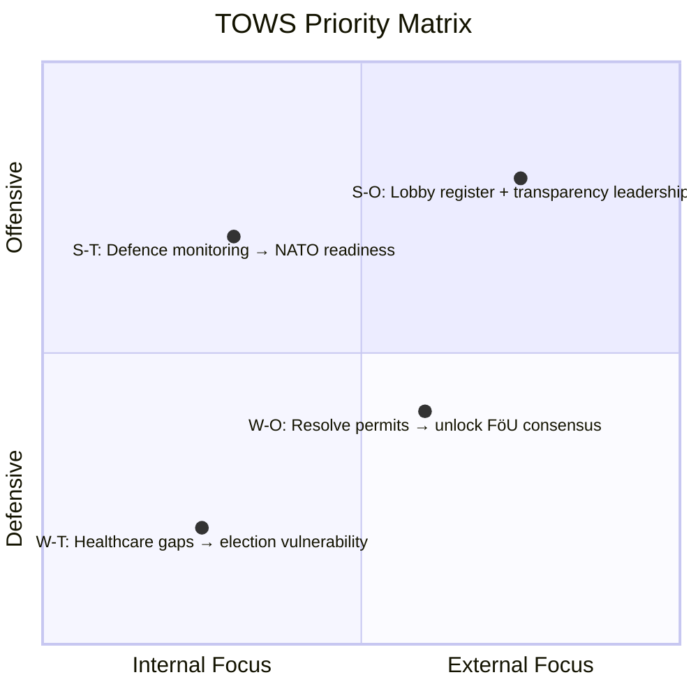

# SWOT Analysis — 2026-04-08

**Generated**: 2026-04-08 10:27 UTC | **Workflow**: news-realtime-monitor (run 1027)
**Documents**: 11 | **Confidence**: MEDIUM (55%) | **Produced By**: news-realtime-monitor AI agent

---

## Aggregate SWOT

### Strengths

| # | Statement | Evidence (dok_id) | Domain | Confidence | Impact |
|---|-----------|-------------------|--------|:----------:|:------:|
| S1 | Government advancing transparency reform via lobby register lagrådsremiss | HD11693 | Governance | H | M |
| S2 | HD03230 proposition balances environmental protection with property rights compensation | HD03230 | Environment | H | M |
| S3 | Active parliamentary oversight through written questions (8 new today) | HD11687-HD11694 | Democracy | H | M |
| S4 | SD demonstrates systematic defence policy monitoring across 3 years | HD11689 | Defence | M | M |
| S5 | S deploys former minister expertise for institutional healthcare scrutiny | HD11687 | Healthcare | H | M |

### Weaknesses

| # | Statement | Evidence (dok_id) | Domain | Confidence | Impact |
|---|-----------|-------------------|--------|:----------:|:------:|
| W1 | 3-year unresolved environmental permit issue for defence exercises | HD11689 | Defence | M | H |
| W2 | Dental care equity gaps acknowledged but unresolved by government audit response | HD03219 | Healthcare | M | M |
| W3 | EV premium access inequality undermines climate policy effectiveness | HD11688 | Climate | M | M |
| W4 | Sida humanitarian aid management deficiencies identified by Riksrevisionen | HD024070 | Foreign Aid | M | M |

### Opportunities

| # | Statement | Evidence (dok_id) | Domain | Confidence | Impact |
|---|-----------|-------------------|--------|:----------:|:------:|
| O1 | Lobby register could make Sweden a Nordic transparency leader | HD11693 | Governance | M | H |
| O2 | Species protection compensation framework could resolve longstanding legal disputes | HD03230 | Environment | M | M |
| O3 | FöU11/FöU12 debates (April 14) provide platform for defence modernisation consensus | HD11689, HD11690, HD11692 | Defence | M | M |
| O4 | Quality registry reform could strengthen Swedish healthcare evidence base | HD11687 | Healthcare | M | M |

### Threats

| # | Statement | Evidence (dok_id) | Domain | Confidence | Impact |
|---|-----------|-------------------|--------|:----------:|:------:|
| T1 | Environmental permits could delay NATO defence commitments | HD11689 | Defence | M | H |
| T2 | SD using sustained non-resolution as coalition leverage tool | HD11689, HD11690, HD11692 cluster | Politics | M | M |
| T3 | S positioning healthcare as 2026 election wedge issue | HD11687, HD03219 | Healthcare | M | H |
| T4 | Continued Sida management gaps undermine Sweden's international reputation | HD024070 | Foreign Aid | L | M |

---

## TOWS Strategy Matrix

| Strategy | Approach | Key Documents |
|----------|----------|---------------|
| **S-O** (Offensive) | Leverage transparency reform momentum for comprehensive lobby register | HD11693 |
| **S-T** (Diversionary) | Use SD's defence monitoring to accelerate NATO readiness fixes | HD11689, HD11690, HD11692 |
| **W-O** (Reorienting) | Resolve environmental permit backlog before FöU debates April 14 | HD11689, HD03230 |
| **W-T** (Defensive) | Address healthcare governance gaps before S builds election narrative | HD11687, HD03219 |

---

## Domain Heat Map

| Domain | Strengths | Weaknesses | Opportunities | Threats | Net Assessment |
|--------|:---------:|:----------:|:-------------:|:-------:|:--------------:|
| Defence & Security | 1 | 1 | 1 | 2 | ⚠️ Watch |
| Healthcare | 1 | 1 | 1 | 1 | ⚠️ Watch |
| Democratic Governance | 2 | 0 | 1 | 0 | ✅ Positive |
| Environment | 1 | 0 | 1 | 0 | ✅ Positive |
| Climate/Energy | 0 | 1 | 0 | 0 | ➖ Neutral |
| Foreign Aid | 0 | 1 | 0 | 1 | ⚠️ Watch |
| Foreign Policy | 0 | 0 | 0 | 0 | ➖ Neutral |
