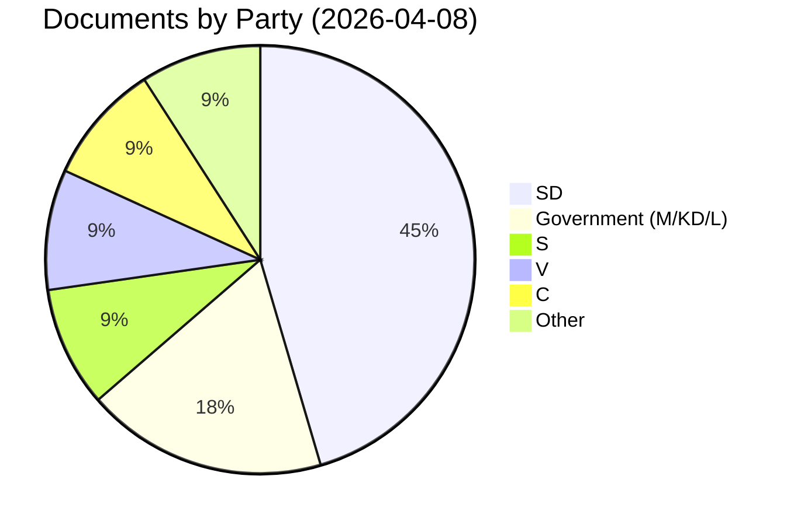

# Daily Synthesis Summary — 2026-04-08

**Generated**: 2026-04-08 10:27 UTC
**Workflow**: news-realtime-monitor (run 1027)
**Riksmöte**: 2025/26
**Documents Analyzed**: 11
**Overall Confidence**: MEDIUM (55%)
**Overall Risk Level**: LOW-MEDIUM
**Produced By**: news-realtime-monitor AI agent

---

## Executive Overview

April 8, 2026 shows moderate parliamentary activity dominated by written questions and two government documents. No votes were held (last vote March 4, AU10). Three significant patterns emerge: (1) a **coordinated SD defence policy push** with three questions to Defence Minister Jonson on the same day, (2) **S healthcare scrutiny** through former minister Hallengren, and (3) **government transparency reform** via the lobby register legislation pathway.

### Key Findings

1. **SD Defence Cluster** (HD11689, HD11690, HD11692): Söder and Wiechel (SD) filed three coordinated questions targeting Defence Minister Jonson (M) covering environmental permits for military exercises, private defence sector actors, and preparedness police — a systematic probe of defence readiness ahead of FöU11/FöU12 committee debates on April 14.

2. **Species Protection Proposition** (HD03230): New government proposition on compensation for species protection restrictions — balances environmental protection with property rights. Referred to MJU committee.

3. **Dental Care Audit Response** (HD03219): Government skrivelse responding to Riksrevisionen's audit of dental care reform implementation, acknowledging equity gaps identified by the auditor.

4. **Lobby Register Progress** (HD11693): Wiechel (SD) questions Justice Minister on lobby register following lagrådsremiss — transparency legislation advancing through the pipeline.

5. **Spring Budget 2026 Context**: Yesterday's (April 7) presentation of Spring Budget with SEK 18.7B in additional spending forms the fiscal backdrop for all policy discussions.

---

## Cross-Document Pattern Analysis

```mermaid
graph TB
    subgraph "SD Defence Cluster"
        HD11689["HD11689<br/>Environmental Permits<br/>Söder→Jonson"]
        HD11690["HD11690<br/>Private Defence Actors<br/>Wiechel→Jonson"]
        HD11692["HD11692<br/>Preparedness Police<br/>Söder→Jonson"]
    end
    
    subgraph "Healthcare Scrutiny"
        HD11687["HD11687<br/>Quality Registries<br/>Hallengren S→Lann KD"]
        HD03219["HD03219<br/>Dental Care Audit<br/>Gov Skrivelse"]
    end
    
    subgraph "Government Propositions"
        HD03230["HD03230<br/>Species Protection<br/>Compensation"]
    end
    
    subgraph "Democratic Governance"
        HD11693["HD11693<br/>Lobby Register<br/>Wiechel SD→Strömmer M"]
        HD11694["HD11694<br/>Trust Positions<br/>Wiechel SD→Edholm L"]
    end
    
    subgraph "Other"
        HD11688["HD11688<br/>EV Premium<br/>Östh V→Britz L"]
        HD11691["HD11691<br/>Chechnya Status<br/>Wiechel SD→Malmer Stenergard M"]
        HD024070["HD024070<br/>Sida Audit Motion<br/>C party"]
    end
    
    HD11689 -.->|same author, same recipient| HD11692
    HD11690 -.->|same recipient| HD11689
    HD11687 -.->|healthcare policy| HD03219
    HD11693 -.->|transparency theme| HD11694
    
    style HD11689 fill:#D32F2F,stroke:#424242,color:#FFFFFF
    style HD11690 fill:#D32F2F,stroke:#424242,color:#FFFFFF
    style HD11692 fill:#D32F2F,stroke:#424242,color:#FFFFFF
    style HD11687 fill:#FFC107,stroke:#424242,color:#000000
    style HD03219 fill:#FFC107,stroke:#424242,color:#000000
    style HD03230 fill:#4CAF50,stroke:#424242,color:#FFFFFF
    style HD11693 fill:#0097A7,stroke:#424242,color:#FFFFFF
    style HD11694 fill:#0097A7,stroke:#424242,color:#FFFFFF
    style HD11688 fill:#9E9E9E,stroke:#424242,color:#FFFFFF
    style HD11691 fill:#9E9E9E,stroke:#424242,color:#FFFFFF
    style HD024070 fill:#9E9E9E,stroke:#424242,color:#FFFFFF
```

---

## Party Activity Summary

| Party | Documents | Key Themes |
|-------|:---------:|------------|
| **SD** | 5 | Defence readiness (×3), democratic transparency (×2) |
| **Government** | 2 | Species protection (Prop), dental care audit (Skr) |
| **S** | 1 | Healthcare quality registries |
| **V** | 1 | EV premium equity |
| **C** | 1 | Sida humanitarian aid oversight |

---

## Policy Domain Distribution

| Domain | Documents | Significance Range |
|--------|:---------:|:------------------:|
| Defence & Security | HD11689, HD11690, HD11692 | 3-4/10 |
| Healthcare | HD11687, HD03219 | 3/10 |
| Environment & Property | HD03230 | 4/10 |
| Democratic Governance | HD11693, HD11694 | 2-4/10 |
| Climate/Energy | HD11688 | 2/10 |
| Foreign Policy | HD11691 | 2/10 |
| Development Aid | HD024070 | 3/10 |

---

## Forward-Looking Indicators

| Event | Date | Relevance | Confidence |
|-------|------|-----------|:----------:|
| FöU11/FöU12 committee debates (defence) | April 14 | Directly responds to SD defence cluster | H |
| Ministerial answers to 8 written questions | April 15-22 | Government policy signals | H |
| UU committee schedules Sida motion | April-May | C opposition oversight outcome | M |
| Lagråd opinion on lobby register | April-May | Transparency reform progress | M |
| Spring budget Riksdag processing | May-June | Fiscal framework for all policy | H |

---

## Assessment

**Breaking News Threshold**: NOT MET (max individual score 4/10, below ≥7 threshold)

**Key Insight**: The most significant pattern is SD's coordinated defence policy push — three questions on the same day to the same minister is unusual and signals a deliberate strategy. With FöU debates in 6 days, expect this to escalate. The healthcare scrutiny by S with former minister Hallengren also bears monitoring for election positioning.
