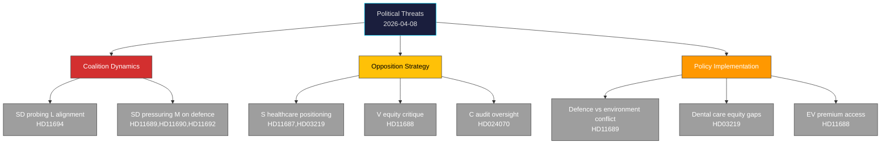

# Threat Analysis — 2026-04-08

**Generated**: 2026-04-08 10:27 UTC | **Workflow**: news-realtime-monitor (run 1027)
**Confidence**: MEDIUM (55%) | **Produced By**: news-realtime-monitor AI agent

---

## Threat Taxonomy

## Primary Threats

| Threat | Source | Target | Severity | Evidence |
|--------|--------|--------|:--------:|----------|
| Coalition friction on security scope | SD | L (Edholm) | LOW | HD11694 |
| Sustained defence readiness pressure | SD | M (Jonson) | MEDIUM | HD11689, HD11690, HD11692 |
| Healthcare election positioning | S | KD (Lann), Government | MEDIUM | HD11687, HD03219 |
| Climate policy equity critique | V | L (Britz) | LOW | HD11688 |
| Aid management accountability | C | Government/Sida | LOW | HD024070 |

## Assessment

No immediate HIGH-severity threats detected. The SD defence cluster represents a coordinated medium-term pressure campaign that will likely escalate at the FöU11/FöU12 debates on April 14. The S healthcare scrutiny pattern is building but not yet at crisis level.
