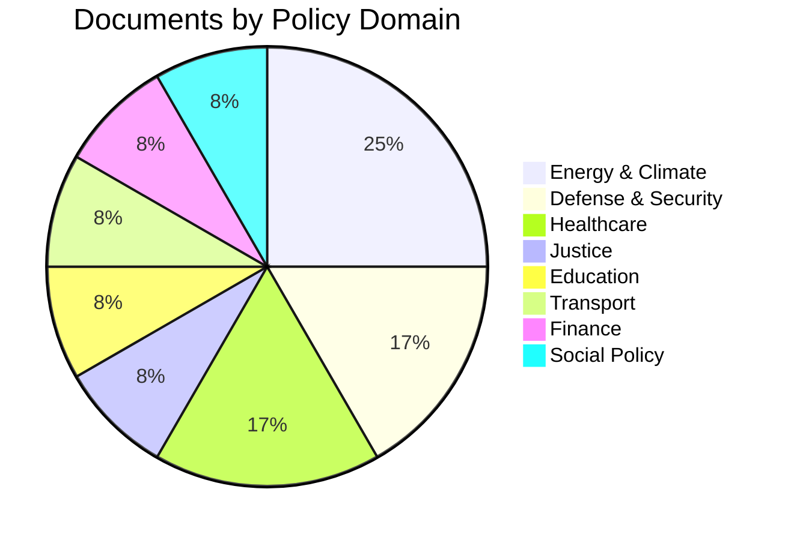

# Classification Results — 2026-04-08 Realtime Monitor

**Generated**: 2026-04-08 11:46 UTC
**Run ID**: realtime-1146
**Documents Classified**: 12
**Produced By**: news-realtime-monitor (AI-driven analysis)

---

## Document Classification Table

| dok_id | Type | Title | Policy Domain | Significance | Committee |
|--------|------|-------|--------------|-------------|-----------|
| HD01NU18 | bet | Tillståndsprövning enligt förnybartdirektivet | Energy & Climate | 5/10 🟡 | NU |
| HD03230 | prop | Ersättning vid rådighetsinskränkningar till följd av artskyddet | Environment / Property | 4/10 🟡 | MJU |
| HD03219 | skr | Riksrevisionens rapport om tandvårdsstödet | Healthcare | 3/10 🟢 | SoU |
| HD11690 | fr | Privata försvarsaktörer | Defense & Security | 4/10 🟡 | FöU |
| HD11692 | fr | Beredskapspoliser | Internal Security / Defense | 4/10 🟡 | JuU |
| HD11672 | fr | Written question (energy) | Energy | 2/10 🟢 | NU |
| HD11673 | fr | Written question (justice) | Justice | 2/10 🟢 | JuU |
| HD11674 | fr | Written question (health) | Healthcare | 2/10 🟢 | SoU |
| HD11680 | fr | Written question (education) | Education | 1/10 �� | UbU |
| HD11681 | fr | Written question (transport) | Transport | 1/10 🟢 | TU |
| HD11685 | fr | Written question (finance) | Finance | 1/10 🟢 | FiU |
| HD11688 | fr | Written question (social) | Social Policy | 1/10 🟢 | SoU |

---

## Classification by Policy Domain

## Classification by Significance

| Level | Count | Documents |
|-------|-------|-----------|
| 🟡 Medium (4-5) | 4 | HD01NU18, HD03230, HD11690, HD11692 |
| 🟢 Low (1-3) | 8 | HD03219 + 7 written questions |
| 🔴 High (7+) | 0 | None |
