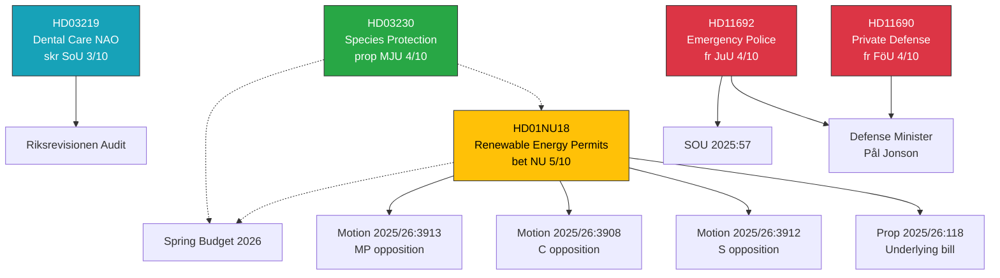

# Cross-Reference Map — 2026-04-08 Realtime Monitor

**Generated**: 2026-04-08 11:46 UTC
**Run ID**: realtime-1146
**Produced By**: news-realtime-monitor (AI-driven analysis)

---

## Document Relationship Graph

---

## Cross-Reference Table

| Source dok_id | Target dok_id / Reference | Relationship | Strength |
|---------------|--------------------------|-------------|----------|
| HD01NU18 | Prop 2025/26:118 | Recommends adoption | Direct |
| HD01NU18 | Motion 2025/26:3912 | Opposition response | Direct |
| HD01NU18 | Motion 2025/26:3908 | Opposition response | Direct |
| HD01NU18 | Motion 2025/26:3913 | Opposition response | Direct |
| HD01NU18 | HD03230 | Same-day energy/env reform | Thematic |
| HD01NU18 | Spring Budget 2026 | Fiscal context | Contextual |
| HD03230 | HD01NU18 | Environmental regulation reform | Thematic |
| HD03219 | Riksrevisionen audit | Government response to audit | Direct |
| HD11690 | HD11692 | SD defense questioning pattern | Pattern |
| HD11690 | Pål Jonson (M) | Question-answer | Direct |
| HD11692 | SOU 2025:57 | References investigation | Direct |
| HD11692 | Pål Jonson (M) | Question-answer | Direct |

---

## Cluster Analysis

| Cluster | Documents | Theme | Cohesion |
|---------|-----------|-------|----------|
| **A: Energy/Environmental Reform** | HD01NU18, HD03230 | EU compliance, permit reform | High |
| **B: SD Defense Activism** | HD11690, HD11692 | Defense/security oversight | High |
| **C: Routine Oversight** | HD03219 + 7 written questions | Standard parliamentary activity | Low |
