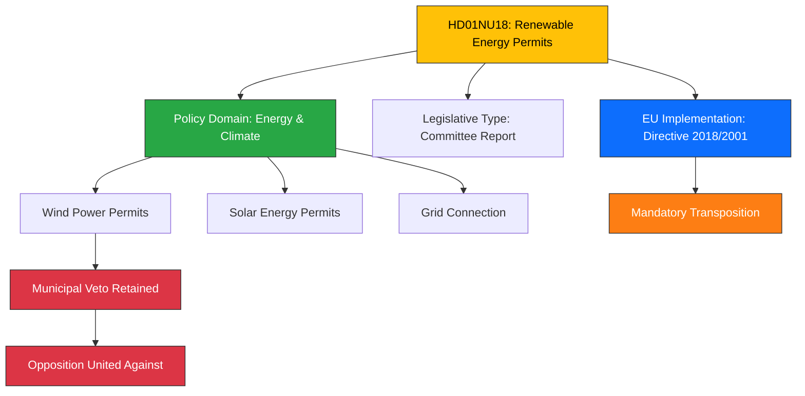

# Document Analysis: Tillståndsprövning enligt förnybartdirektivet

**Generated**: 2026-04-08 11:48 UTC
**dok_id**: HD01NU18
**Document Type**: betänkande (committee report)
**Committee**: NU (Näringsutskottet / Committee on Industry and Trade)
**Date**: 2026-04-08
**Author**: Tobias Andersson (SD), chair
**Party**: Cross-party (all 8 parliamentary parties)
**Riksmöte**: 2025/26
**Significance**: 🟡 Medium (5/10)
**Confidence**: HIGH (85%)
**Source MCP Tool**: get_betankanden, get_dokument
**Analysis Timestamp**: 2026-04-08 11:50 UTC
**Analyst**: news-realtime-monitor

---

## 🎯 Executive Summary

The Näringsutskottet recommends parliament adopt a new law on renewable energy activities (Prop. 2025/26:118), implementing EU Renewable Energy Directive permit procedures. This creates Sweden's first comprehensive permit framework for renewable energy, amending the Environmental Code (miljöbalken), Planning and Building Act, and Electricity Act. Six reservations from all four opposition parties (S, V, C, MP) signal deep political fault lines on wind power policy — particularly the municipal veto. Entry into force: **1 July 2026**. **[HIGH confidence]**

---

## 📊 Classification

---

## SWOT Analysis

### Strengths

| # | Statement | Evidence (dok_id) | Confidence | Impact |
|---|-----------|-------------------|------------|--------|
| S1 | Creates unified legal framework replacing fragmented permit rules | HD01NU18 (new law + 8 amending laws) | HIGH | HIGH |
| S2 | Implements binding EU directive, avoiding infringement proceedings | HD01NU18 (Directive 2018/2001 transposition) | HIGH | HIGH |
| S3 | Cross-party committee majority supports adoption | HD01NU18 (M, SD, KD, L majority) | HIGH | MEDIUM |

### Weaknesses

| # | Statement | Evidence (dok_id) | Confidence | Impact |
|---|-----------|-------------------|------------|--------|
| W1 | Municipal veto on wind power retained — blocks deployment | HD01NU18 Reservation 5 (S, V, MP oppose) | HIGH | HIGH |
| W2 | Opposition parties S, V, C, MP file 6 reservations — signals political fragility | HD01NU18 (6 reservations across all points) | HIGH | MEDIUM |
| W3 | Tight timeline for July 2026 entry into force | HD01NU18 (legislative schedule) | MEDIUM | MEDIUM |

### Opportunities

| # | Statement | Evidence (dok_id) | Confidence | Impact |
|---|-----------|-------------------|------------|--------|
| O1 | Faster permit processing could accelerate green transition | HD01NU18 (time-limit provisions) | MEDIUM | HIGH |
| O2 | May attract renewable energy investment to Sweden | HD01NU18 (legal certainty for investors) | MEDIUM | HIGH |

### Threats

| # | Statement | Evidence (dok_id) | Confidence | Impact |
|---|-----------|-------------------|------------|--------|
| T1 | Municipal veto may undermine EU compliance if wind deployment stalls | HD01NU18 Reservation 5 vs. EU targets | MEDIUM | HIGH |
| T2 | After 2026 election, incoming government could reverse framework | HD01NU18 (S+V+C+MP oppose key provisions) | LOW | HIGH |

---

## Stakeholder Perspective Analysis

| Stakeholder | Position | Evidence | Impact |
|-------------|----------|----------|--------|
| **Government Coalition (M+SD+KD+L)** | Supports adoption — balances EU compliance with municipal autonomy | HD01NU18 majority recommendation | Direct legislative win |
| **Opposition (S)** | Wants faster timelines, shorter deadlines, municipal veto reform | Reservations 1,3,4,5,6 (Fredrik Olovsson) | Signal for 2026 election platform |
| **Opposition (V)** | Supports faster processing but opposes some coalition provisions | Reservations 2,3,4,5,6 (Birger Lahti) | Left-green energy alliance |
| **Opposition (C)** | Wants better coordination and shorter deadlines | Reservations 1,3 (Catarina Deremar) | Rural energy policy focus |
| **Opposition (MP)** | Wants amendment permits, municipal veto reform, faster timelines | Reservations 2,4,5 (Katarina Luhr/Linus Lakso) | Core environmental agenda |
| **Energy Industry** | Benefits from legal certainty but frustrated by municipal veto | Indirect (permit predictability) | Investment decisions |
| **Municipalities** | Retain veto power over wind power — key local governance issue | HD01NU18 point 5 preserved | Local democratic control |
| **EU Commission** | Monitoring transposition compliance — directive deadline pressure | Directive 2018/2001 (recast) | Infringement risk |

---

## Cross-Document References

- **HD03230** (Prop. 2025/26:230): Species protection compensation — related environmental/energy tension
- **NU17** (HD01NU17): Electricity market issues — ongoing Näringsutskottet energy policy debates
- **Prop. 2025/26:118**: The underlying government proposition this betänkande recommends adopting

---

## Significance Assessment

**Overall Score**: 5/10 — 🟡 Medium

**Scoring Factors**:
- Committee report type: +2 (legislative recommendation)
- Energy/climate policy domain: +2 (EU directive implementation)
- All 4 opposition parties file reservations: +2 (cross-party significance)
- Municipal veto retention: +1 (contentious local governance)
- No immediate crisis/vote margin issue: -2

---

## Key Insights

1. **Municipal veto is the political flashpoint**: The retained kommunalt veto on wind power unites S, V, and MP in opposition — this will be a 2026 election issue.
2. **EU compliance pressure**: Sweden must transpose by set deadline or risk infringement — this creates urgency regardless of domestic politics.
3. **New law scope**: Creates unified framework (1 new law + 8 amendments) — most comprehensive energy legislation this riksmöte.
4. **Opposition alignment**: S+V+C+MP united on 3 of 6 reservations — signals potential alternative government energy policy.

## Data Quality Notes

- **Analysis confidence**: HIGH (85%)
- **Full-text content**: Available — detailed committee report with reservations
- **Named actors**: Tobias Andersson (SD chair), Fredrik Olovsson (S), Birger Lahti (V), Catarina Deremar (C), Katarina Luhr (MP), Linus Lakso (MP)
- **Data sources**: get_betankanden, get_dokument (full text)
- **Analysis method**: 6-lens stakeholder analysis with SWOT extraction, cross-document mapping
