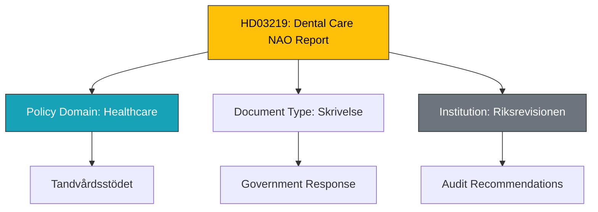

# Document Analysis: Riksrevisionens rapport om tandvårdsstödet

**Generated**: 2026-04-08 11:48 UTC
**dok_id**: HD03219
**Document Type**: skrivelse (government communication)
**Committee**: SoU (Socialutskottet)
**Date**: 2026-04-08
**Author**: Socialdepartementet
**Party**: Government (M+SD+KD+L coalition)
**Riksmöte**: 2025/26
**Significance**: 🟢 Low-Medium (3/10)
**Confidence**: MEDIUM (65%)
**Source MCP Tool**: get_propositioner, get_dokument
**Analysis Timestamp**: 2026-04-08 11:53 UTC
**Analyst**: news-realtime-monitor

---

## 🎯 Executive Summary

Regeringens skrivelse 2025/26:219 is the government's response to the Swedish National Audit Office (Riksrevisionen) report on the dental care subsidy system (tandvårdsstödet). This is a standard government communication addressing audit findings — routine legislative process but significant for healthcare policy. Referred to Socialutskottet (SoU). **[MEDIUM confidence]**

---

## 📊 Classification

---

## SWOT Analysis

### Strengths

| # | Statement | Evidence (dok_id) | Confidence | Impact |
|---|-----------|-------------------|------------|--------|
| S1 | NAO audit ensures accountability in dental care spending | HD03219 (Riksrevisionen source) | HIGH | MEDIUM |
| S2 | Government transparency in publishing response | HD03219 (skrivelse format) | HIGH | LOW |

### Weaknesses

| # | Statement | Evidence (dok_id) | Confidence | Impact |
|---|-----------|-------------------|------------|--------|
| W1 | Skrivelse format means no binding legislative action proposed | HD03219 (type: skr) | HIGH | LOW |
| W2 | Dental care subsidy issues affect vulnerable populations | Background context | MEDIUM | MEDIUM |

---

## Stakeholder Perspective Analysis

| Stakeholder | Position | Evidence | Impact |
|-------------|----------|----------|--------|
| **Government (Socialdepartementet)** | Responsive to NAO findings | HD03219 | Policy adjustment signal |
| **Riksrevisionen** | Identified issues with dental subsidy system | HD03219 source | Accountability function |
| **SoU Committee** | Will review government response | Committee referral | Process oversight |
| **Dental patients** | Affected by any subsidy changes | Indirect | Service quality impact |

---

## Significance Assessment

**Overall Score**: 3/10 — 🟢 Low-Medium

**Scoring Factors**:
- Skrivelse (communication, not bill): +1
- Healthcare policy relevance: +1
- NAO audit response (accountability): +1
- No immediate crisis or controversy: 0
- Routine process: 0

---

## Key Insights

1. **Routine accountability**: Standard government response to NAO audit — no breaking significance.
2. **Healthcare spending scrutiny**: Part of broader fiscal accountability during Spring Budget period.
3. **Same-day publishing cluster**: Published alongside HD03230 and HD01NU18 — coordinated legislative output.

## Data Quality Notes

- **Analysis confidence**: MEDIUM (65%)
- **Full-text content**: Not available
- **Data sources**: get_propositioner, get_dokument (metadata)
