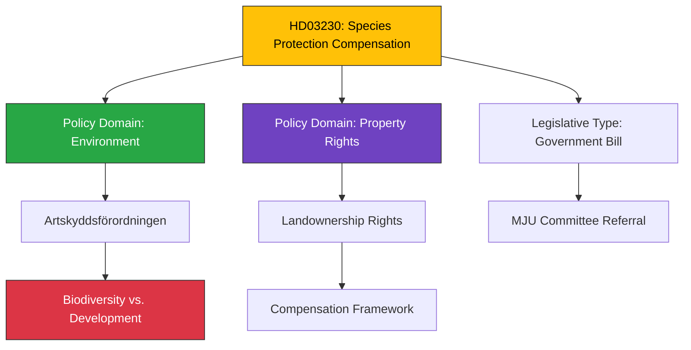

# Document Analysis: Ersättning vid rådighetsinskränkningar till följd av artskyddet

**Generated**: 2026-04-08 11:48 UTC
**dok_id**: HD03230
**Document Type**: proposition (government bill)
**Committee**: MJU (Miljö- och jordbruksutskottet)
**Date**: 2026-04-08
**Author**: Klimat- och näringslivsdepartementet
**Party**: Government (M+SD+KD+L coalition)
**Riksmöte**: 2025/26
**Significance**: 🟡 Medium (4/10)
**Confidence**: MEDIUM (70%)
**Source MCP Tool**: get_propositioner, get_dokument
**Analysis Timestamp**: 2026-04-08 11:52 UTC
**Analyst**: news-realtime-monitor

---

## 🎯 Executive Summary

Proposition 2025/26:230 addresses compensation for property owners whose land-use rights are restricted due to species protection regulations. This is a politically significant balancing act between environmental conservation and property rights — a recurring tension in Swedish policy. Referred to Miljö- och jordbruksutskottet (MJU). Published today, signaling the government's continued push to reform environmental regulation. **[MEDIUM confidence]**

---

## 📊 Classification

---

## SWOT Analysis

### Strengths

| # | Statement | Evidence (dok_id) | Confidence | Impact |
|---|-----------|-------------------|------------|--------|
| S1 | Addresses longstanding grievance of forest/land owners affected by species protection | HD03230 (compensation framework) | MEDIUM | HIGH |
| S2 | Strengthens legal certainty for property owners | HD03230 (clear compensation rules) | MEDIUM | MEDIUM |

### Weaknesses

| # | Statement | Evidence (dok_id) | Confidence | Impact |
|---|-----------|-------------------|------------|--------|
| W1 | May weaken de facto species protection if compensation costs deter enforcement | HD03230 (fiscal impact) | LOW | MEDIUM |
| W2 | Full text not available for detailed policy assessment | HD03230 (metadata only) | HIGH | LOW |

### Opportunities

| # | Statement | Evidence (dok_id) | Confidence | Impact |
|---|-----------|-------------------|------------|--------|
| O1 | Could reduce conflicts between conservation and rural economy | HD03230 | MEDIUM | MEDIUM |
| O2 | Relates to broader environmental permitting reform (see HD01NU18) | HD01NU18, HD03230 cross-reference | MEDIUM | MEDIUM |

### Threats

| # | Statement | Evidence (dok_id) | Confidence | Impact |
|---|-----------|-------------------|------------|--------|
| T1 | Environmental organizations may challenge as weakening biodiversity protections | HD03230 vs. EU Habitats Directive | LOW | MEDIUM |
| T2 | Fiscal cost of compensation scheme uncertain | HD03230 | LOW | MEDIUM |

---

## Stakeholder Perspective Analysis

| Stakeholder | Position | Evidence | Impact |
|-------------|----------|----------|--------|
| **Government** | Proponent — reform of species protection framework | HD03230 from Klimat- och näringslivsdep. | Legislative agenda priority |
| **LRF (Federation of Swedish Farmers)** | Likely supports — longstanding demand for compensation | Background context | Direct beneficiary |
| **Environmental NGOs** | Likely opposes if weakening protections | Background context (Habitats Directive) | Advocacy pressure |
| **MJU Committee** | Will review and potentially add conditions | Committee referral | Legislative process |

---

## Cross-Document References

- **HD01NU18**: Renewable energy permits — parallel environmental regulation reform
- **Spring Budget 2026**: Environmental policy spending context
- **HD03219**: NAO dental care report — same-day government publishing pattern

---

## Significance Assessment

**Overall Score**: 4/10 — 🟡 Medium

**Scoring Factors**:
- Government proposition type: +2
- Environment/property rights intersection: +2
- No immediate crisis: -1
- Limited full-text data: -1
- Single-committee referral: +1

---

## Key Insights

1. **Environmental reform package**: Published same day as NU18 energy permits — government coordinating environmental/energy reform.
2. **Property rights emphasis**: Signals coalition's priority on property owner compensation over environmental restrictions.
3. **EU tension**: Species protection derives from EU Habitats Directive — compensation may need careful EU law alignment.

## Data Quality Notes

- **Analysis confidence**: MEDIUM (70%)
- **Full-text content**: Not available (HTML extraction returned null)
- **Data sources**: get_propositioner, get_dokument (metadata + snippet)
- **Limitation**: Analysis based on title, snippet, and committee referral metadata
