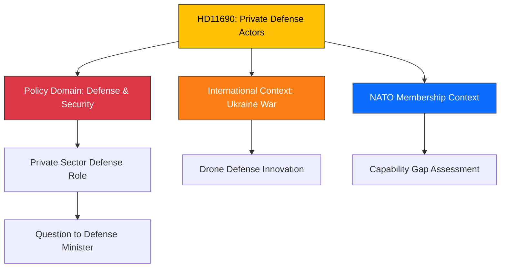

# Document Analysis: Privata försvarsaktörer

**Generated**: 2026-04-08 11:48 UTC
**dok_id**: HD11690
**Document Type**: fr (skriftlig fråga / written question)
**Committee**: FöU (Försvarsutskottet)
**Date**: 2026-04-08
**Author**: Markus Wiechel (SD)
**Party**: SD (Sverigedemokraterna)
**Riksmöte**: 2025/26
**Significance**: 🟡 Medium (4/10)
**Confidence**: HIGH (90%)
**Source MCP Tool**: search_dokument, get_dokument (full text)
**Analysis Timestamp**: 2026-04-08 11:54 UTC
**Analyst**: news-realtime-monitor

---

## 🎯 Executive Summary

Markus Wiechel (SD) poses a written question to Defense Minister Pål Jonson (M) about the role of private actors in Swedish defense, specifically referencing Ukraine's innovative use of private air defense units against Russian drone attacks. The question probes whether Sweden should expand private sector involvement in defense capabilities — a policy-relevant question given Sweden's new NATO membership and the ongoing Russian threat environment. **[HIGH confidence — full text available]**

---

## 📊 Classification

---

## SWOT Analysis

### Strengths

| # | Statement | Evidence (dok_id) | Confidence | Impact |
|---|-----------|-------------------|------------|--------|
| S1 | Raises innovative defense policy using real-world Ukraine evidence | HD11690 (references private air defense against drones) | HIGH | MEDIUM |
| S2 | Timely given Sweden's NATO membership and defense buildup | HD11690 + NATO context | HIGH | MEDIUM |
| S3 | Bipartisan potential — SD (coalition support party) questioning M defense minister | HD11690 (intra-coalition dialogue) | HIGH | LOW |

### Weaknesses

| # | Statement | Evidence (dok_id) | Confidence | Impact |
|---|-----------|-------------------|------------|--------|
| W1 | Written question format — limited legislative impact | HD11690 (fr type) | HIGH | LOW |
| W2 | Private defense actors raise accountability/oversight concerns | Background context | MEDIUM | MEDIUM |

### Opportunities

| # | Statement | Evidence (dok_id) | Confidence | Impact |
|---|-----------|-------------------|------------|--------|
| O1 | Could spark broader debate on defense innovation and private sector role | HD11690 | MEDIUM | MEDIUM |
| O2 | Ukraine lessons applicable to Swedish Total Defense concept | HD11690 (Ukraine reference) | HIGH | HIGH |

### Threats

| # | Statement | Evidence (dok_id) | Confidence | Impact |
|---|-----------|-------------------|------------|--------|
| T1 | Private military/defense actors carry international law risks | Background context | LOW | MEDIUM |

---

## Stakeholder Perspective Analysis

| Stakeholder | Position | Evidence | Impact |
|-------------|----------|----------|--------|
| **Markus Wiechel (SD)** | Proponent — wants expanded private defense role | HD11690 (questioner) | Policy agenda-setting |
| **Pål Jonson (M), Defense Minister** | Will respond — likely cautious given institutional preferences | HD11690 (respondent) | Ministerial position |
| **Defense Industry** | Would benefit from expanded mandate | Indirect | Commercial opportunity |
| **Försvarsmakten** | Institutional preference for state control | Background | Organizational interest |

---

## Cross-Document References

- **HD11692**: Björn Söder (SD) on emergency police — parallel SD defense/security questioning pattern
- **NATO context**: Sweden's NATO membership (2024) increases defense capability requirements
- **Spring Budget 2026**: Defense spending allocations

---

## Significance Assessment

**Overall Score**: 4/10 — 🟡 Medium

**Scoring Factors**:
- Written question type: +1 (low legislative weight)
- Defense/security domain in NATO context: +2
- Ukraine war reference / innovation angle: +1
- Intra-coalition dynamics (SD questioning M): +1
- No immediate crisis: -1

---

## Key Insights

1. **Ukraine lessons for Sweden**: First explicit parliamentary question linking Ukrainian private air defense innovation to Swedish defense policy.
2. **SD defense activism**: Pattern of SD defense/security questions (see also HD11692) — positioning for defense committee influence.
3. **NATO capability gap**: Implicitly questions whether Sweden's defense is innovative enough for NATO obligations.
4. **Drone defense relevance**: The specific reference to drone defense is highly relevant given current military technology trends.

## Data Quality Notes

- **Analysis confidence**: HIGH (90%)
- **Full-text content**: Available — complete question text with Ukrainian drone defense reference
- **Named actors**: Markus Wiechel (SD, questioner), Pål Jonson (M, Defense Minister, respondent)
- **Data sources**: search_dokument, get_dokument (full text)
