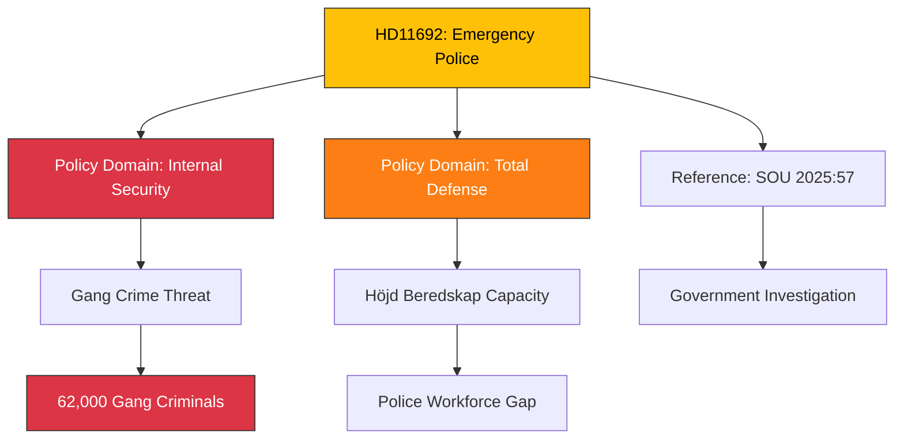

# Document Analysis: Beredskapspoliser

**Generated**: 2026-04-08 11:48 UTC
**dok_id**: HD11692
**Document Type**: fr (skriftlig fråga / written question)
**Committee**: JuU (Justitieutskottet)
**Date**: 2026-04-08
**Author**: Björn Söder (SD)
**Party**: SD (Sverigedemokraterna)
**Riksmöte**: 2025/26
**Significance**: 🟡 Medium (4/10)
**Confidence**: HIGH (90%)
**Source MCP Tool**: search_dokument, get_dokument (full text)
**Analysis Timestamp**: 2026-04-08 11:55 UTC
**Analyst**: news-realtime-monitor

---

## 🎯 Executive Summary

Björn Söder (SD) asks Defense Minister Pål Jonson (M) about emergency police (beredskapspoliser), referencing SOU 2025:57 which examined the concept. Söder cites 62,000 gang criminals and questions whether Sweden has sufficient police capacity during heightened readiness ("höjd beredskap"). This touches on the intersection of internal security, total defense, and organized crime — a politically charged topic. **[HIGH confidence — full text available]**

---

## 📊 Classification

---

## SWOT Analysis

### Strengths

| # | Statement | Evidence (dok_id) | Confidence | Impact |
|---|-----------|-------------------|------------|--------|
| S1 | Addresses real police capacity gap during crisis situations | HD11692 (höjd beredskap context) | HIGH | MEDIUM |
| S2 | References formal government investigation (SOU 2025:57) | HD11692 | HIGH | MEDIUM |
| S3 | Connects gang crime to national defense — novel threat framing | HD11692 (62,000 criminals + beredskap) | HIGH | MEDIUM |

### Weaknesses

| # | Statement | Evidence (dok_id) | Confidence | Impact |
|---|-----------|-------------------|------------|--------|
| W1 | Written question format — advisory only | HD11692 (fr type) | HIGH | LOW |
| W2 | Emergency police concept has historical baggage (disbanded 2012) | Background context | MEDIUM | LOW |

### Opportunities

| # | Statement | Evidence (dok_id) | Confidence | Impact |
|---|-----------|-------------------|------------|--------|
| O1 | Could revive beredskapspoliser concept in new security context | HD11692 + SOU 2025:57 | MEDIUM | MEDIUM |

### Threats

| # | Statement | Evidence (dok_id) | Confidence | Impact |
|---|-----------|-------------------|------------|--------|
| T1 | Rapid deployment of reserve police raises civil liberties concerns | Background context | LOW | MEDIUM |

---

## Stakeholder Perspective Analysis

| Stakeholder | Position | Evidence | Impact |
|-------------|----------|----------|--------|
| **Björn Söder (SD)** | Proponent — wants emergency police capacity expanded | HD11692 | Policy agenda |
| **Pål Jonson (M), Defense Minister** | Will respond — likely references SOU 2025:57 findings | HD11692 | Government position |
| **Polismyndigheten** | Institutional interest in capacity expansion | Background | Resource implications |
| **Criminal justice organizations** | Mixed — capacity vs. rights balance | Background | Oversight |

---

## Cross-Document References

- **HD11690**: Markus Wiechel (SD) on private defense actors — parallel SD security questioning (same day)
- **SOU 2025:57**: Government investigation on emergency police — foundation for question
- **Spring Budget 2026**: Law enforcement spending allocations

---

## Significance Assessment

**Overall Score**: 4/10 — 🟡 Medium

**Scoring Factors**:
- Written question type: +1
- Internal security + total defense intersection: +2
- Gang crime framing (politically salient): +1
- SOU reference (evidence-based): +1
- No immediate crisis trigger: -1

---

## Key Insights

1. **SD coordinated security push**: Two SD written questions on defense/security same day (HD11690 + HD11692) — systematic pressure on defense portfolio.
2. **Crime-defense nexus**: Framing 62,000 gang criminals as a national security threat during heightened readiness is a novel political argument.
3. **SOU 2025:57 follow-up**: Signals SD wants faster government action on emergency police investigation.
4. **Total defense integration**: Connects internal police capacity to external defense readiness — key for Sweden's comprehensive defense concept.

## Data Quality Notes

- **Analysis confidence**: HIGH (90%)
- **Full-text content**: Available — complete question with SOU 2025:57 reference and 62,000 figure
- **Named actors**: Björn Söder (SD, questioner), Pål Jonson (M, Defense Minister, respondent)
- **Data sources**: search_dokument, get_dokument (full text)
