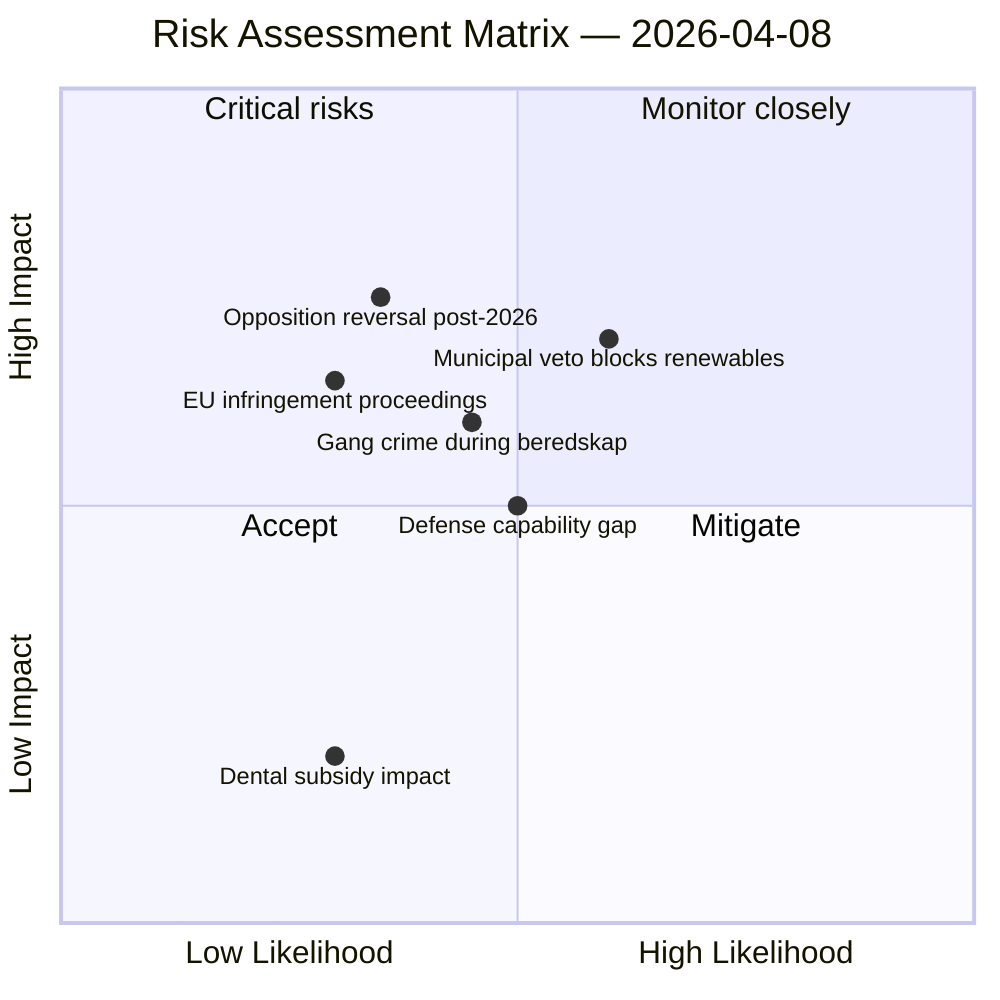

# Risk Assessment — 2026-04-08 Realtime Monitor

**Generated**: 2026-04-08 11:46 UTC
**Run ID**: realtime-1146
**Overall Risk Level**: 🟢 LOW
**Overall Confidence**: HIGH
**Produced By**: news-realtime-monitor (AI-driven analysis)

---

## Risk Matrix

---

## Identified Risks

### R1: Municipal veto undermines EU renewable energy targets

| Attribute | Value |
|-----------|-------|
| **Likelihood** | MEDIUM (60%) |
| **Impact** | HIGH |
| **Risk Level** | 🟡 MEDIUM |
| **Source** | HD01NU18 Reservation 5 |
| **Description** | Retained municipal veto on wind power may prevent sufficient renewable energy deployment to meet EU 2030 targets |
| **Mitigation** | Legislative follow-up or voluntary municipal cooperation frameworks |

### R2: Post-2026 election policy reversal

| Attribute | Value |
|-----------|-------|
| **Likelihood** | LOW (35%) |
| **Impact** | HIGH |
| **Risk Level** | 🟡 MEDIUM |
| **Source** | HD01NU18 (S+V+C+MP united opposition) |
| **Description** | Incoming S-led government could significantly alter energy framework if winning 2026 election |
| **Mitigation** | EU directive creates floor — reversal limited by treaty obligations |

### R3: Police capacity gap during heightened readiness

| Attribute | Value |
|-----------|-------|
| **Likelihood** | MEDIUM (45%) |
| **Impact** | MEDIUM-HIGH |
| **Risk Level** | 🟡 MEDIUM |
| **Source** | HD11692 (SOU 2025:57, 62,000 gang criminals) |
| **Description** | Insufficient police capacity during höjd beredskap, compounded by organized crime threat |
| **Mitigation** | SOU 2025:57 recommendations, emergency police concept revival |

### R4: Defense capability gap in private sector innovation

| Attribute | Value |
|-----------|-------|
| **Likelihood** | MEDIUM (50%) |
| **Impact** | MEDIUM |
| **Risk Level** | 🟢 LOW-MEDIUM |
| **Source** | HD11690 (Ukraine drone defense reference) |
| **Description** | Sweden may lack innovative private defense partnerships compared to Ukraine model |
| **Mitigation** | Defense review, NATO cooperation, private sector engagement |

---

## Risk Summary

| Risk | Level | Trend |
|------|-------|-------|
| R1: Municipal veto vs. EU targets | 🟡 MEDIUM | → Stable (legislative action taken but veto retained) |
| R2: Post-election reversal | 🟡 MEDIUM | → Stable (depends on election outcome) |
| R3: Police capacity gap | 🟡 MEDIUM | → Stable (SOU 2025:57 under review) |
| R4: Defense innovation gap | 🟢 LOW-MEDIUM | ↗ Rising (NATO obligations increasing) |

---

## Overall Assessment

No HIGH-risk or CRITICAL-risk items identified in today's parliamentary activity. The primary risk cluster is around **energy policy** (R1 + R2) where the government has taken legislative action but retained a structural weakness (municipal veto). Defense/security risks (R3 + R4) are systemic rather than acute.

**Breaking news risk trigger**: ❌ None detected
