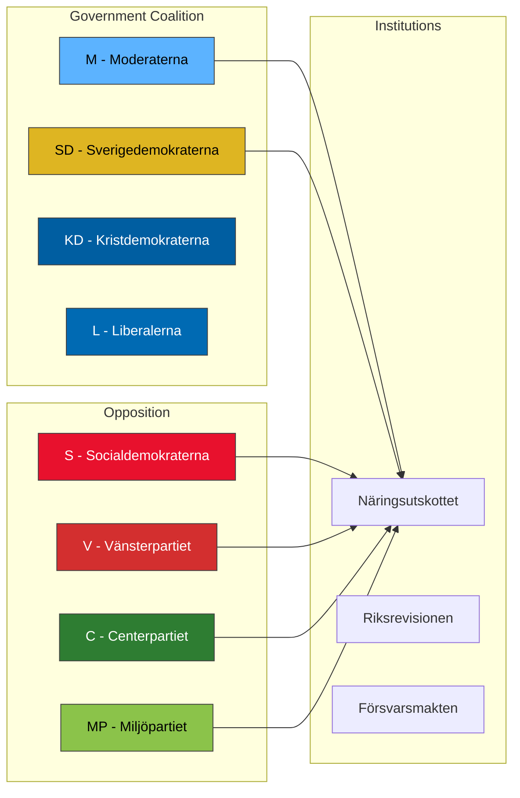

# Stakeholder Perspectives — 2026-04-08 Realtime Monitor

**Generated**: 2026-04-08 11:46 UTC
**Run ID**: realtime-1146
**Produced By**: news-realtime-monitor (AI-driven analysis)

---

## Key Stakeholders Today

---

## Stakeholder Position Matrix

| Stakeholder | Energy Permits (NU18) | Species Protection (230) | Defense Questions |
|-------------|----------------------|--------------------------|-------------------|
| **M** | ✅ Supports (coalition lead) | ✅ Supports (proposing) | Receiving questions |
| **SD** | ✅ Supports (committee chair) | ✅ Supports | Asking questions (HD11690, HD11692) |
| **KD** | ✅ Supports | ✅ Supports | N/A |
| **L** | ✅ Supports | ✅ Supports | N/A |
| **S** | ⚠️ 5 reservations | TBD | N/A |
| **V** | ⚠️ 5 reservations | TBD | N/A |
| **C** | ⚠️ 2 reservations | TBD | N/A |
| **MP** | ⚠️ 4 reservations | TBD | N/A |

---

## Named Actors

| Person | Party | Role | Action |
|--------|-------|------|--------|
| Tobias Andersson | SD | NU Committee Chair | Signed NU18 report |
| Fredrik Olovsson | S | NU member | Filed motions 3912 (5 yrkanden) |
| Rickard Nordin | C | NU opposition | Filed motion 3908 (2 yrkanden) |
| Linus Lakso | MP | NU opposition | Filed motion 3913 (4 yrkanden) |
| Birger Lahti | V | NU member | Co-signed reservations |
| Markus Wiechel | SD | Riksdagsledamot | Written question HD11690 |
| Björn Söder | SD | Riksdagsledamot | Written question HD11692 |
| Pål Jonson | M | Defense Minister | Respondent for HD11690, HD11692 |

---

## Key Dynamics

1. **Coalition cohesion**: M+SD+KD+L united on NU18 — strong government position
2. **Opposition fragmentation**: S, V, C, MP file overlapping but not identical reservations — not fully united
3. **SD dual role**: Supports energy legislation via committee chair while independently questioning defense minister
4. **S strategic positioning**: 5 reservations signal 2026 election platform on energy policy
