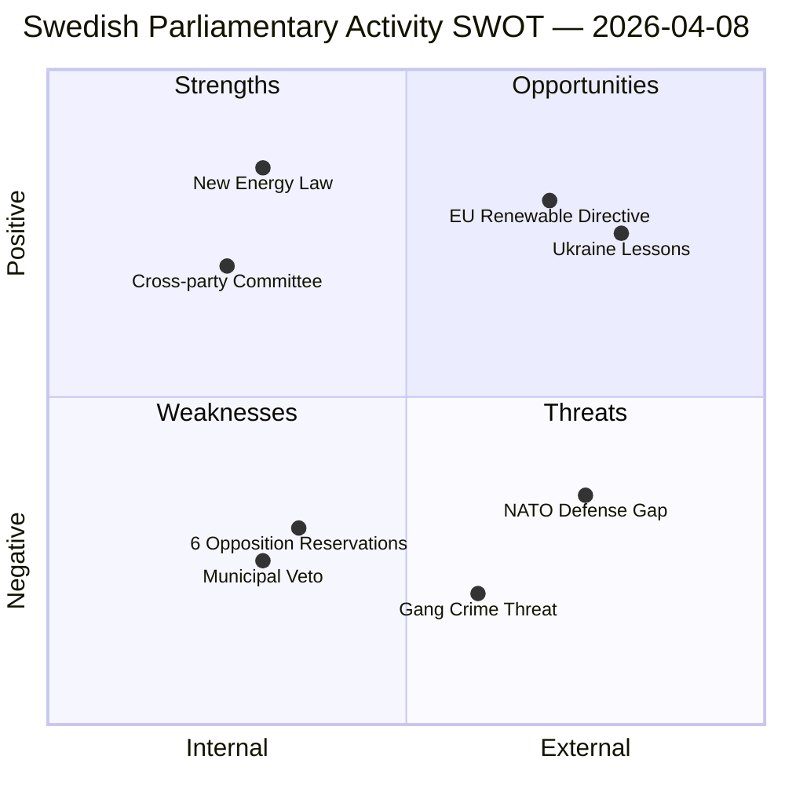

# SWOT Analysis — 2026-04-08 Realtime Monitor

**Generated**: 2026-04-08 11:46 UTC
**Run ID**: realtime-1146
**Scope**: 12 documents from riksmöte 2025/26
**Overall Confidence**: HIGH
**Produced By**: news-realtime-monitor (AI-driven analysis)

---

## 📊 SWOT Quadrant Map

---

## Strengths

| # | Statement | Evidence (dok_id) | Confidence | Impact |
|---|-----------|-------------------|------------|--------|
| S1 | New comprehensive renewable energy law creates unified permit framework | HD01NU18 (1 new law + 8 amendments) | HIGH | HIGH |
| S2 | EU directive compliance avoids infringement proceedings | HD01NU18 (Directive 2018/2001) | HIGH | HIGH |
| S3 | Government maintains active legislative agenda (3 major docs same day) | HD01NU18, HD03230, HD03219 | HIGH | MEDIUM |
| S4 | Species protection compensation addresses longstanding landowner grievance | HD03230 | MEDIUM | MEDIUM |
| S5 | Active parliamentary oversight via defense/security questions | HD11690, HD11692 | HIGH | LOW |
| S6 | NAO audit accountability in healthcare spending | HD03219 (Riksrevisionen) | HIGH | LOW |

## Weaknesses

| # | Statement | Evidence (dok_id) | Confidence | Impact |
|---|-----------|-------------------|------------|--------|
| W1 | Municipal veto on wind power retained — blocks renewable energy deployment | HD01NU18 Reservation 5 | HIGH | HIGH |
| W2 | All 4 opposition parties oppose key provisions — legislative fragility | HD01NU18 (6 reservations: S, V, C, MP) | HIGH | HIGH |
| W3 | Police capacity gap during heightened readiness unaddressed | HD11692 (SOU 2025:57) | HIGH | MEDIUM |
| W4 | Private defense sector role undefined despite NATO obligations | HD11690 | MEDIUM | MEDIUM |
| W5 | Dental care subsidy system has identified deficiencies | HD03219 (NAO audit) | MEDIUM | LOW |

## Opportunities

| # | Statement | Evidence (dok_id) | Confidence | Impact |
|---|-----------|-------------------|------------|--------|
| O1 | EU renewable energy framework could attract green investment | HD01NU18 (legal certainty for investors) | MEDIUM | HIGH |
| O2 | Ukraine conflict lessons applicable to Swedish total defense | HD11690 (private air defense innovation) | HIGH | HIGH |
| O3 | Spring Budget 2026 provides fiscal context for reform implementation | Government press releases | HIGH | MEDIUM |
| O4 | Environmental reform package could reduce permit backlogs | HD01NU18, HD03230 | MEDIUM | MEDIUM |
| O5 | Emergency police concept could address security gap | HD11692 (SOU 2025:57) | MEDIUM | MEDIUM |

## Threats

| # | Statement | Evidence (dok_id) | Confidence | Impact |
|---|-----------|-------------------|------------|--------|
| T1 | Municipal veto may undermine EU renewable energy targets | HD01NU18 vs. EU 2030 targets | MEDIUM | HIGH |
| T2 | After 2026 election, S+V+C+MP could reverse energy framework | HD01NU18 (united opposition) | LOW | HIGH |
| T3 | Gang crime (62,000 criminals) as national security threat during beredskap | HD11692 | HIGH | HIGH |
| T4 | Species protection compensation may weaken biodiversity safeguards | HD03230 vs. EU Habitats Directive | LOW | MEDIUM |
| T5 | Defense capability gaps in drone/private sector arena | HD11690 (Ukraine comparison) | MEDIUM | MEDIUM |

---

## 🔗 Cross-Reference Matrix

| SWOT Item | Related Items | Theme |
|-----------|---------------|-------|
| S1 + W1 | New law vs. municipal veto | Energy policy paradox |
| S2 + T1 | EU compliance vs. local governance | Governance tension |
| W2 + T2 | Opposition unity → election vulnerability | Political risk |
| S5 + W3 + W4 | Parliamentary oversight → identified gaps | Defense accountability |
| O2 + T5 | Ukraine lessons → Swedish capability needs | Defense modernization |
| O3 + S3 | Budget context → legislative ambition | Government strategy |

---

## 📋 Summary

The 2026-04-08 parliamentary activity centers on **energy and environmental regulatory reform** (NU18, Prop 230) alongside **defense/security oversight** (HD11690, HD11692). The primary SWOT finding is a **fundamental tension** between the government's renewable energy law and the retained municipal veto — a weakness that may undermine the law's stated EU compliance objectives. On defense, SD questions highlight real capability gaps but through routine written question channels. No items reach breaking-news severity.
