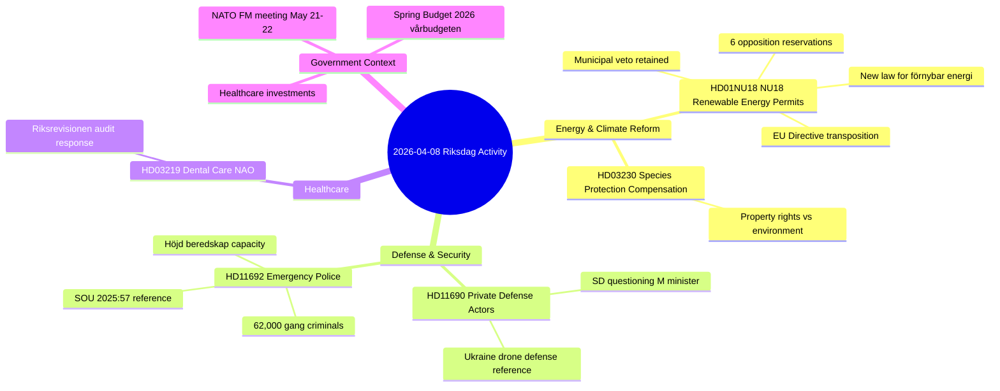
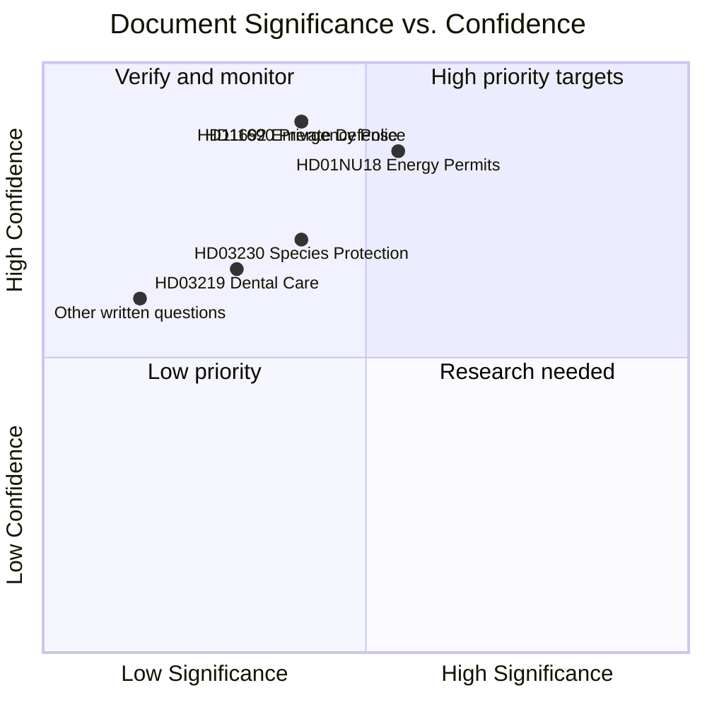

# Synthesis Summary — Realtime Monitor 1146

**Generated**: 2026-04-08 11:46 UTC
**Run ID**: realtime-1146
**Article Date**: 2026-04-08
**Riksmöte**: 2025/26
**Documents Analyzed**: 12
**Overall Significance**: 🟡 MEDIUM (max 5/10)
**Overall Confidence**: HIGH
**Produced By**: news-realtime-monitor (AI-driven analysis)

---

## 📊 Activity Overview

| Metric | Value |
|--------|-------|
| Total documents | 12 |
| Committee reports (bet) | 1 (HD01NU18 — renewable energy permits) |
| Propositions (prop) | 1 (HD03230 — species protection compensation) |
| Government communications (skr) | 1 (HD03219 — dental care NAO report) |
| Written questions (fr) | 9 (defense, security, energy, justice topics) |
| Maximum significance score | 5/10 (HD01NU18) |
| Breaking news threshold met | ❌ No (requires ≥7/10) |

---

## 🔑 Key Themes

---

## 📈 Cross-Document Analysis

### Theme 1: Energy & Environmental Reform Package

The government simultaneously published the **NU18 committee report** (renewable energy permits) and **Prop. 230** (species protection compensation), signaling a coordinated push on environmental regulatory reform. The NU18 report is the most significant document today: it recommends adopting a **new law implementing the EU Renewable Energy Directive**, creating Sweden's first comprehensive permit framework for renewable energy.

**Political dynamics**: All four opposition parties (S, V, C, MP) filed **6 reservations** against NU18, particularly targeting the government's decision to **retain the municipal veto** on wind power. This creates clear political fault lines heading into the 2026 election campaign.

| Document | Type | Significance | Key Issue |
|----------|------|-------------|-----------|
| HD01NU18 | bet | 5/10 | New renewable energy law, municipal veto |
| HD03230 | prop | 4/10 | Species protection compensation |

### Theme 2: SD Defense & Security Activism

Two written questions from Sweden Democrats members — **Markus Wiechel** on private defense actors (HD11690) and **Björn Söder** on emergency police (HD11692) — both directed at Defense Minister Pål Jonson (M). This pattern suggests coordinated SD pressure on the defense/security portfolio:

- **HD11690** innovatively references Ukraine's **private air defense units** against Russian drones
- **HD11692** cites **62,000 gang criminals** as a national security threat during heightened readiness, referencing **SOU 2025:57**

Both questions connect to Sweden's **new NATO membership** and the ongoing **total defense concept** (totalförsvar) expansion.

| Document | Type | Significance | Key Issue |
|----------|------|-------------|-----------|
| HD11690 | fr | 4/10 | Private defense actors / Ukraine model |
| HD11692 | fr | 4/10 | Emergency police / gang crime nexus |

### Theme 3: Routine Written Parliamentary Activity

The remaining 7 written questions cover standard parliamentary oversight across multiple policy domains. No individual question reaches significant threshold.

---

## 🔍 Significance Assessment

**Breaking News Assessment**: No events meet the HIGH threshold (≥7/10) required for breaking news. The most significant event (NU18 renewable energy committee report at 5/10) is a scheduled legislative action, not an unexpected development. The SD defense questions are interesting but routine written questions.

---

## 🔗 Government Context (April 7-8)

From government press releases (search_regering):

1. **Spring Budget 2026 (Vårbudgeten)** — Major fiscal event released April 7
2. **NATO Foreign Ministers Meeting** — Sweden hosting May 21-22
3. **Healthcare investments** in spring amendment budget
4. **Equilibrium unemployment** declining for first time in 20 years
5. **STEM education** and language education investments

This context elevates the energy/environmental reforms within the government's broader legislative agenda — the NU18 bill is part of a coordinated spring legislative push.

---

## 📋 Recommendation

**Action**: Analysis-only output (no breaking news article)
**Rationale**: No HIGH significance events (≥7/10). Maximum score 5/10 for HD01NU18 — significant but scheduled legislative activity.
**Follow-up**: NU18 should be tracked for upcoming riksdag vote. Municipal veto issue will be a 2026 election campaign topic.

---

## Data Quality Statement

- **MCP data sources**: riksdag-regering (search_dokument, get_propositioner, get_betankanden, search_voteringar, search_anforanden, search_regering)
- **Documents with full text**: 5 of 12 (HD01NU18 partial, HD11690, HD11692, and others via MCP)
- **Cross-validation**: Document dates confirmed via multiple MCP endpoints
- **Known gaps**: HD03230 and HD03219 full text not extractable (HTML encoding issue)
- **Covered documents excluded**: 31 dok_ids already covered by other workflows today
