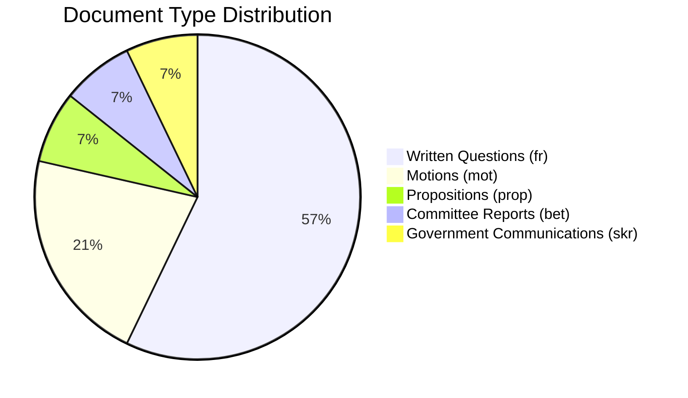

# 🏷️ Classification Results — 2026-04-08 14:33 UTC

**📋 Document Owner:** CEO | **📄 Version:** 2.2 | **📅 Last Updated:** 2026-04-08 (UTC)
**🏢 Owner:** Hack23 AB (Org.nr 5595347807) | **🏷️ Classification:** Public

---

## 📊 Document Classification Matrix

| dok_id | Type | Policy Domain | Sensitivity | Committee/Organ | Party | Minister Target |
|--------|------|--------------|:-----------:|-----------------|-------|----------------|
| HD01NU18 | bet (committee report) | Energy — EU renewable directive | PUBLIC | NU | All (via NU17 debate) | — |
| HD03230 | prop (proposition) | Environment — species protection | PUBLIC | Klimat- och näringslivsdep. | Gov | Johan Britz (L) |
| HD03219 | skr (government communication) | Healthcare — dental care audit | PUBLIC | Socialdepartementet | Gov | — |
| HD024070 | mot (motion) | Foreign aid — SIDA humanitarian | PUBLIC | UU | C | — |
| HD024071 | mot (motion) | Foreign aid — SIDA humanitarian | PUBLIC | UU | C | — |
| HD024072 | mot (motion) | Foreign aid — SIDA humanitarian | PUBLIC | UU | C | — |
| HD11687 | fr (written question) | Healthcare — quality registers | PUBLIC | — | S | Elisabet Lann (KD) |
| HD11688 | fr (written question) | Climate/Transport — EV premium | PUBLIC | — | V | Johan Britz (L) |
| HD11689 | fr (written question) | Defense — environmental permits | PUBLIC | — | SD | Pål Jonson (M) |
| HD11690 | fr (written question) | Defense — private actors | PUBLIC | — | SD | Pål Jonson (M) |
| HD11691 | fr (written question) | Foreign — Chechnya status | PUBLIC | — | SD | Maria Malmer Stenergard (M) |
| HD11692 | fr (written question) | Security — reserve police | PUBLIC | — | SD | Pål Jonson (M) |
| HD11693 | fr (written question) | Democracy — lobby register | PUBLIC | — | SD | Gunnar Strömmer (M) |
| HD11694 | fr (written question) | Security — trust assignments | PUBLIC | — | SD | Lotta Edholm (L) |

---

## 📊 Distribution Summary

### By Party

| Party | Count | Focus Areas |
|-------|:-----:|------------|
| SD | 6 | Defense (3), foreign (1), democracy (1), security (1) |
| C | 3 | Foreign aid (3 motions on same topic) |
| S | 1 | Healthcare quality |
| V | 1 | Climate/transport equity |
| Gov (M/KD/L) | 3 | Energy, environment, healthcare audit response |

### By Policy Domain

| Domain | Count | Significance Range |
|--------|:-----:|:-----------------:|
| Defense/Security | 4 | 3.5–5.5 |
| Energy/Environment | 2 | 4.5–5.0 |
| Foreign affairs/aid | 4 | 1.0–3.0 |
| Healthcare | 2 | 2.0–2.5 |
| Democracy/Transparency | 2 | 3.5–4.5 |

---

**Document Control:**
- **Template Path:** `/analysis/templates/political-classification.md`
- **Version:** 2.2
