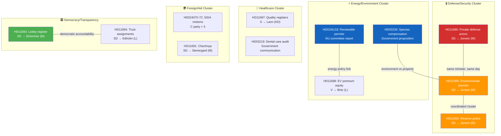

# 🔗 Cross-Reference Map — 2026-04-08 14:33 UTC

**📋 Document Owner:** CEO | **📄 Version:** 2.2 | **📅 Last Updated:** 2026-04-08 (UTC)
**🏢 Owner:** Hack23 AB (Org.nr 5595347807) | **🏷️ Classification:** Public

---

## 📊 Document Relationship Graph

---

## 🔗 Key Cross-References

| From | To | Relationship |
|------|----|-------------|
| HD11690, HD11689, HD11692 | All → Pål Jonson (M) | Coordinated SD defense cluster targeting same minister |
| HD01NU18 | NU17 debate (ongoing) | Committee report released during active energy market chamber debate |
| HD03230 | HD11689 | Environment-property tension mirrors defense-environment conflict |
| HD11693 | Lagrådsremiss "Ökad insyn" | Question references recently delivered government transparency bill |
| HD024070-72 | Skr. 2025/26:226 | Three motions responding to same Riksrevisionen report on SIDA |
| HD11692 | SOU 2025:57 | Question references official inquiry on reserve police force |

---

**Document Control:**
- **Version:** 2.2
