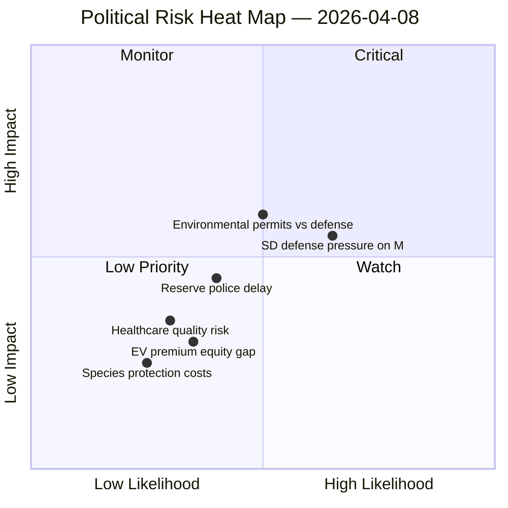
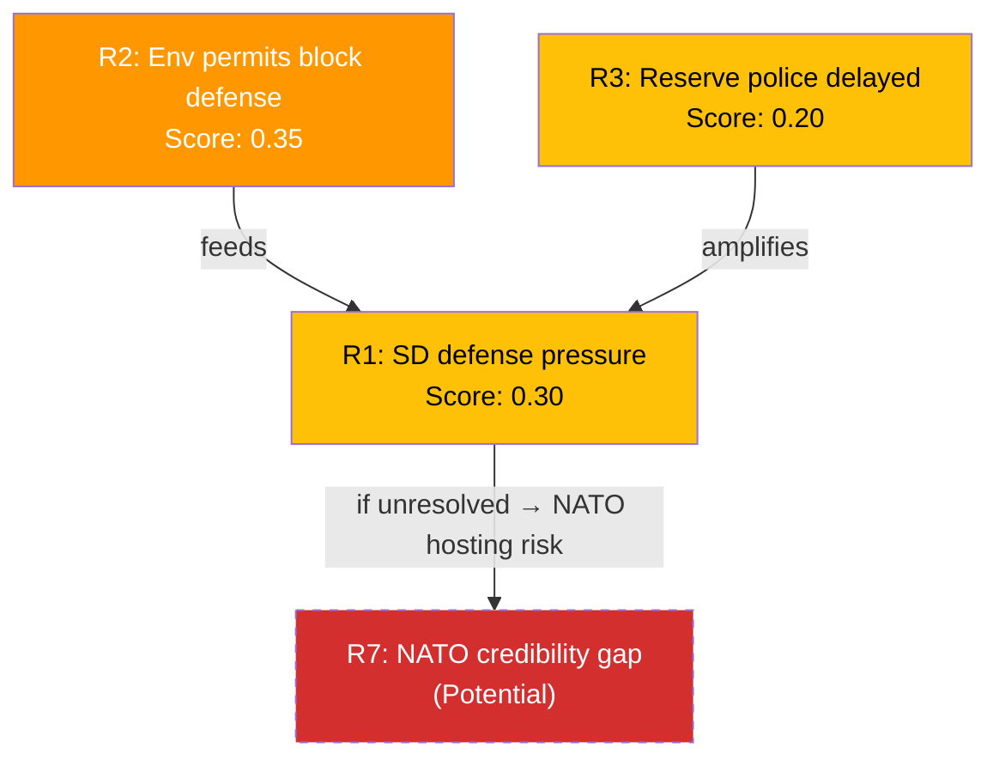

# ⚖️ Political Risk Assessment — 2026-04-08 14:33 UTC

**📋 Document Owner:** CEO | **📄 Version:** 2.2 | **📅 Last Updated:** 2026-04-08 (UTC)
**🏢 Owner:** Hack23 AB (Org.nr 5595347807) | **🏷️ Classification:** Public

---

## 📋 Risk Context

| Field | Value |
|-------|-------|
| **Assessment ID** | RISK-2026-04-08-002 |
| **Analysis Date** | 2026-04-08 14:33 UTC |
| **Documents Analyzed** | 14 |
| **Produced By** | news-realtime-monitor |
| **Overall Risk Level** | MEDIUM |

---

## 🔥 Risk Heat Map

---

## 📊 Risk Register

| ID | Risk | Likelihood | Impact | Risk Score | Category | Trend |
|----|------|:----------:|:------:|:----------:|----------|:-----:|
| R1 | SD coordinated defense questioning undermines coalition trust with M | 0.5 | 0.6 | 0.30 | Coalition Stability | ↑ |
| R2 | Environmental permits continue blocking Försvarsmakten operations | 0.5 | 0.7 | 0.35 | Policy Implementation | → |
| R3 | Reserve police force remains unimplemented despite security need | 0.4 | 0.5 | 0.20 | Security Preparedness | → |
| R4 | EV premium accessibility creates social equity optics problem | 0.3 | 0.3 | 0.09 | Policy Equity | ↑ |
| R5 | Healthcare quality registers funding gap affects equitable care | 0.3 | 0.4 | 0.12 | Public Services | → |
| R6 | Species protection compensation creates fiscal precedent | 0.2 | 0.3 | 0.06 | Fiscal | → |

---

## 🔗 Cascading Risk Chain

**Chain Analysis:** Environmental permit barriers (R2) and reserve police delays (R3) feed SD's defense pressure narrative (R1). If unresolved before NATO foreign ministers meeting (May 21-22), this could create credibility gaps when Sweden hosts alliance partners.

---

## 📋 Risk Summary

| Metric | Value |
|--------|-------|
| Total Risks Identified | 6 |
| Critical Risks | 0 |
| High Risks | 0 |
| Medium Risks | 3 (R1, R2, R3) |
| Low Risks | 3 (R4, R5, R6) |
| **Overall Risk Level** | **MEDIUM** |
| Trend vs. Previous Run | → (stable) |

---

**Document Control:**
- **Template Path:** `/analysis/templates/risk-assessment.md`
- **Version:** 2.2
- **ISMS Alignment:** ISO 27001:2022 A.5.7, NIST CSF 2.0 ID.RA
