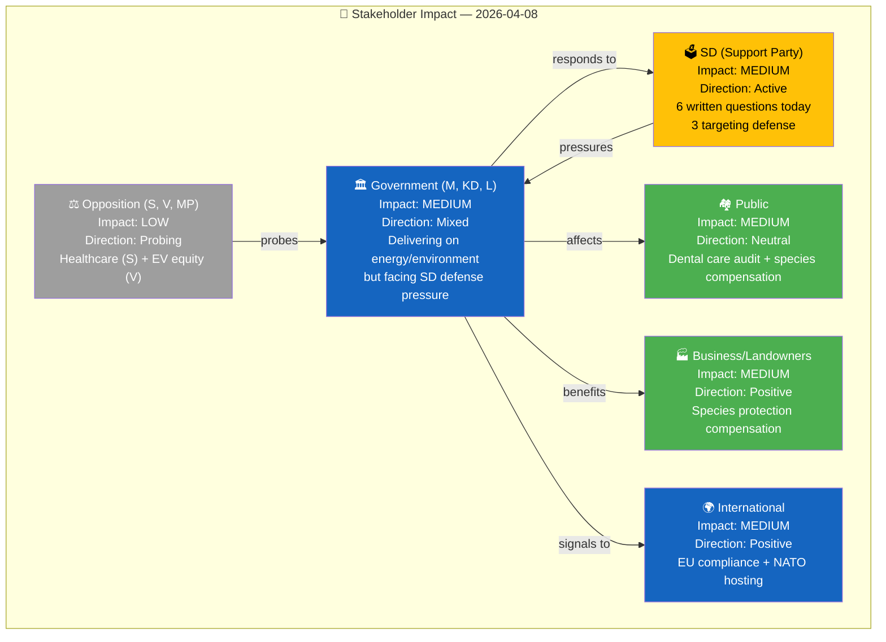

# 👥 Stakeholder Impact Analysis — 2026-04-08 14:33 UTC

**📋 Document Owner:** CEO | **📄 Version:** 2.2 | **📅 Last Updated:** 2026-04-08 (UTC)
**🏢 Owner:** Hack23 AB (Org.nr 5595347807) | **🏷️ Classification:** Public

---

## 📊 Stakeholder Impact Map

---

## 📋 Detailed Stakeholder Assessment

### 🏛️ Government Coalition (M, KD, L)

| Aspect | Assessment |
|--------|-----------|
| **Overall Impact** | MEDIUM |
| **Direction** | Mixed — policy delivery strong, but defense accountability questioned |
| **Key Drivers** | NU18 energy reform delivery, Prop 230 environmental compensation, lobby register lagrådsremiss |
| **Pressure Points** | Defense Minister Pål Jonson (M) receives 3 targeted questions from SD in single day |
| **Outlook** | Government can demonstrate legislative productivity but must address defense readiness gap before NATO hosting |

### 🗳️ SD (Support Party)

| Aspect | Assessment |
|--------|-----------|
| **Overall Impact** | MEDIUM |
| **Direction** | Active — coordinated accountability campaign |
| **Key Actions** | Filed 6 written questions: 3 defense (Söder, Wiechel → Jonson M), 1 transparency (Wiechel → Strömmer M), 1 foreign (Wiechel → Stenergard M), 1 security/trust (Wiechel → Edholm L) |
| **Strategic Pattern** | Using written questions to demonstrate engagement across defense, foreign policy, and democratic transparency |
| **Outlook** | SD positioning as defense hawks and accountability advocates ahead of 2026 budget cycle |

### ⚖️ Opposition (S, V, MP, C)

| Aspect | Assessment |
|--------|-----------|
| **Overall Impact** | LOW |
| **Direction** | Probing — individual questions rather than coordinated strategy |
| **S (Hallengren)** | Healthcare quality registers — systematic care equity concern |
| **V (Östh)** | EV premium equity — accessibility and fairness angle |
| **C (Mutt, Nyman, Lönegård)** | 3 motions on SIDA humanitarian aid response — foreign aid accountability |
| **Outlook** | Opposition fragmented across different policy areas; no unified narrative today |

---

**Document Control:**
- **Template Path:** `/analysis/templates/stakeholder-impact.md`
- **Version:** 2.2
