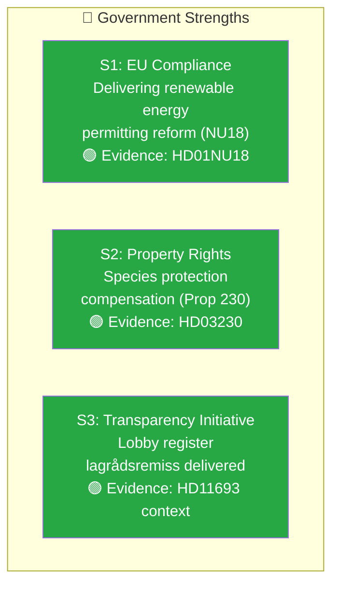
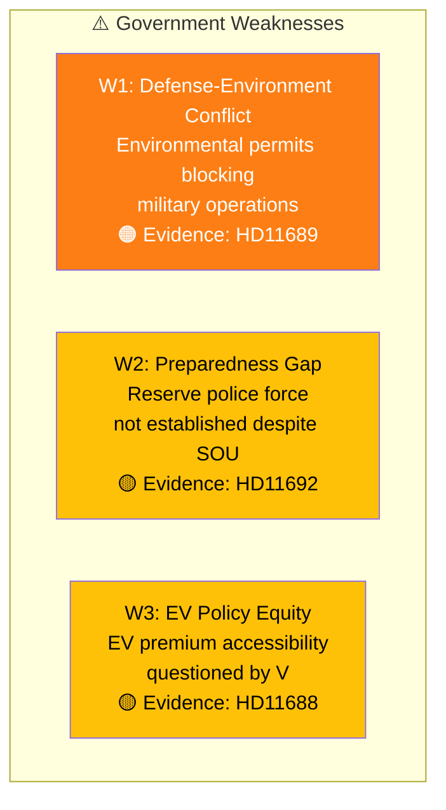
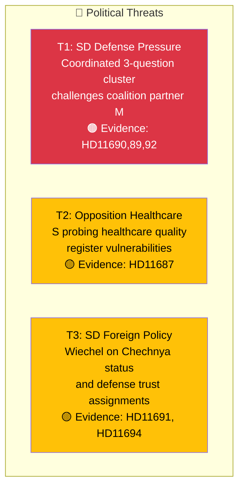
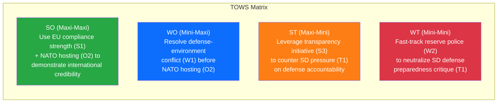

# 📊 Political SWOT Analysis — 2026-04-08 14:33 UTC

**📋 Document Owner:** CEO | **📄 Version:** 2.2 | **📅 Last Updated:** 2026-04-08 (UTC)
**🏢 Owner:** Hack23 AB (Org.nr 5595347807) | **🏷️ Classification:** Public

---

## 📋 SWOT Context

| Field | Value |
|-------|-------|
| **Analysis ID** | SWOT-2026-04-08-002 |
| **Analysis Date** | 2026-04-08 14:33 UTC |
| **Documents Analyzed** | 14 |
| **Produced By** | news-realtime-monitor |
| **Overall Confidence** | MEDIUM |

---

## 💪 Strengths (Government/Coalition)

| ID | Strength | Evidence | Confidence | Impact |
|----|----------|----------|:----------:|:------:|
| S1 | Government delivering EU-mandated renewable energy permitting reform through NU committee | HD01NU18 — NU committee report on förnybartdirektivet permitting streamlining | HIGH | 🟡 |
| S2 | Addressing property rights concerns with species protection compensation proposition | HD03230 — Prop. 2025/26:230 from Klimat- och näringslivsdepartementet | HIGH | 🟡 |
| S3 | Proactive transparency legislation — lobby register lagrådsremiss "Ökad insyn i politiska processer" | HD11693 context — SD question confirms lagrådsremiss was recently delivered | MEDIUM | 🟢 |

---

## ⚠️ Weaknesses (Government/Coalition)

| ID | Weakness | Evidence | Confidence | Impact |
|----|----------|----------|:----------:|:------:|
| W1 | Environmental permits hamper Försvarsmaktens operations — 3 years since SD first raised this issue, still unresolved | HD11689 — Björn Söder (SD) to Pål Jonson (M): "snart tre år sedan SD tog upp frågan" | HIGH | 🟠 |
| W2 | Reserve police force remains unimplemented despite SOU 2025:57 recommendations | HD11692 — Björn Söder (SD) references SOU 2025:57 proposals using police students and pensioners | MEDIUM | 🟡 |
| W3 | EV premium design questioned for accessibility — requires BankID and digital infrastructure not universally available | HD11688 — Malin Östh (V) questions equity of EV premium application process | MEDIUM | 🟡 |

---

## 🚀 Opportunities (Political Environment)

| ID | Opportunity | Evidence | Confidence | Timeline |
|----|------------|----------|:----------:|----------|
| O1 | Lobby register legislation could build cross-party democratic credibility if handled well | HD11693 — Even SD (support party) engages constructively with lobby register via written question | MEDIUM | 4-8 weeks |
| O2 | NATO hosting (May 21-22) positions Sweden as alliance leader and validates defense investment | Government press release — Sweden to host NATO foreign ministers meeting | HIGH | 6 weeks |

---

## 🔴 Threats (Political Environment)

| ID | Threat | Evidence | Confidence | Severity |
|----|--------|----------|:----------:|:--------:|
| T1 | SD mounts coordinated 3-question defense pressure on coalition partner M — Wiechel (HD11690) and Söder (HD11689, HD11692) target Pål Jonson simultaneously | HD11690, HD11689, HD11692 — all addressed to Försvarsminister Pål Jonson (M) on the same day | HIGH | 🟠 |
| T2 | S (Hallengren) probing healthcare quality registers signals potential campaign issue for equitable care | HD11687 — "nationella kvalitetsregistrens funktion, finansiering och betydelse för en jämlik vård" | MEDIUM | 🟡 |
| T3 | SD's Wiechel files on Chechnya status and public trust assignments — tests government's foreign policy coherence | HD11691, HD11694 — Two separate questions probing different policy areas | MEDIUM | 🟡 |

---

## 📐 TOWS Strategy Matrix

| Strategy | SWOT Intersection | Action |
|----------|-------------------|--------|
| **SO** (Maxi-Maxi) | S1 × O2 | EU energy reform + NATO hosting = demonstrate Sweden as reliable international partner |
| **WO** (Mini-Maxi) | W1 × O2 | Resolve environmental permit barriers before hosting NATO ministers |
| **ST** (Maxi-Mini) | S3 × T1 | Use transparency legislation to reframe SD's accountability questions as already addressed |
| **WT** (Mini-Mini) | W2 × T1 | Expedite reserve police implementation to neutralize SD defense preparedness pressure |

---

## 📋 SWOT Balance Assessment

| Metric | Value | Assessment |
|--------|-------|-----------|
| Total Strengths | 3 | Government has substantive policy delivery in energy, environment, and transparency |
| Total Weaknesses | 3 | Defense readiness gaps and policy equity concerns balance strengths |
| Total Opportunities | 2 | NATO hosting and lobby register offer coalition-strengthening potential |
| Total Threats | 3 | SD defense pressure is primary threat, but within normal bounds |
| **Overall Balance** | **Neutral** | Coalition maintains legislative momentum but faces SD pressure on defense |

---

**Document Control:**
- **Template Path:** `/analysis/templates/swot-analysis.md`
- **Version:** 2.2
- **ISMS Alignment:** ISO 27001:2022 A.5.7
