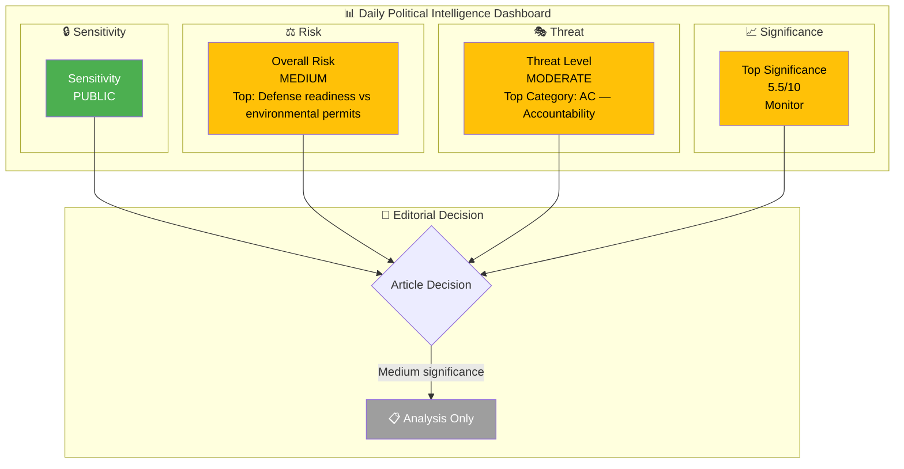
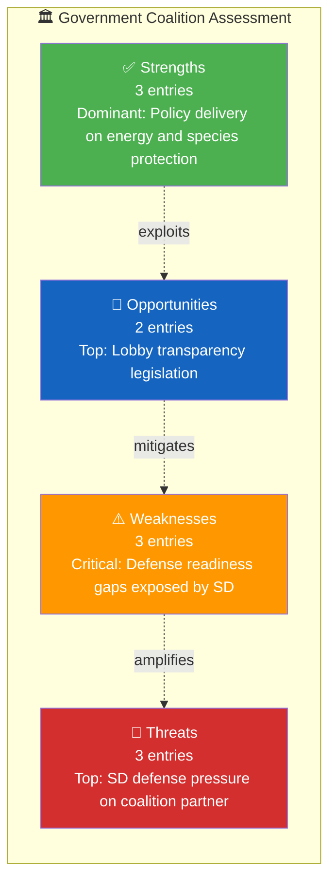

# 🧩 Political Intelligence Synthesis — 2026-04-08 14:33 UTC

**📋 Document Owner:** CEO | **📄 Version:** 2.2 | **📅 Last Updated:** 2026-04-08 (UTC)
**🏢 Owner:** Hack23 AB (Org.nr 5595347807) | **🏷️ Classification:** Public

---

## 📋 Synthesis Context

| Field | Value |
|-------|-------|
| **Synthesis ID** | SYN-2026-04-08-002 |
| **Analysis Date** | 2026-04-08 14:33 UTC |
| **Documents Analyzed** | 14 |
| **Analysis Period** | 2026-04-08 00:00–14:33 UTC |
| **Produced By** | news-realtime-monitor |
| **Overall Confidence** | MEDIUM |

---

## 📊 Intelligence Dashboard

### Daily Political Landscape

---

## 🏆 Top Findings by Significance

| Rank | dok_id | Title | Significance | Risk Tier | SWOT Impact | Recommendation |
|:----:|--------|-------|:-----------:|:---------:|:-----------:|----------------|
| 1 | HD11690 | Privata aktörer i försvaret | 5.5 | 🟡 | T dominant | Monitor |
| 2 | HD01NU18 | Tillståndsprövning enligt förnybartdirektivet | 5.0 | 🟡 | O dominant | Monitor |
| 3 | HD03230 | Ersättning vid artskyddet | 4.5 | 🟡 | O dominant | Monitor |
| 4 | HD11693 | Lobbyregister | 4.5 | 🟢 | S dominant | Monitor |
| 5 | HD11692 | Beredskapspoliser | 4.0 | 🟡 | W dominant | Monitor |

### Cross-Document Pattern Analysis

Three dominant themes emerge across the 14 documents:

1. **Defense & Security Preparedness**: SD MPs Markus Wiechel and Björn Söder filed 3 written questions to Defense Minister Pål Jonson (M) on private defense actors (HD11690), environmental permits blocking military operations (HD11689), and reserve police forces (HD11692). This coordinated cluster signals SD pressure on the government's defense readiness posture.

2. **Energy & Environmental Policy Tension**: Committee report NU18 on renewable energy permitting and Prop. 2025/26:230 on species protection compensation represent the ongoing tension between green transition goals and property rights/economic interests. V's question on EV premium equity (HD11688) adds a social dimension.

3. **Democratic Transparency**: SD's Wiechel questions on lobby register (HD11693) and public trust assignments (HD11694) align with the government's recent lagrådsremiss "Ökad insyn i politiska processer", suggesting SD is both supporting and testing the government's transparency agenda.

---

## 💪 Aggregated SWOT Summary

### Coalition Balance

| Quadrant | Count | Highest-Impact Entry | Evidence |
|----------|:-----:|---------------------|----------|
| ✅ Strengths | 3 | Government delivering EU-mandated renewable energy permitting reform (NU18) | HD01NU18 |
| ⚠️ Weaknesses | 3 | Environmental permits hampering defense operations (Björn Söder SD) | HD11689 |
| 🚀 Opportunities | 2 | Lobby register legislation builds cross-party democratic credibility | HD11693 |
| 🔴 Threats | 3 | SD's coordinated defense questioning signals dissatisfaction with coalition defense policy | HD11690, HD11689, HD11692 |

**SWOT Balance Assessment:** Government maintains legislative momentum on energy and environmental policy, but SD's coordinated defense questioning cluster (3 questions in one day to Pål Jonson) reveals growing tension between the coalition's support partner and the defense ministry's pace of preparedness reforms.

---

## ⚖️ Risk Landscape Summary

| Risk Category | Score Range | Highest Risk | Trend vs. Previous |
|--------------|:----------:|-------------|:------------------:|
| Coalition Stability | 3–6 | SD defense pressure on M (Jonson) | → |
| Policy Implementation | 3–5 | Environmental permits vs defense operations | ↑ |
| Budget / Fiscal | 2–4 | Species protection compensation costs | → |
| Electoral | 2–3 | Low direct electoral impact | → |
| Democratic Process | 2–3 | Lobby register strengthens transparency | ↓ |
| External / International | 2–4 | NATO hosting May 2026, Ukraine defense lessons | → |

**Overall Risk Level:** MEDIUM

---

## 🎭 Threat Summary

| Threat Category | Threat Level | Key Finding |
|----------------|:------------:|-------------|
| NI — Narrative Integrity | LOW | No disinformation signals detected |
| LI — Legislative Integrity | LOW | Standard legislative process for NU18 and Prop 230 |
| AC — Accountability | MODERATE | SD questions probe government's defense implementation accountability |
| TR — Transparency | LOW | Lobby register initiative improves transparency |
| DP — Democratic Process | LOW | Normal parliamentary questioning functioning |
| PB — Power Balance | LOW | SD exercising support party leverage within normal bounds |

**Overall Threat Level:** MODERATE

---

## 👥 Stakeholder Impact Overview

| Stakeholder | Impact | Direction | Key Driver |
|------------|:------:|:---------:|------------|
| 🏘️ Citizens | M | neutral | Dental care audit and species protection compensation affect property owners |
| 🏛️ Government | M | mixed | Delivering on energy/environment but facing SD defense pressure |
| 🗳️ Opposition | L | neutral | S (Hallengren) probing healthcare quality; V (Östh) on EV equity |
| 🏭 Business | M | positive | Species protection compensation and energy permitting benefit landowners/industry |
| 🤝 Civil Society | L | positive | Lobby register increases political process transparency |
| 🌍 International | M | positive | EU renewable energy directive compliance; NATO hosting in May |

---

## 🎯 Narrative Direction

Today's parliamentary activity reveals SD intensifying pressure on the government's defense preparedness through a coordinated cluster of three written questions to Defense Minister Pål Jonson (M). Simultaneously, the government advances its energy and environmental policy agenda with the NU committee's renewable energy permitting report and a new proposition on species protection compensation. The juxtaposition of SD pushing for faster defense reform while the government prioritizes EU-mandated green transition creates a policy priority tension that may test coalition dynamics in the weeks ahead. **[MEDIUM confidence]**

**Primary Narrative Angle:** SD mounts coordinated defense pressure on coalition partner M while government advances EU energy reforms
**Secondary Angles:** Lobby register legislation as cross-party democratic credential; Healthcare quality concerns from S
**Confidence:** MEDIUM

---

## 🔮 Forward Indicators (MANDATORY)

| # | Indicator | Timeline | Source | Watch Priority |
|---|-----------|----------|--------|:--------------:|
| 1 | Defense Minister Pål Jonson's responses to SD's 3 written questions | 1-2 weeks | search_dokument(doktyp=frs) | 🟠 |
| 2 | NU committee vote on NU18 renewable energy permitting | 2-4 weeks | get_betankanden(organ=NU) | 🟡 |
| 3 | Lobby register bill progression through KU committee | 4-8 weeks | search_dokument(doktyp=bet, organ=KU) | 🟡 |
| 4 | NATO foreign ministers meeting preparation (Sweden hosting May 21-22) | 6 weeks | search_regering(type=pressmeddelanden) | �� |

**Aggregate Risk Level Summary:**

| Metric | Value | Trend vs. Previous |
|--------|-------|:------------------:|
| **Overall Risk Level** | MEDIUM | → |
| **Overall Threat Level** | MODERATE | → |
| **Highest Significance Score** | 5.5/10 | → |
| **SWOT Balance** | Neutral | → |

**Previous Synthesis Reference:** analysis/daily/2026-04-08/realtime-1146/synthesis-summary.md

---

## 📋 Analysis Artifacts Inventory

| File | Status | Key Output |
|------|:------:|-----------|
| `classification-results.md` | ✅ | PUBLIC sensitivity, mixed policy domains |
| `risk-assessment.md` | ✅ | MEDIUM overall risk |
| `swot-analysis.md` | ✅ | Neutral balance, SD defense pressure key threat |
| `threat-analysis.md` | ✅ | MODERATE overall threat, accountability focus |
| `stakeholder-perspectives.md` | ✅ | Government most impacted stakeholder |
| `significance-scoring.md` | ✅ | Top score 5.5/10 (HD11690) |
| Per-file analysis files | 14 created | All 14 documents analyzed |

---

## 📂 MCP Data Files Used

| # | Data Source | File / Tool Path | Retrieved |
|---|-----------|-----------------|-----------|
| 1 | riksdag-regering-mcp | search_dokument(from_date=2026-04-07, to_date=2026-04-08) | 2026-04-08 14:33 UTC |
| 2 | riksdag-regering-mcp | get_propositioner(rm=2025/26) | 2026-04-08 14:33 UTC |
| 3 | riksdag-regering-mcp | get_betankanden(rm=2025/26) | 2026-04-08 14:33 UTC |
| 4 | riksdag-regering-mcp | search_voteringar(rm=2025/26) | 2026-04-08 14:33 UTC |
| 5 | riksdag-regering-mcp | search_anforanden(rm=2025/26) | 2026-04-08 14:33 UTC |
| 6 | riksdag-regering-mcp | search_regering(dateFrom=2026-04-07) | 2026-04-08 14:33 UTC |

---

**Document Control:**
- **Template Path:** `/analysis/templates/synthesis-summary.md`
- **Version:** 2.2
- **Effective Date:** 2026-04-08 (UTC)
- **ISMS Alignment:** ISO 27001:2022 A.5.7, NIST CSF 2.0 ID.RA
- **Classification:** Public
- **Owner:** Hack23 AB (Org.nr 5595347807)
