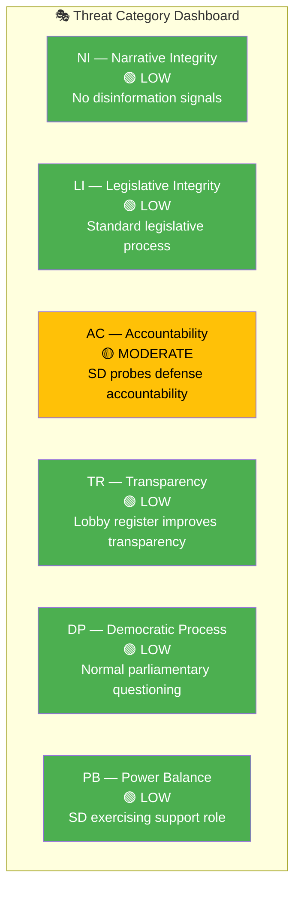
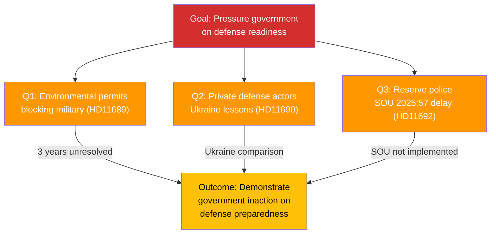

# 🎭 Political Threat Analysis — 2026-04-08 14:33 UTC

**📋 Document Owner:** CEO | **�� Version:** 3.2 | **📅 Last Updated:** 2026-04-08 (UTC)
**🏢 Owner:** Hack23 AB (Org.nr 5595347807) | **🏷️ Classification:** Public

---

## 📋 Threat Context

| Field | Value |
|-------|-------|
| **Assessment ID** | THREAT-2026-04-08-002 |
| **Analysis Date** | 2026-04-08 14:33 UTC |
| **Documents Analyzed** | 14 |
| **Produced By** | news-realtime-monitor |
| **Overall Threat Level** | MODERATE |

---

## 🎯 Threat Category Assessment

---

## 📊 Threat Register

| ID | Threat | Category | Level | Evidence | Confidence |
|----|--------|----------|:-----:|----------|:----------:|
| TH-1 | SD coordinated defense questions challenge government accountability on preparedness delays | AC | 🟡 MODERATE | HD11690, HD11689, HD11692 — 3 questions to same minister, same day | HIGH |
| TH-2 | Opposition S probing healthcare quality funding creates potential campaign vulnerability | AC | 🟢 LOW | HD11687 — Hallengren questions national quality register financing | MEDIUM |
| TH-3 | V questions EV premium equity — potential social fairness narrative | DP | 🟢 LOW | HD11688 — Accessibility barriers for EV premium application | MEDIUM |
| TH-4 | SD's Chechnya and trust assignment questions test foreign policy coherence | NI | 🟢 LOW | HD11691, HD11694 — Wiechel probes multiple policy areas | MEDIUM |

---

## 🌲 Attack Tree — SD Defense Pressure Campaign

**Assessment:** SD's Björn Söder and Markus Wiechel execute a coordinated questioning strategy targeting Defense Minister Pål Jonson (M) on three defense readiness gaps simultaneously. This is a standard support party accountability tactic — challenging the coalition partner to deliver on defense priorities. The pattern is consistent with SD's historical emphasis on defense spending and military preparedness.

---

## 📋 Threat Summary

| Metric | Value |
|--------|-------|
| Total Threats | 4 |
| Critical | 0 |
| High | 0 |
| Moderate | 1 (TH-1) |
| Low | 3 (TH-2, TH-3, TH-4) |
| **Overall Threat Level** | **MODERATE** |

---

**Document Control:**
- **Template Path:** `/analysis/templates/threat-analysis.md`
- **Version:** 3.2
- **ISMS Alignment:** ISO 27001:2022 A.5.7
