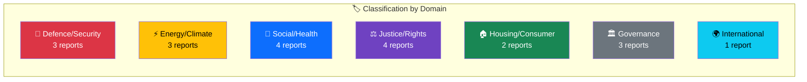

# Document Classification — Committee Reports 2026-04-09

**Generated**: 2026-04-09 04:36 UTC | **Analyst**: news-committee-reports (AI-enriched)
**Documents Analyzed**: 20 | **Confidence**: HIGH | **Riksmöte**: 2025/26

---

## Classification Summary

## Detailed Classification

| dok_id | Committee | Domain | Sensitivity | Urgency | Significance |
|--------|:---------:|--------|:-----------:|:-------:|:------------:|
| HD01FöU12 | FöU | Defence | SENSITIVE | URGENT | 9/10 |
| HD01UU6 | UU | Foreign/Security | SENSITIVE | URGENT | 9/10 |
| HD01NU18 | NU | Energy | PUBLIC | ELEVATED | 8/10 |
| HD01MJU30 | MJU | Climate/Environment | PUBLIC | ROUTINE | 7/10 |
| HD01AU11 | AU | Social/Equality | PUBLIC | ROUTINE | 7/10 |
| HD01SoU37 | SoU | Health/EU | PUBLIC | ELEVATED | 6/10 |
| HD01JuU15 | JuU | Justice | PUBLIC | ROUTINE | 6/10 |
| HD01FöU11 | FöU | Defence/Environment | PUBLIC | ROUTINE | 5/10 |
| HD01SfU18 | SfU | Social Insurance | PUBLIC | ROUTINE | 5/10 |
| HD01SoU16 | SoU | Healthcare | PUBLIC | ROUTINE | 5/10 |
| HD01SoU17 | SoU | Healthcare | PUBLIC | ROUTINE | 5/10 |
| HD01MJU18 | MJU | Trade/Agriculture | PUBLIC | ROUTINE | 5/10 |
| HD01AU12 | AU | Labour | PUBLIC | ROUTINE | 5/10 |
| HD01KU38 | KU | Constitutional | PUBLIC | ROUTINE | 4/10 |
| HD01KU31 | KU | Minority Rights | PUBLIC | ROUTINE | 5/10 |
| HD01KrU10 | KrU | Culture/EU | PUBLIC | ROUTINE | 4/10 |
| HD01CU18 | CU | Housing | PUBLIC | ROUTINE | 5/10 |
| HD01CU17 | CU | Consumer | PUBLIC | ROUTINE | 4/10 |
| HD01NU17 | NU | Energy/Electricity | PUBLIC | ROUTINE | 5/10 |
| HD01JuU16 | JuU | Police | PUBLIC | ROUTINE | 5/10 |

## Data Quality Notes
Classification uses committee→domain mapping with cross-referencing against proposition sources and reservation analysis.
