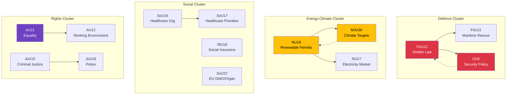

# Cross-Reference Map — Committee Reports 2026-04-09

**Generated**: 2026-04-09 04:36 UTC | **Analyst**: news-committee-reports (AI-enriched)
**Documents Analyzed**: 20 | **Confidence**: HIGH | **Riksmöte**: 2025/26

---

## Cross-Document References

## Key Linkages

| Source | Target | Relationship | Confidence |
|--------|--------|-------------|:----------:|
| FöU12 (Shelter Law) | UU6 (Security Policy) | Both address post-NATO security infrastructure **[HIGH]** | HIGH |
| NU18 (Renewable Permits) | MJU30 (Climate Targets) | Energy permitting framework supports climate target delivery **[HIGH]** | HIGH |
| NU18 | NU17 (Electricity Market) | Both shape energy sector regulatory environment **[MEDIUM]** | MEDIUM |
| SoU16 | SoU17 | Complementary healthcare reform reports **[HIGH]** | HIGH |
| JuU15 | JuU16 | Criminal justice and police policy alignment **[MEDIUM]** | MEDIUM |
| FöU12 | FöU11 | Defence committee dual-track: civilian + maritime protection **[MEDIUM]** | MEDIUM |

## Data Quality Notes
Cross-references identified through committee overlap, policy domain analysis, and reservation party alignment patterns.
