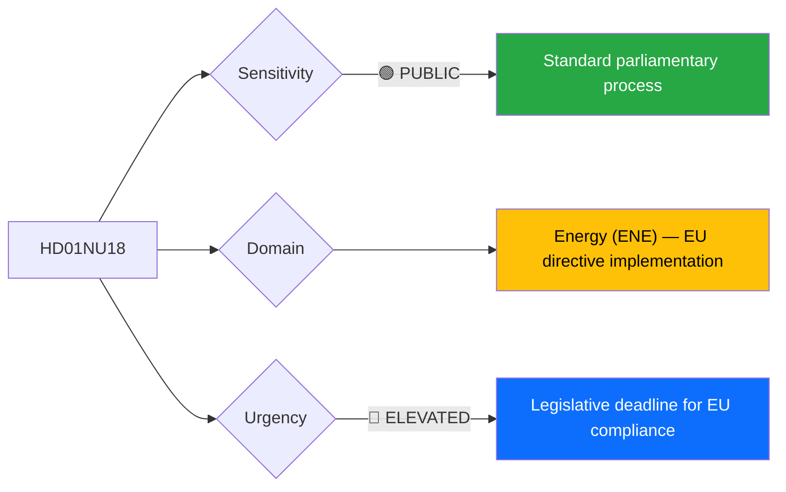

# Per-File Political Intelligence Analysis — HD01NU18

**Document ID**: HD01NU18 | **Type**: committeeReports | **Committee**: NU (Näringsutskottet)
**Title**: Tillståndsprövning enligt förnybartdirektivet
**Date**: 2026-04-08 | **Riksmöte**: 2025/26 | **Source**: get_betankanden
**Analysis Timestamp**: 2026-04-09 04:36 UTC | **Analyst**: news-committee-reports

---

## 🎯 Executive Summary

The Industry Committee (NU) recommends adoption of Proposition 2025/26:118, establishing a new legal framework for renewable energy permitting aligned with the EU Renewable Energy Directive. The bill introduces a dedicated permit pathway for renewable energy projects, replacing the fragmented current system. Six reservations from S, V, C, and MP signal opposition demands for stronger environmental safeguards. This represents a critical juncture in Sweden's energy transition — streamlining permits to meet EU 2030 targets while balancing environmental protection. **[HIGH]**

## 📊 Political Classification

| Field | Assessment |
|-------|-----------|
| **Sensitivity Level** | PUBLIC |
| **Primary Domain** | Energy (ENE) — EU Renewable Energy Directive implementation |
| **Urgency** | ELEVATED — EU compliance timeline |
| **Significance Score** | 8/10 |
| **Confidence** | HIGH |

## 💪 SWOT Impact Assessment

### Government Coalition Impact

| Quadrant | Statement | Evidence | Confidence | Impact |
|----------|-----------|----------|:----------:|:------:|
| ✅ Strength | Demonstrates EU compliance commitment — renewable energy permitting streamlined | HD01NU18: utskottet tillstyrker Prop 2025/26:118 punkterna 1-9 | H | H |
| ✅ Strength | Government passes 9-point legislative package intact | HD01NU18: all proposition points recommended for adoption | H | H |
| ⚠️ Weakness | Opposition united in demanding environmental safeguards | HD01NU18: 6 reservations from S, V, C, MP combined | H | M |
| 🔴 Threat | Legal challenges from environmental groups possible | HD01NU18: reservations cite insufficient environmental protections | M | M |

### Opposition Impact

| Quadrant | Statement | Evidence | Confidence | Impact |
|----------|-----------|----------|:----------:|:------:|
| ✅ Strength | United front across S, V, C, MP on environmental protection | HD01NU18: Reservation 1 (S, C), Res 2 (V, MP), Res 3 (S, V, C) | H | M |
| ⚠️ Weakness | Cannot block government majority on key proposition points | HD01NU18: all motionsyrkanden avstyrks | H | M |
| 🚀 Opportunity | Can frame government as prioritizing speed over environment | HD01NU18: opposition reservations target environmental safeguards | M | M |
| 🔴 Threat | Fragmented reservation strategy (different party combinations per point) | HD01NU18: Res 4 (S, V, MP) — C not joining; Res 1 (S, C) — V, MP not joining | H | L |

## ⚖️ Risk Assessment

| Risk | L (1-5) | I (1-5) | Score | Trigger | Confidence |
|------|:-------:|:-------:|:-----:|---------|:----------:|
| EU compliance failure if law delayed | 2 | 5 | 10 | If chamber vote postponed beyond April 2026 | MEDIUM |
| Environmental litigation post-enactment | 3 | 3 | 9 | If permit streamlining reduces environmental review quality | MEDIUM |
| Energy transition acceleration meets public resistance | 2 | 3 | 6 | If renewable projects face local opposition under new permits | LOW |

## 🔭 Forward Indicators

1. **Chamber vote on NU18** — expected mid-April 2026. Watch for opposition demanding recorded vote on each reservation point **[HIGH]**
2. **Implementation timeline** — new law requires secondary regulations. Watch for government directive to energy agencies **[MEDIUM]**
3. **MJU30 climate target debate** — June 2026 decision will shape context for renewable energy expansion under NU18 framework **[HIGH]**

## Data Quality Notes
Confidence: **HIGH**. Full-text analysis of committee report. Reservation details verified against document content. Cross-referenced with Prop 2025/26:118.
