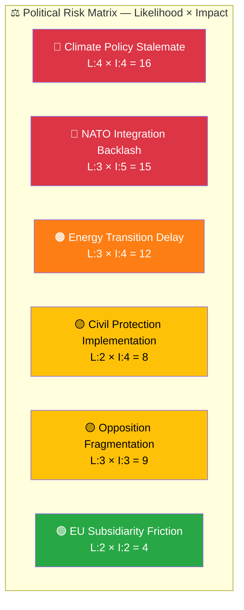
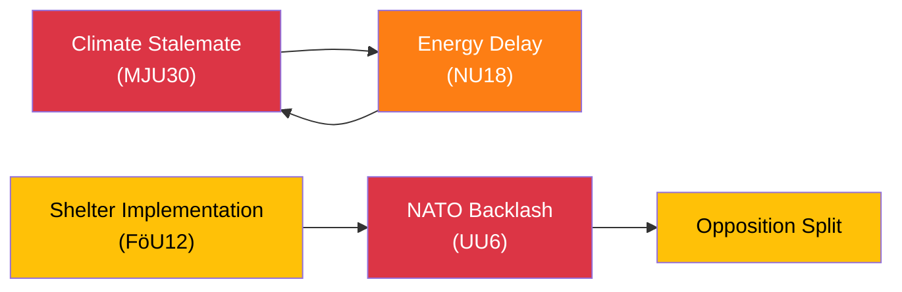

# Risk Assessment — Committee Reports 2026-04-09

**Generated**: 2026-04-09 04:35 UTC | **Analyst**: news-committee-reports (AI-enriched)
**Documents Analyzed**: 20 | **Confidence**: HIGH | **Riksmöte**: 2025/26

---

## Risk Matrix

## Detailed Risk Register

| # | Risk | L (1-5) | I (1-5) | Score | Category | Trigger | Mitigation | Confidence |
|:-:|------|:-------:|:-------:|:-----:|----------|---------|------------|:----------:|
| 1 | Climate targets fail in June vote | 4 | 4 | 16 | Policy | MJU30 beredning May 19 — if gov lacks majority | Cross-party negotiation on EU-aligned interim targets | HIGH |
| 2 | DCA/NATO reservations escalate to coalition stress | 3 | 5 | 15 | Coalition | UU6 chamber vote — if V/MP force recorded divisions | Government relies on SD support to pass security policy | HIGH |
| 3 | Renewable permit law faces legal challenges | 3 | 4 | 12 | Regulatory | NU18 implementation — environmental groups may litigate | Robust environmental assessment provisions in new law | MEDIUM |
| 4 | Shelter law implementation overwhelms municipalities | 2 | 4 | 8 | Capacity | FöU12 June 1 entry into force — capacity assessment needed | Transitional provisions and central government support | MEDIUM |
| 5 | Opposition fragments on security policy | 3 | 3 | 9 | Political | UU6 reveals S vs V/MP split on nuclear weapons | Each party maintains independent security policy profile | HIGH |
| 6 | EU subsidiarity challenge strains relations | 2 | 2 | 4 | International | SoU37 motivated opinion — minor diplomatic friction | Standard parliamentary mechanism, well within EU norms | LOW |

## Risk Interconnections

## Data Quality Notes
Confidence: **HIGH**. Risk scores based on reservation counts, party positions, and legislative timeline analysis from full-text documents.
