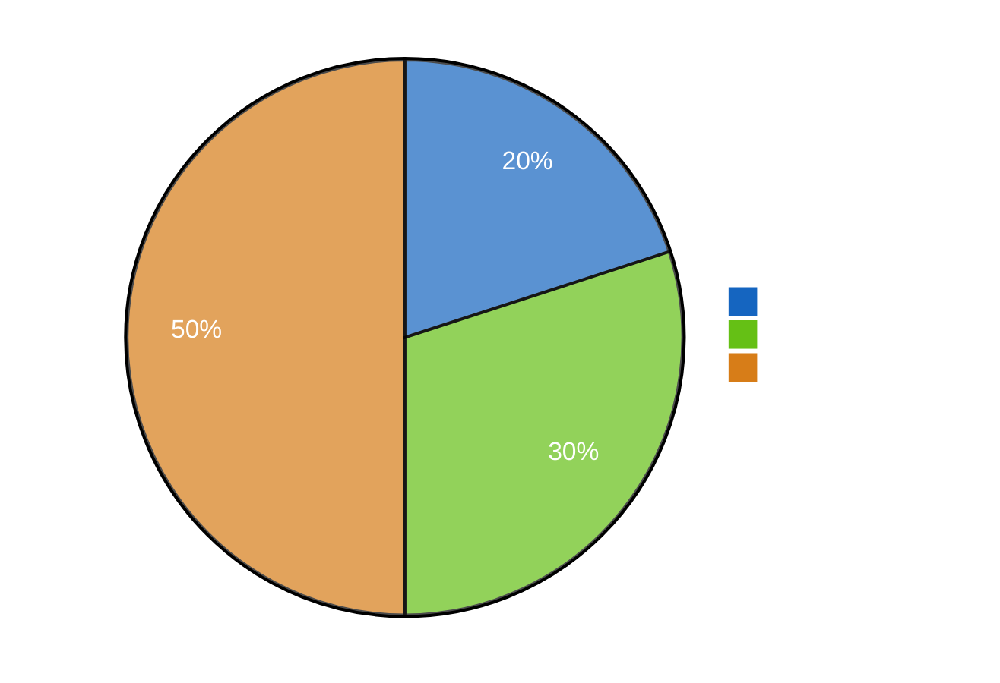
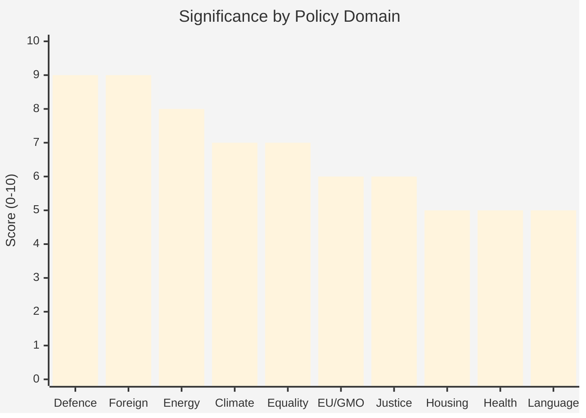

# Document Significance Scoring — 2026-04-09

**Generated**: 2026-04-09 04:36 UTC | **Analyst**: news-committee-reports (AI-enriched)
**Documents Analyzed**: 20 | **Confidence**: HIGH | **Riksmöte**: 2025/26

---

## 5-Dimension Significance Scoring

| dok_id | Title | Parliamentary | Policy | Public Interest | Urgency | Cross-Party | Total |
|--------|-------|:------------:|:------:|:---------------:|:-------:|:-----------:|:-----:|
| HD01FöU12 | Civilbefolkningsskydd | 9 | 9 | 9 | 8 | 8 | **9/10** |
| HD01UU6 | Säkerhetspolitik | 9 | 9 | 8 | 7 | 9 | **9/10** |
| HD01NU18 | Förnybartdirektivet | 8 | 8 | 7 | 8 | 7 | **8/10** |
| HD01MJU30 | Klimatmål 2030 | 7 | 8 | 8 | 5 | 7 | **7/10** |
| HD01AU11 | Jämställdhet | 7 | 6 | 7 | 5 | 8 | **7/10** |
| HD01SoU37 | Subsidiaritetsprövning GMO | 6 | 6 | 5 | 7 | 5 | **6/10** |
| HD01JuU15 | Kriminalvård | 6 | 6 | 6 | 5 | 5 | **6/10** |
| HD01CU18 | Bostadspolitik | 5 | 6 | 7 | 4 | 4 | **5/10** |
| HD01SoU16 | Sjukvårdsorganisation | 5 | 6 | 6 | 4 | 4 | **5/10** |
| HD01KU31 | Minoritetsspråk | 5 | 5 | 5 | 4 | 4 | **5/10** |

## Key Findings

1. **2** document(s) rated Critical (score ≥ 8): FöU12, UU6
2. **3** document(s) rated High (score 6-7): NU18, MJU30, AU11
3. Defence and security dominate this period's legislative activity

## Significance Distribution

## Policy Domain Heatmap

## Data Quality Notes
Scores based on reservation count analysis, committee hierarchy (FöU/UU = tier-1), policy domain breadth, and coalition context.
