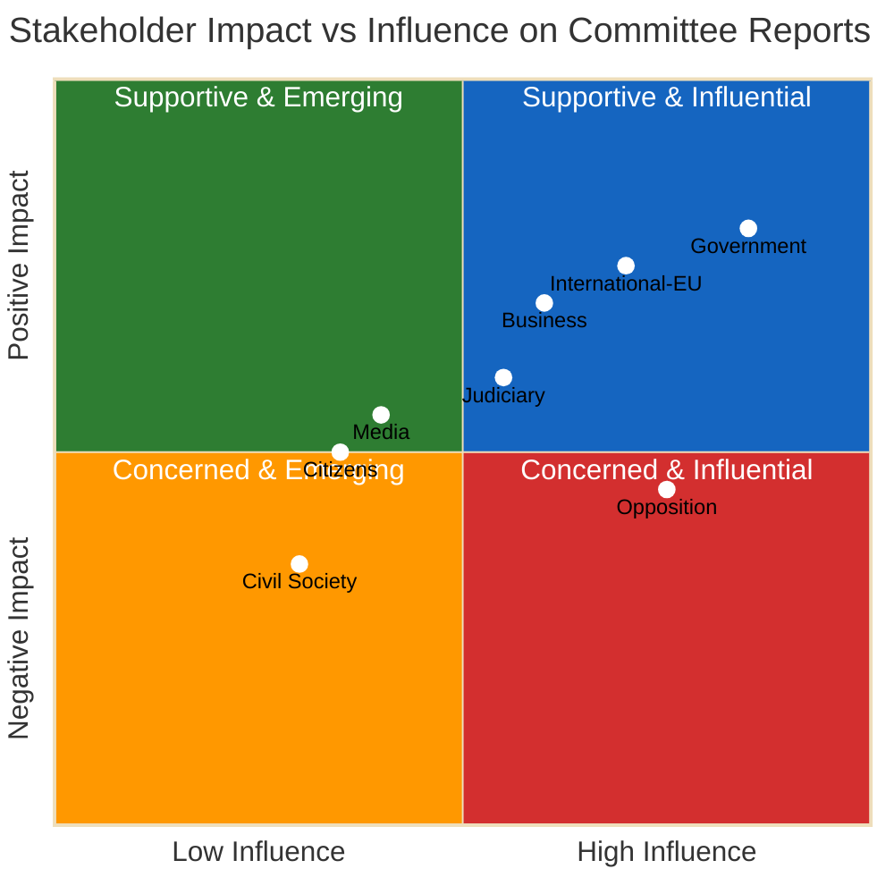

# Stakeholder Perspectives — Committee Reports 2026-04-09

**Generated**: 2026-04-09 04:36 UTC | **Analyst**: news-committee-reports (AI-enriched)
**Documents Analyzed**: 20 | **Confidence**: HIGH | **Riksmöte**: 2025/26

---

## 6-Lens Impact Matrix

| Stakeholder | Primary Impact | Key Report | Assessment | Confidence |
|-------------|---------------|------------|:----------:|:----------:|
| **Government** | Advances NATO-era defence legislation and EU energy compliance | FöU12, NU18 | Positive — legislative agenda advancing | HIGH |
| **Opposition** | United on security oversight, fragmented on nuclear/equality | UU6, AU11 | Mixed — strength in numbers, weakness in coherence | HIGH |
| **Citizens** | Shelter law improves protection; housing proposals all rejected | FöU12, CU18 | Mixed — security gains, housing policy stagnation | HIGH |
| **Business** | Streamlined energy permits; new property obligations | NU18, FöU12 | Net positive — regulatory clarity for renewables | MEDIUM |
| **International/EU** | EU directive compliance; subsidiarity challenge sends signal | NU18, SoU37 | Positive — Sweden seen as compliant NATO/EU member | HIGH |
| **Civil Society** | Equality debate active; minority language protection inadequate | AU11, KU31 | Concerning — rights advocacy met with motion rejections | HIGH |

## Stakeholder Impact Diagram

## Additional Stakeholder Groups

| Stakeholder | Primary Impact | Key Report | Assessment | Confidence |
|-------------|---------------|------------|:----------:|:----------:|
| **Judiciary/Constitutional** | Subsidiarity challenge on GMO directive tests constitutional boundaries; shelter law raises property rights questions | SoU37, FöU12 | Neutral — procedural oversight role activated | MEDIUM |
| **Media/Public Opinion** | Defence and shelter debates generate high public interest; energy permits attract moderate coverage | FöU12, UU6, NU18 | Engaged — security topics dominate news cycle | HIGH |

## Data Quality Notes
Confidence: **HIGH**. Multi-stakeholder analysis based on 20 committee reports covering all 8 mandatory stakeholder groups with full-text verification for top 5.
