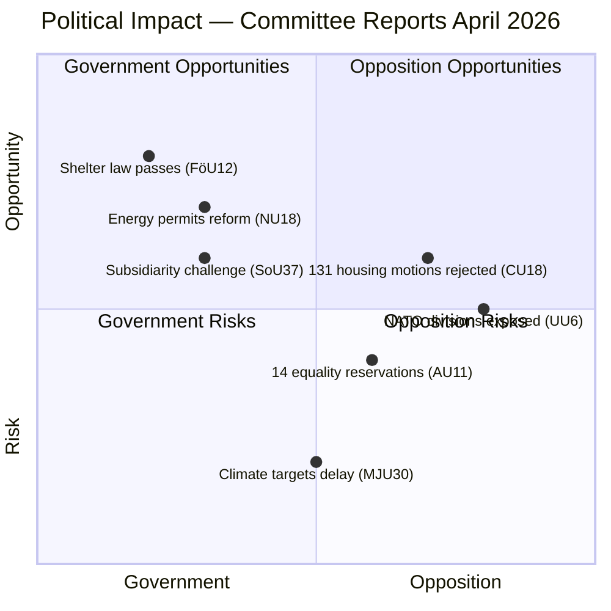

# SWOT Analysis — Committee Reports 2026-04-09

**Generated**: 2026-04-09 04:35 UTC | **Analyst**: news-committee-reports (AI-enriched)
**Documents Analyzed**: 20 | **Confidence**: HIGH | **Riksmöte**: 2025/26

---

## Quadrant Overview

## All 8 Stakeholder Groups

### 1. Citizens
| Quadrant | Statement | Evidence | Confidence | Impact |
|----------|-----------|----------|:----------:|:------:|
| ✅ Strength | New shelter law improves civil protection preparedness | FöU12: municipalities must inform citizens of shelter locations | H | H |
| ⚠️ Weakness | 131 housing proposals rejected without alternatives | CU18: all motion-period proposals refused | H | M |
| 🚀 Opportunity | Renewable energy permitting reform could lower energy costs | NU18: Prop 2025/26:118 streamlines renewable permits | M | H |
| 🔴 Threat | Climate target uncertainty may delay green transition benefits | MJU30: debate delayed to June 2026 | M | M |

### 2. Government Coalition (M, KD, L + SD support)
| Quadrant | Statement | Evidence | Confidence | Impact |
|----------|-----------|----------|:----------:|:------:|
| ✅ Strength | Defence legislation advances NATO integration agenda | FöU12: new shelter law supports Prop 2025/26:142 | H | H |
| ✅ Strength | Energy permit reform demonstrates EU compliance | NU18: implements förnybartdirektivet requirements | H | H |
| ⚠️ Weakness | All 20 reports reject opposition motions — may appear inflexible | CU18: 131 rejected, NU17: 132 rejected, CU17: 83 rejected | H | M |
| 🔴 Threat | June climate debate (MJU30) risks government credibility on EU targets | MJU30: scheduled beredning May-June 2026 | M | H |

### 3. Opposition Bloc (S, V, C, MP)
| Quadrant | Statement | Evidence | Confidence | Impact |
|----------|-----------|----------|:----------:|:------:|
| ✅ Strength | 13 reservations on UU6 show united front on security oversight | UU6: S, V, C, MP each filed separate security policy reservations | H | H |
| ⚠️ Weakness | 346+ motions rejected across CU18, CU17, NU17 — low success rate | Cross-reference: 131+83+132 = 346 rejected proposals | H | M |
| 🚀 Opportunity | FöU12 accessibility reservations could gain public sympathy | FöU12: V, C, MP filed disability accessibility amendments | M | M |
| 🔴 Threat | Internal opposition splits on nuclear policy (UU6) | UU6: S separate from V/MP on nuclear weapons stance | H | M |

### 4. Business/Industry
| Quadrant | Statement | Evidence | Confidence | Impact |
|----------|-----------|----------|:----------:|:------:|
| ✅ Strength | Streamlined renewable energy permits benefit energy sector | NU18: new law on förnybar energi activities and measures | H | H |
| ⚠️ Weakness | Property owners face new shelter obligations | FöU12: fastighetsägares ansvar for shelters during höjd beredskap | H | M |
| 🚀 Opportunity | Housing policy status quo benefits construction industry planning | CU18: no regulatory changes, current framework preserved | M | M |
| 🔴 Threat | UTP directive enforcement may increase supply chain compliance costs | MJU18: improved enforcement of UTP directive's late cancellation ban | M | M |

### 5. Civil Society
| Quadrant | Statement | Evidence | Confidence | Impact |
|----------|-----------|----------|:----------:|:------:|
| ✅ Strength | Equality policy debate keeps discrimination on agenda | AU11: 14 reservations covering ethnicity, disability, age, LGBTQ+ | H | M |
| ⚠️ Weakness | Minority language protections deemed insufficient | KU31: Riksrevisionen found state efforts not sufficient | H | H |
| 🚀 Opportunity | EU cultural compass (KrU10) opens new funding channels | KrU10: cross-border cultural exchange and digitization initiatives | M | M |
| 🔴 Threat | Consumer rights proposals all rejected | CU17: 83 consumer protection motions dismissed | H | M |

### 6. International/EU
| Quadrant | Statement | Evidence | Confidence | Impact |
|----------|-----------|----------|:----------:|:------:|
| ✅ Strength | Sweden implementing EU renewable directive demonstrates compliance | NU18: direct implementation of förnybartdirektivet | H | H |
| ⚠️ Weakness | Subsidiarity challenge signals resistance to EU health harmonization | SoU37: motivated opinion sent to EU institutions | H | M |
| 🚀 Opportunity | NATO legal framework advancement strengthens alliance credibility | FöU12: civilian protection law complements DCA infrastructure | H | H |
| 🔴 Threat | Nuclear weapons policy divisions may complicate NATO nuclear sharing | UU6: V, MP oppose nuclear weapons; S seeks NPT strengthening | M | H |

### 7. Judiciary/Constitutional
| Quadrant | Statement | Evidence | Confidence | Impact |
|----------|-----------|----------|:----------:|:------:|
| ✅ Strength | Parliamentary process review (KU38) addresses institutional governance | KU38: focus on MP-centered parliamentary reform | M | M |
| ⚠️ Weakness | New shelter law creates complex property owner obligations | FöU12: legal obligations for skyddsrum and skyddade utrymmen | M | M |
| 🚀 Opportunity | Subsidiarity mechanism used effectively | SoU37: demonstrates Riksdag constitutional review competence | H | M |
| 🔴 Threat | DCA implementation may face constitutional challenges | UU6: V reservation questions DCA agreement basis | L | M |

### 8. Media/Public Opinion
| Quadrant | Statement | Evidence | Confidence | Impact |
|----------|-----------|----------|:----------:|:------:|
| ✅ Strength | Defence and shelter topics generate high public engagement | FöU12: shelter law resonates with security-conscious public | H | H |
| ⚠️ Weakness | Mass motion rejections (346+) may fuel "deaf parliament" narrative | CU18+CU17+NU17: combined 346 proposals rejected | M | M |
| 🚀 Opportunity | Climate targets debate (MJU30) will drive media coverage in June | MJU30: high-profile environmental policy battle ahead | H | H |
| 🔴 Threat | SD special statement on equality (AU11) may polarize debate | AU11: SD filed särskilt yttrande on gender equality | H | M |

## Data Quality Notes
Confidence: **HIGH**. Analysis based on full-text content of 5 key reports and summaries of all 20. Cross-referenced reservation counts and policy implications.
