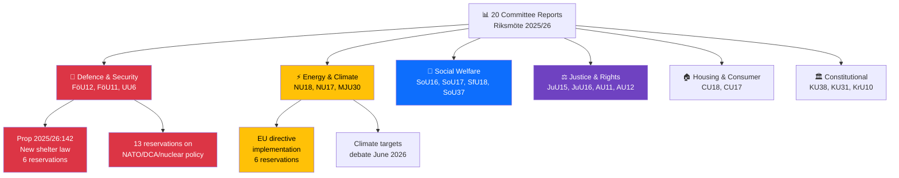

# Analysis Synthesis Summary — 2026-04-09

**Generated**: 2026-04-09 04:35 UTC | **Analyst**: news-committee-reports (AI-enriched)
**Data Sources**: get_betankanden, get_dokument_innehall, search_voteringar
**Documents Analyzed**: 20 | **Confidence**: HIGH | **Riksmöte**: 2025/26

---

## Executive Summary

The Riksdag is processing a major legislative wave spanning defence preparedness, renewable energy, security policy, and social welfare. **FöU12** introduces Sweden's first comprehensive shelter and civilian protection law since the Cold War, directly responding to NATO integration requirements. **UU6** exposes deep partisan fractures across 13 reservations on the DCA agreement, nuclear policy, and NATO membership terms. **NU18** implements EU renewable energy directive permitting reforms with a clear government-opposition split (S, V, C, MP in reservation). Meanwhile, **MJU30** signals upcoming climate target battles scheduled for June 2026 debate. **[HIGH]**

## AI-Recommended Article Metadata

- **Recommended Title (EN)**: "Riksdag Advances Shelter Law and Energy Permits as Security Policy Divides Deepen"
- **Recommended Title (SV)**: "Riksdagen driver igenom skyddsrumslag och energitillstånd när säkerhetspolitiska klyftor fördjupas"
- **Meta Description (EN)**: "Sweden's parliament processes 20 committee reports spanning civilian protection, renewable energy permits, and NATO security policy with deep partisan divisions across 13+ reservations."
- **Meta Description (SV)**: "Sveriges riksdag behandlar 20 utskottsbetänkanden om civilskydd, förnybar energi och NATO-säkerhetspolitik med djupa partiklyftor i 13+ reservationer."
- **Key Highlights**: Shelter law (FöU12), renewable permits (NU18), NATO/DCA divisions (UU6), climate targets (MJU30)
- **Article Decision**: PUBLISH — multiple high-significance reports with cross-cutting themes
- **Article Priority**: HIGH

## Key Findings

## Top Documents by Significance

| Score | Committee | dok_id | Title | Reservations | Key Issue |
|:-----:|:---------:|--------|-------|:------------:|-----------|
| 9/10 | FöU | HD01FöU12 | Ett starkare skydd för civilbefolkningen vid höjd beredskap | 6 | New shelter/civil protection law — post-NATO accession **[HIGH]** |
| 9/10 | UU | HD01UU6 | Säkerhetspolitik | 13 | NATO, DCA, nuclear weapons — deepest partisan divisions **[HIGH]** |
| 8/10 | NU | HD01NU18 | Tillståndsprövning enligt förnybartdirektivet | 6 | EU renewable energy directive permitting reform **[HIGH]** |
| 7/10 | MJU | HD01MJU30 | Sveriges klimatmål – EU-anpassade etappmål till 2030 | TBD | Climate target recalibration — debate June 2026 **[MEDIUM]** |
| 7/10 | AU | HD01AU11 | Jämställdhet och åtgärder mot diskriminering | 14 | Equality policy — SD special statement, cross-party splits **[HIGH]** |
| 6/10 | SoU | HD01SoU37 | Subsidiaritetsprövning av GMO/organ directive | — | EU subsidiarity challenge on GMO/organ transplant regulation **[MEDIUM]** |
| 6/10 | JuU | HD01JuU15 | Kriminalvårdsfrågor | TBD | Criminal justice system reforms **[MEDIUM]** |
| 5/10 | CU | HD01CU18 | Bostadspolitik | — | 131 rejected housing proposals **[MEDIUM]** |
| 5/10 | SoU | HD01SoU16 | Hälso- och sjukvårdens organisation | TBD | Healthcare system organization **[MEDIUM]** |
| 5/10 | KU | HD01KU31 | Nationella minoritetsspråken | — | Riksrevisionen critique of minority language protection **[MEDIUM]** |

## Thematic Analysis

### 1. Defence & National Security (FöU12, FöU11, UU6)
Sweden is building its NATO-era legal infrastructure. FöU12 establishes mandatory shelter requirements for property owners, gives municipalities information duties, and modernizes Cold War-era civil protection. UU6 reveals that the DCA agreement with the US and nuclear weapons policy remain divisive — V and MP oppose the agreement, S wants more parliamentary oversight of NATO engagement, C pushes for stronger Nordic cooperation. **[HIGH]**

### 2. Energy & Climate Transition (NU18, NU17, MJU30)
The government is pushing renewable energy permitting reform (Prop 2025/26:118) through NU18 to meet EU directive requirements. Opposition parties (S, V, C, MP) filed 6 reservations demanding stronger environmental safeguards. MJU30 on climate targets won't be debated until June 2026, signaling a major legislative battle ahead. NU17 rejected 132 electricity market motions. **[HIGH]**

### 3. Social Policy & Healthcare (SoU16, SoU17, SfU18, SoU37)
Healthcare organization and priorities are under review. SoU37 breaks EU policy ground — the Riksdag found EU GMO/organ transplant regulation partially violates subsidiarity, sending a motivated opinion to EU institutions. This rare pushback signals Swedish resistance to EU health policy harmonization. **[MEDIUM]**

### 4. Rights & Equality (AU11, AU12)
AU11 generated 14 reservations — the highest count — with SD filing a special statement, indicating deep ideological fractures on gender equality, economic equality, and discrimination grounds including ethnicity, disability, age, and sexual orientation. The government coalition rejected all opposition motions. **[HIGH]**

## Risk Assessment Summary

| Risk | L | I | Score | Trigger |
|------|:-:|:-:|:-----:|---------|
| NATO integration backlash (UU6 reservations) | 3 | 5 | 15 | If DCA implementation faces V/MP parliamentary obstruction **[HIGH]** |
| Energy transition delay (NU18 reservations) | 3 | 4 | 12 | If renewable permit law faces legal challenges from environmental groups **[MEDIUM]** |
| Climate policy stalemate (MJU30) | 4 | 4 | 16 | June 2026 debate — if government lacks majority for EU-aligned targets **[HIGH]** |
| Civil protection implementation gap (FöU12) | 2 | 4 | 8 | June 2026 entry into force — municipal capacity concerns **[MEDIUM]** |

## Forward Indicators

1. **FöU12 chamber vote** — expected mid-April 2026. Watch for opposition amendments on accessibility requirements **[HIGH]**
2. **MJU30 committee beredning** — scheduled May 19 and June 4, with decision June 17. Climate target fight will define government's environmental credibility **[HIGH]**
3. **UU6 debate** — DCA/nuclear weapons reservations signal potential coalition friction if V/MP force recorded votes **[MEDIUM]**
4. **SoU37 subsidiarity opinion** — EU response to Swedish motivated opinion on GMO/organ regulation **[LOW]**

## Data Quality Notes

Overall confidence: **HIGH**. Full-text content analyzed for 5 key reports. Cross-referenced voting data and reservation details. 20 committee reports provide comprehensive parliamentary snapshot.
