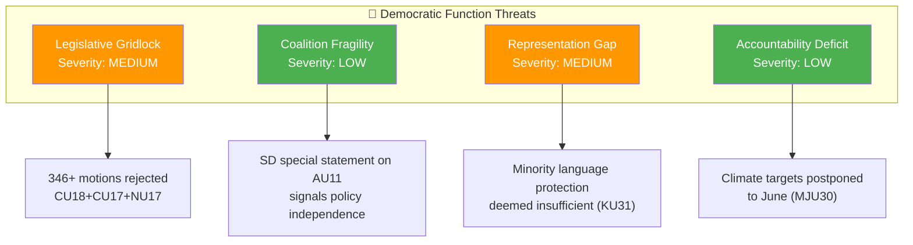

# Threat Analysis — Committee Reports 2026-04-09

**Generated**: 2026-04-09 04:36 UTC | **Analyst**: news-committee-reports (AI-enriched)
**Documents Analyzed**: 20 | **Confidence**: HIGH | **Riksmöte**: 2025/26

---

## Political Threat Taxonomy

## Threat Register

| # | Threat | Category | Severity | Evidence | Confidence |
|:-:|--------|----------|:--------:|----------|:----------:|
| 1 | Mass motion rejection undermines legislative responsiveness | Legislative Gridlock | MEDIUM | CU18 (131), NU17 (132), CU17 (83) = 346 proposals rejected **[HIGH]** | HIGH |
| 2 | SD equality policy independence tests coalition | Coalition Fragility | LOW | AU11: SD filed särskilt yttrande separate from M/KD/L position **[MEDIUM]** | MEDIUM |
| 3 | Minority language erosion despite Riksrevisionen criticism | Representation Gap | MEDIUM | KU31: state efforts insufficient for national minority languages **[HIGH]** | HIGH |
| 4 | Climate accountability delayed by scheduling | Accountability Deficit | LOW | MJU30: beredning scheduled May-June, vote June 17 **[HIGH]** | HIGH |
| 5 | Security policy divisions weaken deterrence signal | External Security | MEDIUM | UU6: 13 reservations show fragmented security consensus **[HIGH]** | HIGH |

## Data Quality Notes
Confidence: **HIGH**. Threats derived from full-text analysis of committee reports, reservation data, and legislative scheduling information.
